# Lab 01 - Environment Setup

Previous: Start | [Back to README](../../README.md) | [Next: Lab 02](../02-knowledge-sources/README.md)

> [!NOTE]
> Portions of this lab are adapted from Microsoft Agent Academy:
> https://github.com/microsoft/agent-academy  
> Copyright (c) Microsoft Corporation. Used under the MIT License.

## Prerequisiti:

1. `Mail aziendale o scolastica` ( @outlook.com, @gmail.com, etc., email personali non sono supportate).
2. Accesso a `internet`e un motore di ricerca (Edge, Chrome, or Firefox recommended).
3. Essere familiari con `Microsoft 365`.
4. (Opzionale) Avere una carta di credito o un metodo di pagamento in caso di acquisto di licenze a pagamento.

## Ottenere un Microsoft 365 Account

Per accedere a Copilot Studio e usufruire della piattaforma è possibile usare un account esistente o seguire questi step per procurarsi la licenza appropriata:

1. Acquistare una `Microsoft 365 Business Subscription`
2. Andare su [Microsoft 365 Business Plans and Pricing Page](https://www.microsoft.com/microsoft-365/business/microsoft-365-plans-and-pricing)
3. Selezionare l'opzione meno costosa per iniziare, Microsoft 265 Business Basic Plan, premere su `Try for free` e compilare il form guidato con le informazioni per l'account e metodo di pagamento.

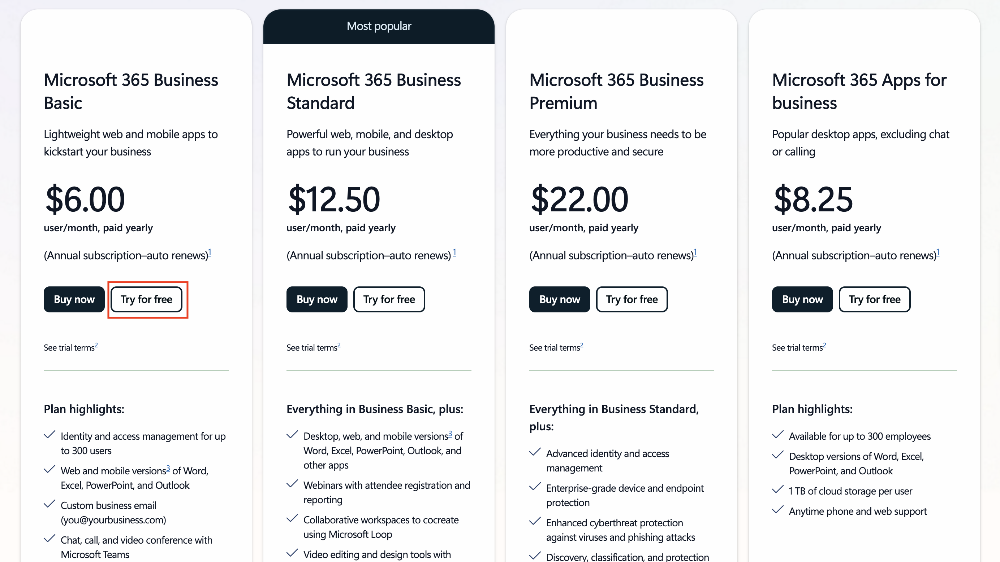

4. Una volta ottenuto l'account eseguire il `login`.

>[!NOTE]
>Nel caso in cui tu voglia pubblicare agenti all’interno di **Microsoft 365 Copilot Chat** oppure collegarti ai dati aziendali (come **SharePoint, OneDrive o Dataverse**), è indispensabile disporre di una licenza **Microsoft 365 Copilot**.
>Questa licenza è un componente aggiuntivo (_add-on_); per ulteriori dettagli puoi consultare il [sito](https://www.microsoft.com/microsoft-365/copilot#plans) dedicato alle opzioni di licenza.

## Iniziare la Copilot Studio Trial

Una volta ottenuto un `Microsoft 365 Tenant`, è necessario l'accesso a `Copilot Studio`. E' possibile riscattare gratuitamente una Trial di 30 giorni seguendo questi step:

1. Navigare su [aka.ms/TryCopilotStudio](https://aka.ms/TryCopilotStudio).

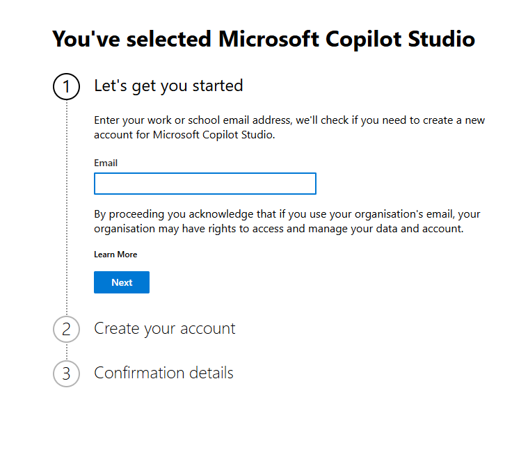

2. Inserire le informazioni dell'account creato negli step precedenti e premere`Next`.

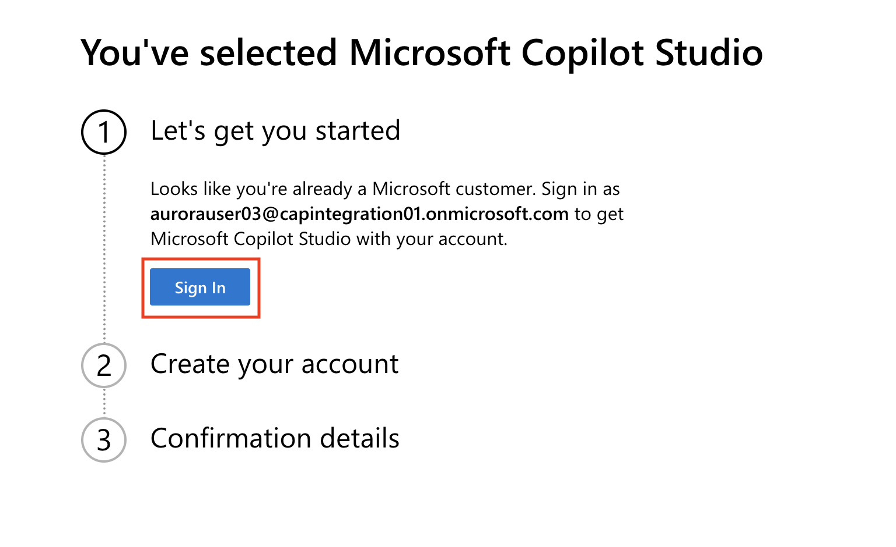

3. Una volta riconosciuto l'account. Selezionare `Sign In`.

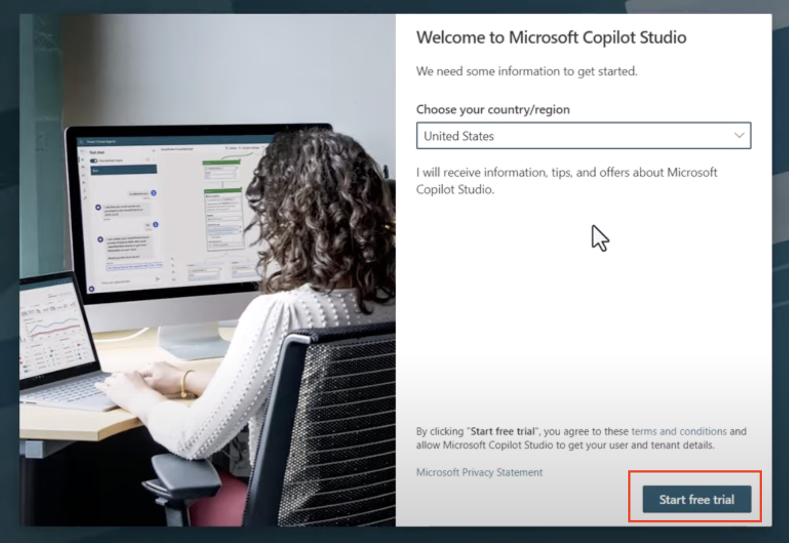

4. Premere su `Start Free Trial`.

>[!NOTE]
>**Trial Notes**
>
>La versione di prova gratuita offre tutte le funzionalità di Copilot Studio.
>Verranno inviate notifiche via email relative alla scadenza della prova. È possibile estendere la prova a incrementi di 30 giorni (fino a un massimo di 90 giorni di runtime dell'agente).	Se l'amministratore del tenant ha disattivato la registrazione self-service, verrà visualizzato un errore: in tal caso, contattare l'amministratore Microsoft 365 per riattivarla.

## Creare un nuovo Developer Environment

Una best practice nello sviluppo di Agenti è lavorare su un Environment diverso da quello Default, quindi per proseguire con questo lab seguire questi step per la creazione del nuovo ambiente.

1. Andare su [Power Apps Developer Plan website](https://aka.ms/PowerAppsDevPlan).

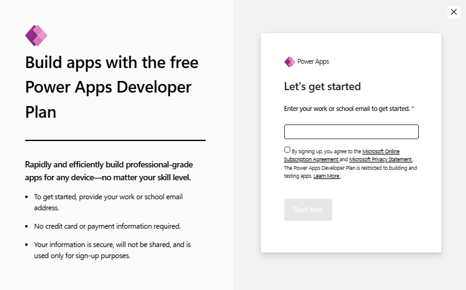

2. Inserire l'`email address` -> Spuntare la `checkbox` -> Selezionare `Start free`.

3. Dopo aver eseguito il login per il Developer Plan, verrà aperto [Power Apps](https://make.powerapps.com/). 

4. Utilizzare questo nuovo `Enviroment` per il Lab su `Copilot Studio`.

>[!NOTE]
>**Note**
>
>Se si utilizza un account Microsoft 365 esistente e non ne è stato creato uno nello Step 1, ad esempio utilizzando il proprio account nell'organizzazione di lavoro, è possibile che l'amministratore IT (o il team equivalente) che gestisce il tenant/ambiente abbia disattivato il processo di registrazione. In tal caso, contattare l'amministratore oppure creare un tenant di test come indicato nello Step 1.

## Abilitare la Pubblicazione con la Copilot Studio Trial

La trial di **Copilot Studio** è stata aggiornata e, attualmente, la pubblicazione degli agenti non è consentita per impostazione predefinita. Per abilitare tale funzionalità, è necessario assegnare il ruolo **Copilot Studio Authors** tramite il **Power Platform Admin Center**.

Come primo passaggio, è richiesta la creazione di un **gruppo di sicurezza** che includa tutti gli utenti autorizzati alla pubblicazione; tale gruppo dovrà successivamente essere associato al ruolo **Copilot Studio Authors**.

1. Andare sull' [Admin Center](https://admin.cloud.microsoft/)

2. Nella sezione **Teams & groups** selezionare **Active teams & groups**

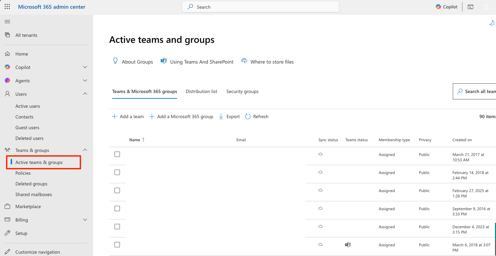

3. Andare su **Security groups** e premere **Add a security group** e chiamarlo `AgentCreators`, successivamente premere **Next**.

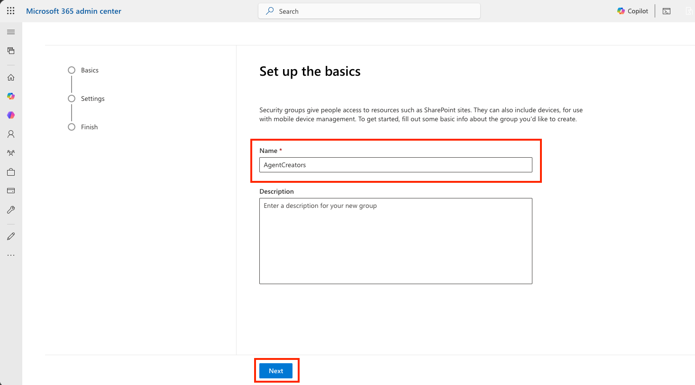

4. Verificare i dati inseriti e premere **Create group**. Dopo ciò cercare il security group appena creato.

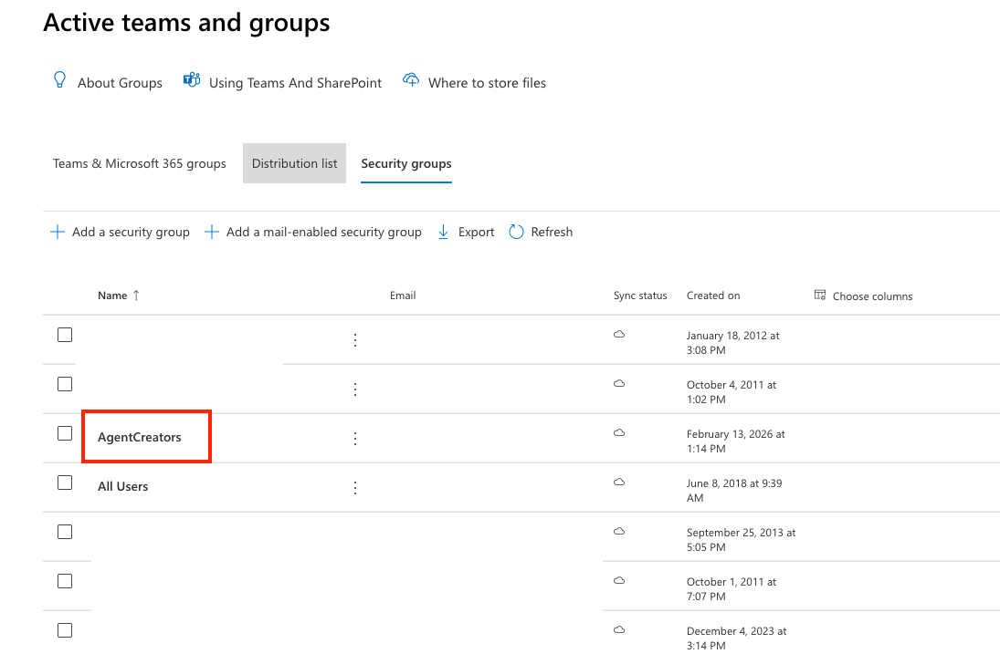

5. Andare nella sezione **Members**, premere **view all and manage members**

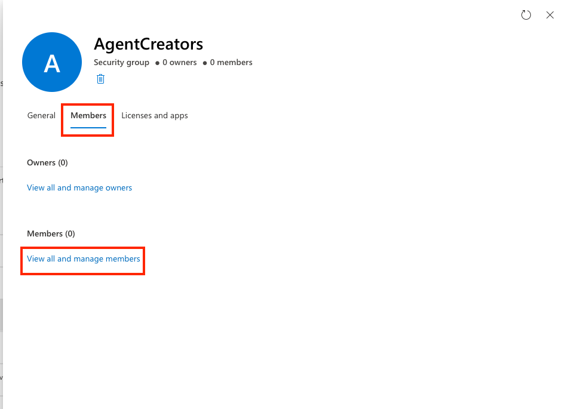

6. Premere **Add members**, cercare il proprio account e aggiungersi come membro.
7. Terminata la creazione del Security group recarsi su [Power Platform admin center](https://admin.powerplatform.microsoft.com/)
8. Dalla schermata **Home** andare su **Manage** e poi **Tenant Settings**.

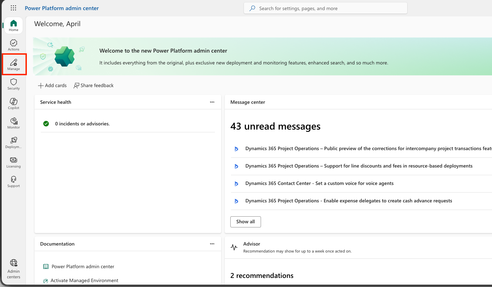

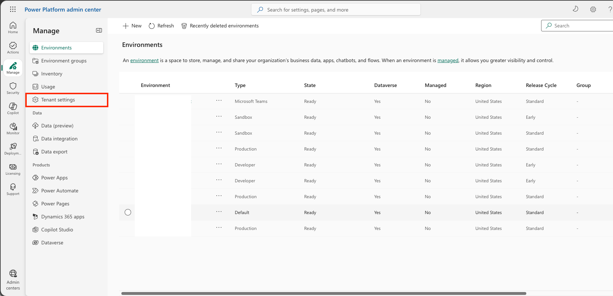

9. Selezionare **Copilot Studio Authors** e cambiare da **All Users** al security group creato in precedenza, poi premere **Done** e successivamente **Save**.

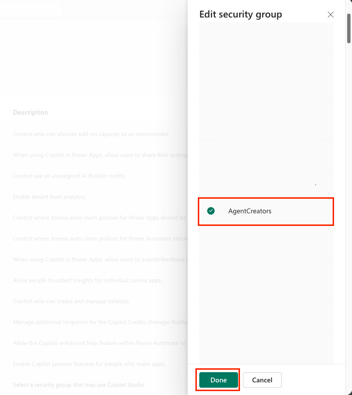

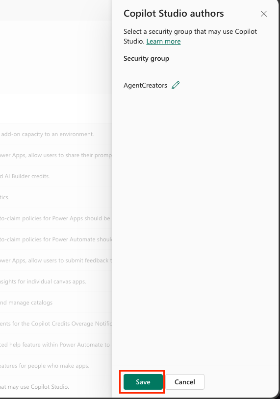

## Solution e Publisher

Una volta aperto [Copilot Studio](https://copilotstudio.microsoft.com/), essere sicuri di lavorare sul nuovo `developer environment`,  
per cambiare `Enviroment` in alto a destra selezionare il box `Enviroment` e cambiare il `default Enviroment` con quello nuovo. 
Il prossimo passo è creare una Solution, un contenitore logico utilizzato per organizzare, gestire e distribuire in modo strutturato i componenti di una soluzione applicativa.

>[!TIP]
>**Best Practice**
>
>È considerata una best practice creare ogni agente all’interno di una **solution specifica**, al fine di mantenere una chiara separazione logica tra i diversi componenti della piattaforma.  
>Le solution permettono di organizzare e versionare gli elementi dell’agente, facilitando il ciclo di vita applicativo e le attività di aggiornamento e rilascio.


1. Dopo aver selezionato il giusto`Copilot Studio environment`, premere sull'`ellipsis icon (. . .)`nel menù a sinistra, successivamente  `Solutions` sotto`Explore`.

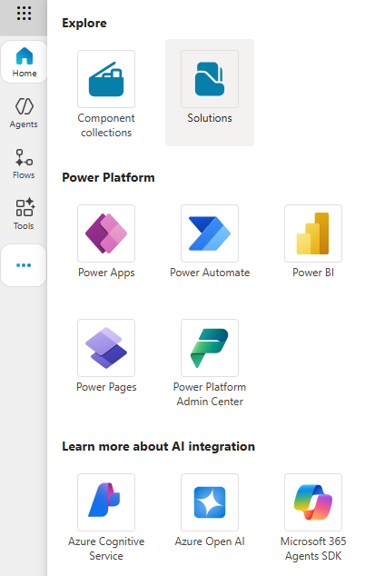

2. Verrà aperto il`Solution Explorer` premere `+ New solution`.

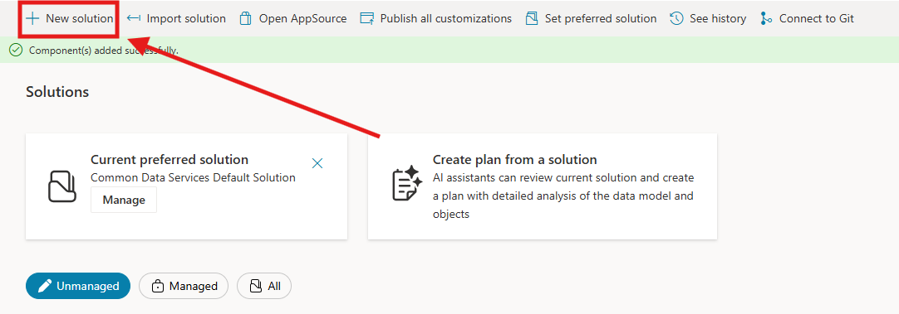

3. Il pannello`New solution` apparirà e sarà possibile definire i dettagli della`Solution`. Prima di fare ciò è necessario creare un nuovo`Publisher`, selezionare `+ New publisher`.

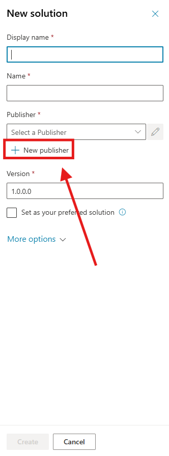

4. La Tab `Properties`del nuovo `Publisher`apparirà con campi da compilare nella scheda `Properties`.

Qui è possibile delineare i dettagli del `Publisher`che verranno utilizzati come etichetta o marchio per identificare chi ha creato o possiede la `Solution`.

5. Compilare come in figura i dettagli del Publisher 

	- Display Name: `CSM Solutions`
	- Name: `CSMSolutions`
	- Description: `Copilot Studio Masterclass`
	- Prefix: `csm`
	- Prefix value: `77000`

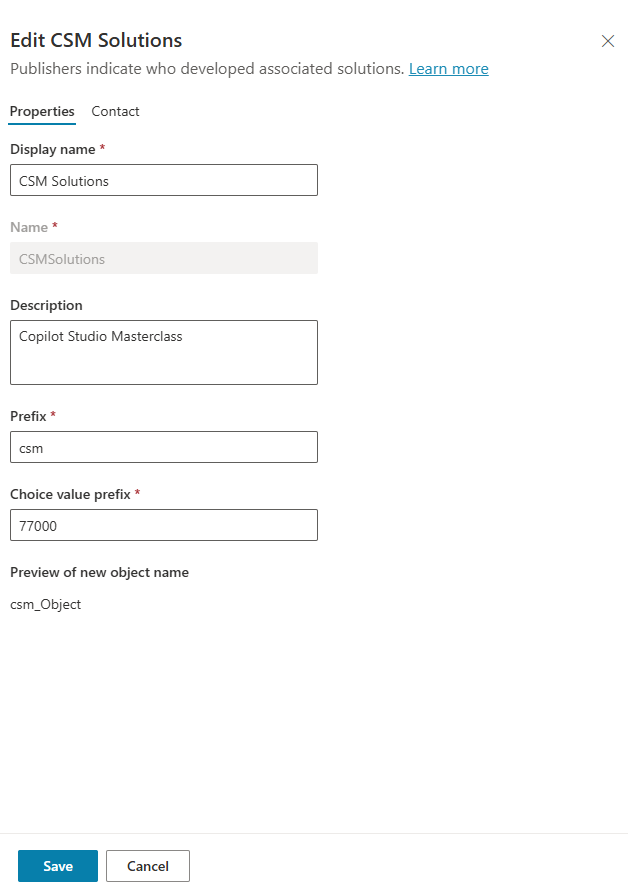

6. Premere `Save` per creare il `Publisher`.

7. La pagina `New publisher` verrà chiusa e il riquadro `New solution` si aprirà con il Publisher appena creato selezionato.

8. Compilare i dati mancanti nella Solution con i seguenti dati:

Display Name:

```
CSMFirstAgent
```

Name:

```
CSMFirstAgent
```

9. Visto che è stata creata una nuova `Solution` il  [**Version** number](https://learn.microsoft.com/power-apps/maker/data-platform/update-solutions#understanding-version-numbers-for-updates/?WT.mc_id=power-172615-ebenitez) di default sarà`1.0.0.0`.

10. Selezionare il`Set as your preferred solution` checkbox.

11. Espandere `More Options` per vedere dettagli aggiuntivi della `Solution`,lasciare i campi bianchi per questo lab.

12. Premere `Create`.

La soluzione `CSMFirstAgent` è stata creata. 
Non saranno presenti `components` finché non verrà creato un agente in Copilot Studio. Selezionare l’icona della `Back Arrow` per tornare al Solution Explorer.
La `Current preferred Solution` risulta essere `CSMFirstAgent` in quanto in precedenza è stata selezionata la casella di controllo **Set as your preferred solution**.

>[!NOTE]
>**Info**
>
>Una best practice consiste nel creare una nuova solution ogni volta che viene sviluppato un nuovo agente.
## Creazione del primo Agente

Questo laboratorio ha l’obiettivo di guidare alla creazione del primo agente utilizzando Copilot Studio. L’attività è pensata come un primo approccio pratico alla piattaforma.

Nel corso del laboratorio viene creato un agente minimale, privo di connettori, azioni o fonti esterne. L’agente si basa unicamente sulle istruzioni fornite, che ne definiscono lo scopo, il tono e le modalità di interazione con l’utente.

1. Dalla home page di  [Copilot Studio](https://copilotstudio.microsoft.com/) premere **Agents**

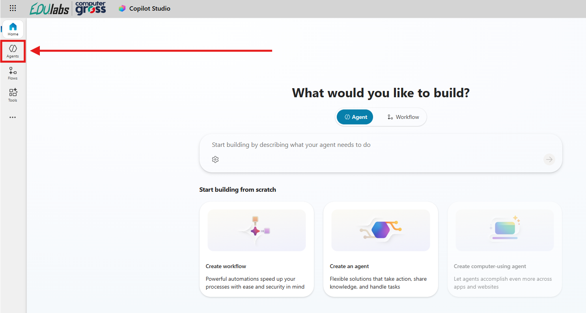

2. Nella schermata **Agents** è possibile visualizzare la lista completa degli agenti creati nel' Environment, proseguire inserendo la descrizione del primo agente:

```
Crea un agente chiamato IT Support con descrizione "Assistente di supporto IT di primo livello per l’azienda Zava". Deve fornire supporto tecnico di base usando un linguaggio semplice e porre domande solo se strettamente necessario. Non può recuperare password, bypassare MFA, sbloccare account o fornire codici. Il tono deve essere sempre professionale, calmo e neutro.
```


 3. Aspettare che Copilot Studio termini il setup dell'agente, e esplorare la schermata di personalizzazione dell'Agent.

4. Come ultima aggiunta premere **Add knowledge** nel box Knowledge e inserire come fonte di conoscenza il seguente Url selezionando **Public website** all'apertura del wizard:

```
https://support.microsoft.com
```

7. Salvare la fonte di conoscenza.

Terminato quest'ultimo passaggio premere in alto a destra il tasto **Test** che aprirà una schermata intitolata "Test your Agent" dove è possibile interagire con l'agente prima di pubblicarlo.
Testare a piacere il funzionamento dell'Agent appena creato.

>[!IMPORTANT]
>**Lab Completato**
>
>Con questo ultimo passaggio, il laboratorio per la creazione del primo agente in Copilot Studio è completato.


