# Lab 02 - Knowledge Sources

[Previous: Lab 01](../01-environment-setup/README.md) | [Back to README](../../README.md) | [Next: Lab 03](../03-ticket-agent-topics/README.md)

## Prerequisiti 

### Creazione Sito SharePoint

Questo Lab affronta varie tipologie di Knowledge Base fra cui SharePoint, perciò è necessario creare un sito SharePoint seguendo questi step:

1. Andare su [Microsoft 365](https://m365.cloud.microsoft/), accedere con il proprio account aziendale/scolastico,  premere su `Apps` e selezionare `All Apps`.

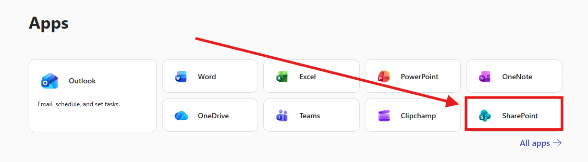

2. Selezionare `SharePoint`, successivamente premere su `Create Site` -> `Team Site` -> `From Microsoft` -> `Standard Team`-> `Use Template`.

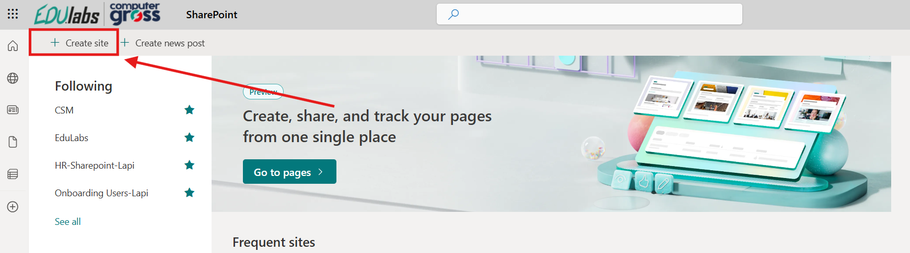

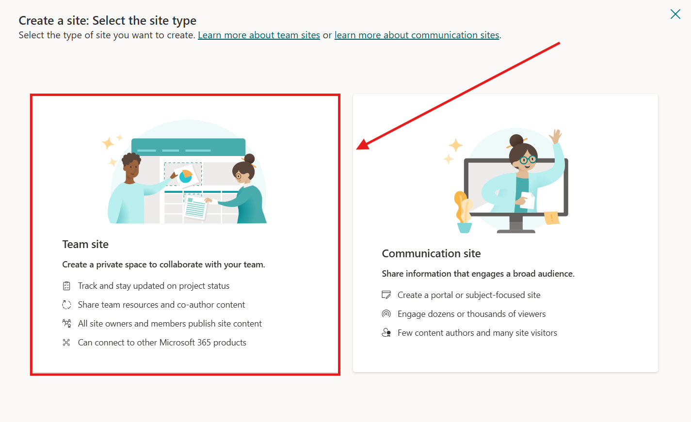

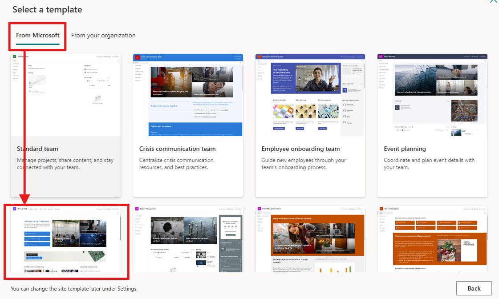

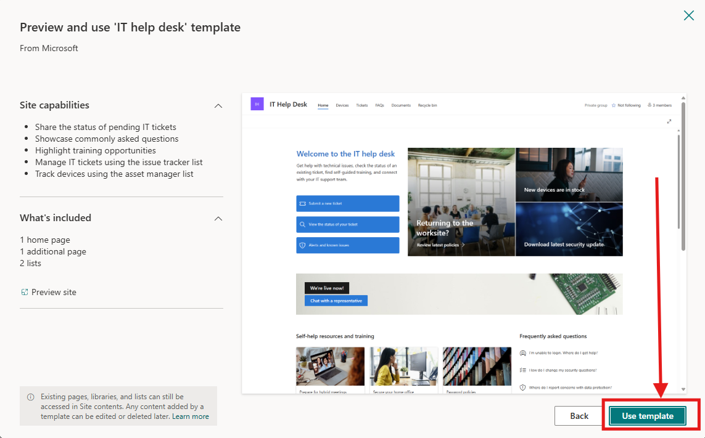

3. Ora aggiungere i dettagli del sito SharePoint elencati qui sotto e premere su `Next`.

| Field            | Value                      |
| ---------------- | -------------------------- |
| Site name        | Help Desk CSM              |
| Site description | Copilot Studio Masterclass |
| Site address     | HelpDeskCSM                |

4. Andare avanti premendo su `Create site` e `Finish`, senza aggiungere altro.

5. Andare in `Documents`, premere + Upload, e successivamente selezionare i seguenti file:

[Zava_Help_Desk_Playbook.docx](./files/Zava_Help_Desk_Playbook.docx)
[Zava_Incident_report_Template_Example.docx](./files/Zava_Incident_report_Template_Example.docx)
[Zava_Help_Desk_SLA.docx](./files/Zava_Help_Desk_SLA.docx)

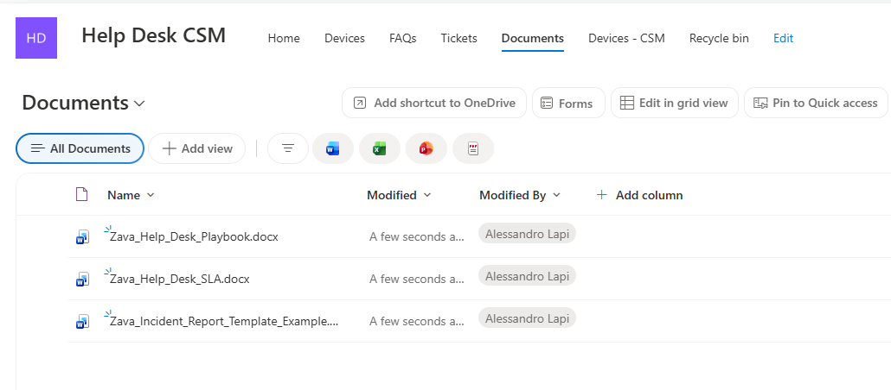
## Upload di Documenti come KB

1. Dalla schermata `Home` di Copilot Studio selezionare `Agents`.

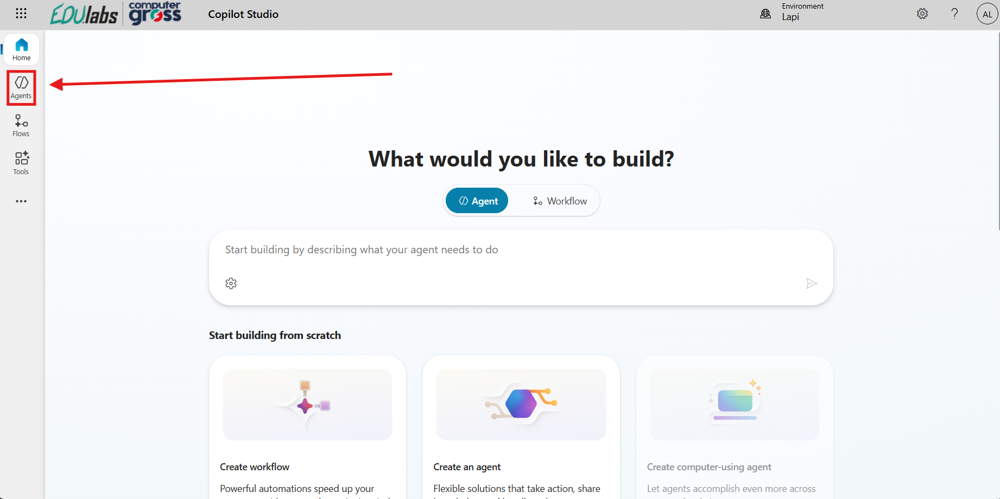

2. Cercare l'Agente creato nel `Lab 1` e aprire la pagina di configurazione.

3. Selezionare `Knowledge` nel menu in alto adiacente al Nome dell'Agente.

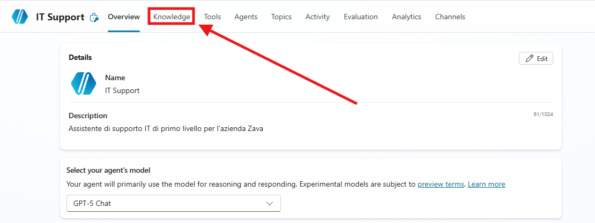

4. Premere su `+Add knowledge`.

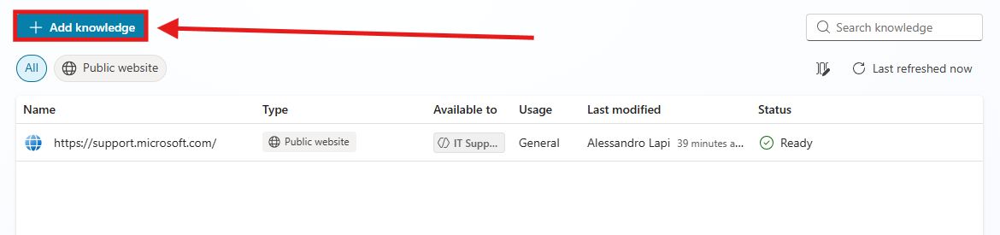

5. Una volta premuto apparirà una schermata per aggiungere all'agente fonti di conoscenza.

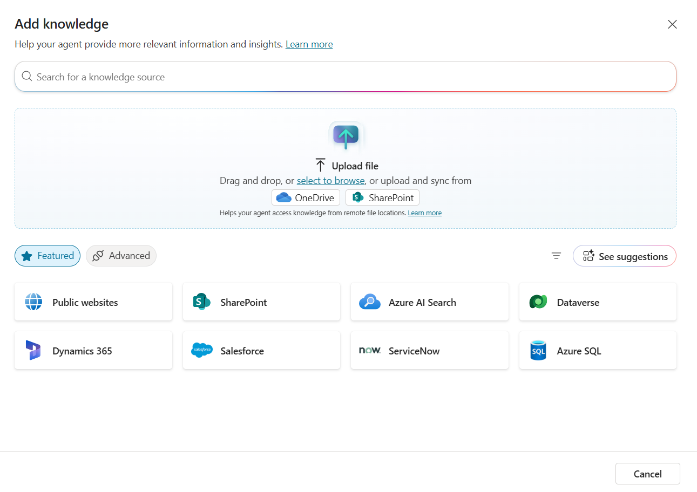

>[!NOTE]
>**Info**
>La dimensione massima dei file da uploadare è 512MB e il numero massimo di URL per siti pubblici è 4. Per controllare altre specifiche tecniche andare su [Quotas and limits - Microsoft Copilot Studio | Microsoft Learn](https://learn.microsoft.com/en-us/microsoft-copilot-studio/requirements-quotas)

6. Premere su `Upload`, verrà aperta una finestra del File Explorer, nella quale selezionare i seguenti Documenti: 

[Zava_KB_Reset_M365_Password.docx](./files/Zava_KB_Reset_M365_Password.docx)

>[!NOTE]
>Gli agenti di Copilot Studio richiedono la [Dataverse search](https://learn.microsoft.com/en-us/microsoft-copilot-studio/knowledge-add-file-upload) per utilizzare questa fonte di conoscenza. Se non puoi aggiungere file Dataverse a un agente, chiedi all’amministratore di attivare la `Dataverse search` nel tuo `Enviroment`.

7. Modificare la `Description` con il seguente testo:

```
Usa questa Knowledge quando un Utente vuole resettare la Password.
```

8. Per evitare che l'agente riporti informazioni trovate sul Web e quindi procedure non conformi all'azienda è necessario disattivare la Web Search.

9. Andare sui Settings.

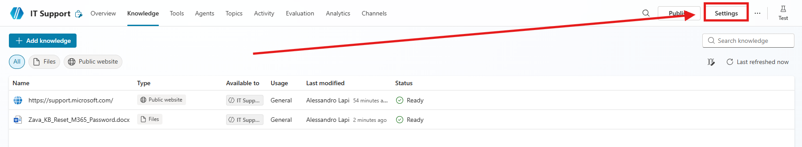

10. Nella sezione Generative AI cercare il paragrafo Knowledge, disattivare "Use general Knowledge", "Use information from the Web" e Salvare le impostazioni.

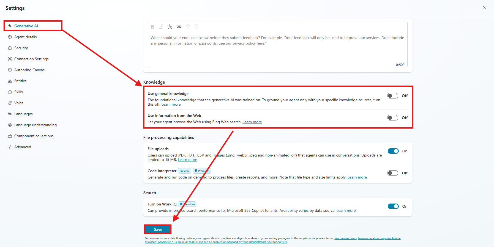

>[!TIP]
>Disattivare la General Knowledge e la Web Search permette all'agente di focalizzarsi solo sui dati che andiamo a fornire, andando così a limitare il rischio di allucinazione.


11. Testare l'aggiunta della knowledge dalla chat di `test`, premere su `start a new session` e incollare la seguente domanda:

```
Come posso resettare la Password?
```

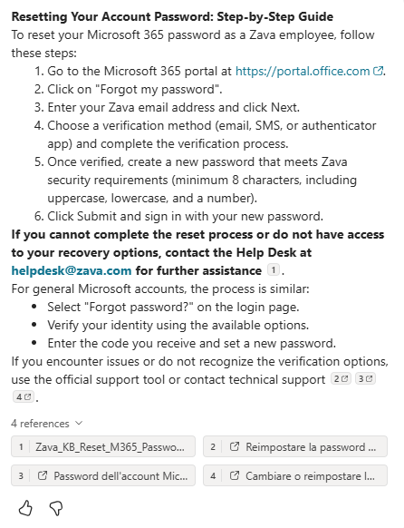

12. Notare come l'agente ha utilizzato il documento e lo ha riportato nelle references della risposta data.

## Files Group come KB

1. Selezionare `Knowledge` nel menu in alto adiacente al Nome dell'Agente, premere su `+Add knowledge`.

2. Una volta premuto apparirà la schermata per aggiungere all'agente fonti di conoscenza, premere `Upload` e selezionare questi file :

[Zava_Guida_VPN_v1.docx](./files/Zava_Guida_VPN_v1.docx)
[Zava_Guida_VPN_v2.docx](./files/Zava_Guida_VPN_v2.docx)
[Zava_Guida_VPN_v3.docx](./files/Zava_Guida_VPN_v3.docx)

3. Al posto di premere su **Add to agent** selezionare  **Upload as a group**.

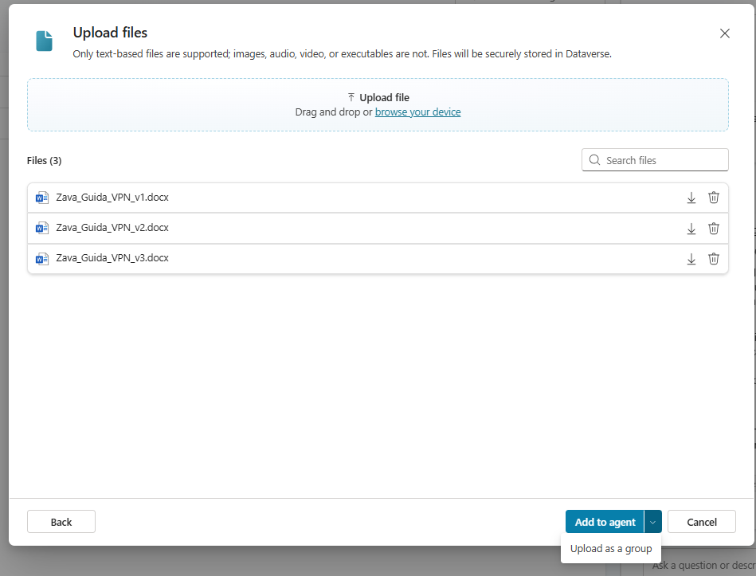

>[!NOTE]
>Per sapere i limiti o eventuali informazioni aggiuntive sui Files Group visitare la [Documentazione](https://learn.microsoft.com/en-us/microsoft-copilot-studio/knowledge-file-group)

4. Successivamente modificare il `Name` e la `Description` con :

```
VPN Guide
```

```
Contiene le guide di installazione e utilizzo per la VPN ZavaSecure. Utilizza la versione più aggiornata (v3), a meno che non sia richiesta una versione diversa.
```

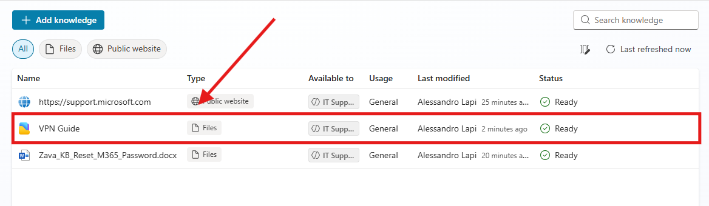

6. Aspettare che il Files Group diventi **Ready** e aprirlo per modificarne i dettagli.

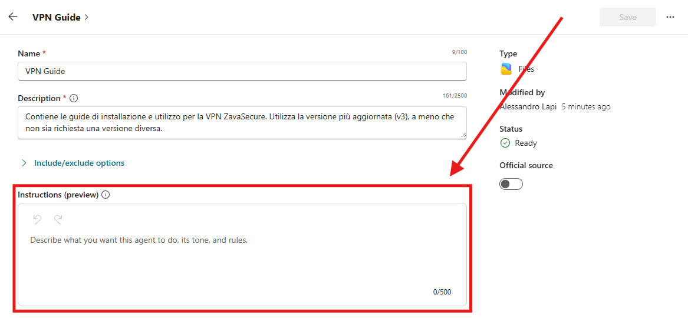

7. Aggiungere le `Instructions`:

```
I documenti sono denominati `Zava_Guida_"topic"_vX`, dove X indica la versione (più basso = più vecchio). **Utilizza sempre la versione più recente disponibile** per fornire le istruzioni. Non utilizzare versioni precedenti **a meno che l’utente non lo richieda esplicitamente**. Verifica il numero di versione e l’argomento prima di rispondere e specifica all’utente se stai utilizzando la guida più aggiornata disponibile.
```

8. Salvare il Files group.

9. Testare l'aggiunta della knowledge dalla chat di `test`, premere su `start a new session` e incollare la seguente domanda:

```
Come configuro la VPN secondo la guida del 2022?
```

## Sito SharePoint come KB

1. Selezionare `Knowledge` nel menu in alto adiacente al Nome dell'Agente.


2. Premere su `+Add knowledge`.

>[!NOTE]
>**Nota:**
>Alcune Knowledge Base, come SharePoint e Dataverse, richiedono l'autenticazione dell'utente. Questo significa che l'agente farà riferimento, nelle sue risposte, solo ai dati che l'utente è autorizzato a visualizzare.
>

3. Selezionare `SharePoint`.

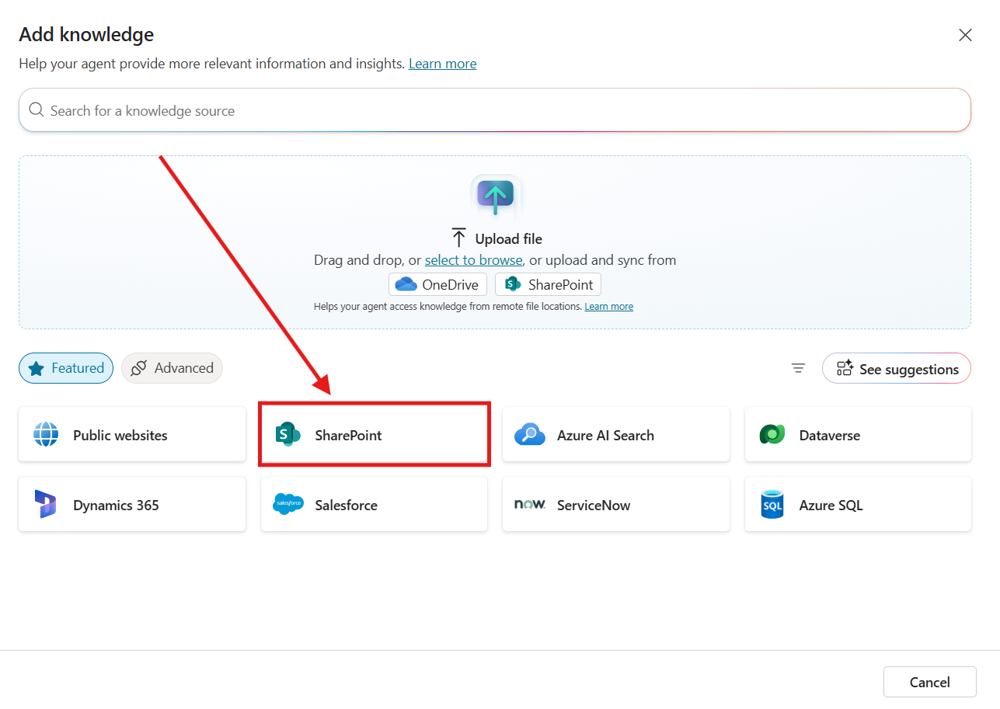

5. Premere su `Browse Item`.

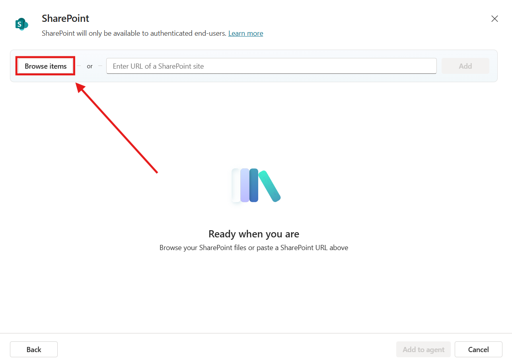

6. Cercare il sito SharePoint `Help Desk CSM`.
   
7. Selezionare `Documents`, e premere `Confirm Selection`.

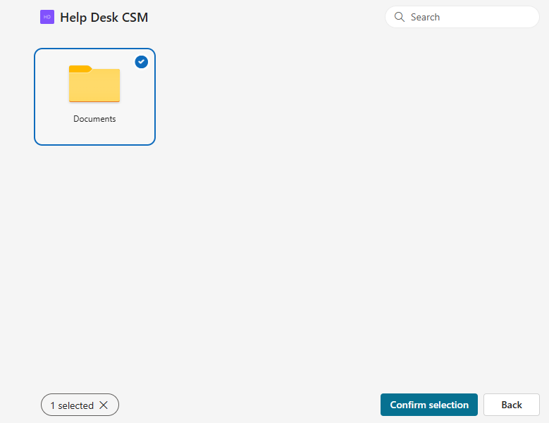

8. Aggiornare la Descrizione della Knowledge con la seguente:

```
Documentazione essenziale e risorse per supportare la gestione dei servizi IT e l’assistenza agli utenti finali.
```

> [!TIP]
> **Tip**
> L'aggiunta di una descrizione aiuta l'Agente a identificare meglio quale fonte utilizzare in base alla richiesta posta dall'utente.
> 

11. Testare l'aggiunta della knowledge dalla chat di `test`, premere su `start a new session` e incollare la seguente domanda:

```
Quali sono gli orari standard rispetto alla disponibilità del supporto di emergenza?
```

> [!TIP]
> Per ulteriori informazioni sulle Knowledge Base consultare la [Documentazione](https://learn.microsoft.com/en-us/microsoft-copilot-studio/knowledge-copilot-studio)

>[!IMPORTANT]
>**Lab Terminato**
>Con questo ultimo passaggio, il laboratorio per l'aggiunta di Knowledge al nostro Agente è completato.

