# Lab 03 - Ticket Agent Topics

[Previous: Lab 02](../02-knowledge-sources/README.md) | [Back to README](../../README.md) | [Next: Lab 04](../04-job-posting-tools/README.md)

## Creazione Agente Ticket

Questo laboratorio ha l’obiettivo di guidare alla creazione del primo Topic utilizzando un nuovo agente per avere un maggiore controllo sul comportamento. 

Nel corso del laboratorio viene creato un agente vuoto, privo di connettori, azioni o fonti esterne. L’agente si basa unicamente sulle istruzioni fornite e su i Topics.

1. Dalla home page di  [Copilot Studio](https://copilotstudio.microsoft.com/) premere **Agents**


2. Nella schermata **Agents** è possibile visualizzare la lista completa degli agenti creati nel' Environment, proseguire premendo **Create blank agent** .

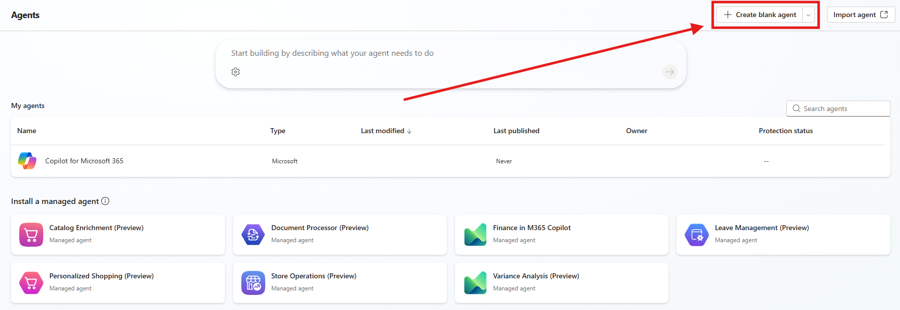

3. Copilot Studio procederà con la creazione dell' agente vuoto, per effettuare modifiche aspettare il seguente Messaggio:


### Dettagli e Istruzioni

Inserire alcuni dettagli all'agente e delle istruzioni molto basilari, il focus di questo Lab è lavorare con i Topic per gestire flussi di conversazione.

- Name: `Help Desk`
- Description: 

```
Un Help Desk Agent fornisce supporto tecnico di primo livello agli utenti identificando e risolvendo problematiche Hardware, Software e di rete.
```

- Istructions:

```
## Obiettivo

L’Help Desk Agent fornisce supporto tecnico di primo livello utilizzando esclusivamente i Topic predefiniti disponibili.

## Limitazioni

- Non improvvisare soluzioni tecniche.
- Non fornire supporto al di fuori delle categorie disponibili.
```


## Creazione del Primo Topic


1. Nel menù dell'Agente premere su `Topics`.

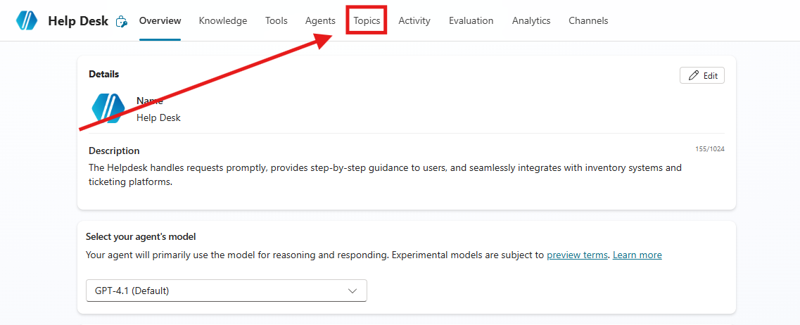

2. Premere `Add a topic` e successivamente `From blank`.

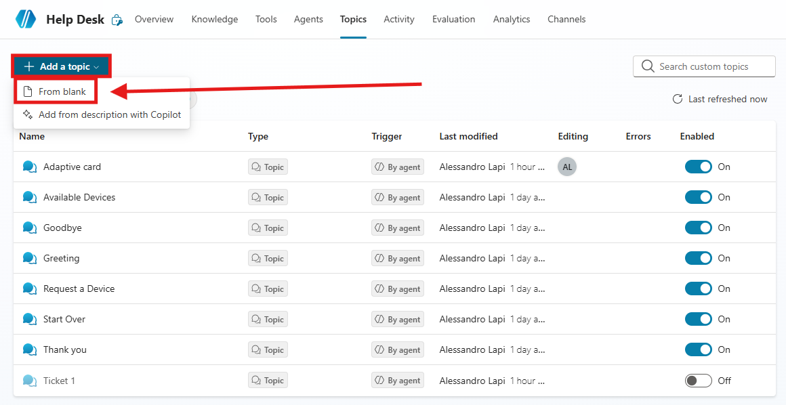

3. Per prima cosa cambiare il nome del `Topic`, selezionando `Untitled` in alto a sinistra e inserendo il seguente nome:

```
First Topic - Supporto Tecnico
```

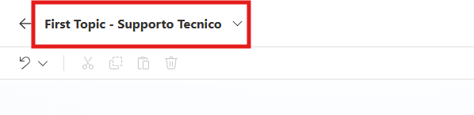

5. Ora aggiugere il `trigger` con la seguente descrizione:

```
Questo topic gestisce le richieste di assistenza relative a problematiche tecniche segnalate dagli utenti durante l’utilizzo di strumenti, applicazioni o servizi aziendali.
```

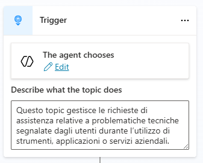


6. Sotto al `Trigger` premere su `+Add Node`

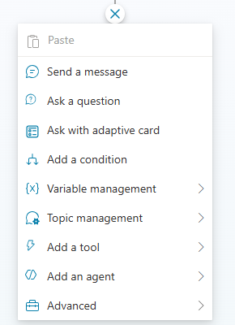

7. Selezionare `Ask a question` e inserire nel corpo il seguente messaggio:

```
Salve User.DisplayName ,
potresti identificare la tipologia di problema?
```

3. Aggiungere *User.DisplayName* premendo il simbolo `{x}`.

>[!NOTE]
>In questo lab vegono citate e utilizzate le Variabili, presenti in Copilot Studio. Per avere maggiori informazioni sul funzionamento, la tipologia e la creazione di variabili visitare la [Documentazione](https://learn.microsoft.com/en-us/microsoft-copilot-studio/authoring-variables?tabs=webApp)

4. Su Identify selezionare `Multiple choice options` 

5. Inserire nuove opzioni di risposta:

- `Hardware Issues`
- `Software Issues`
- `Network Issues`

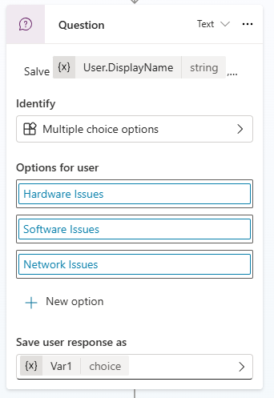

6. Modificare il nome della variabile del nodo. Per fare ciò premere sulla variabile.

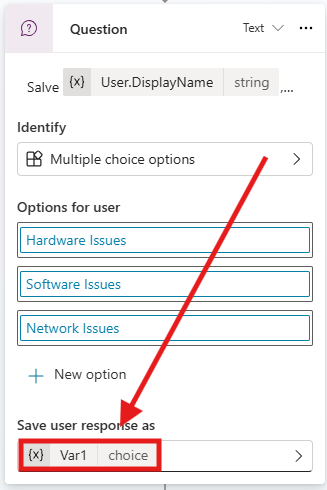

7. Nelle Variable Properties modificare il nome in Issue e fare caso ai vari settaggi della variabile

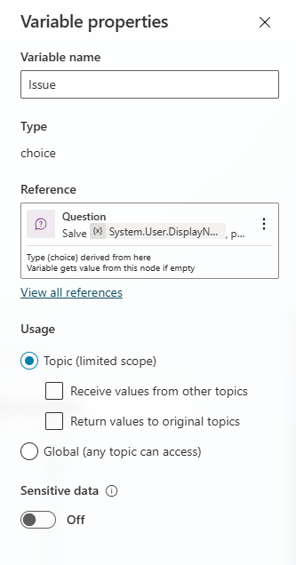

3. Notare come Copilot Studio crea in automatico le `Conditions` per ogni caso possibile.

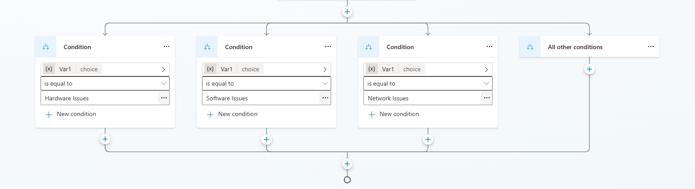

4. Sotto ogni opzione premere `Add a node` e selezionare `Send a message`.
5. Sotto a hardware issue inserire:

```
🔧 Problema Hardware rilevato. Segui questi passaggi di troubleshooting:

1. Controlla che tutti i cavi siano collegati correttamente. 
2. Riavvia il dispositivo. 
3. Controlla eventuali segni di surriscaldamento o rumori anomali.
4. Scollega e ricollega le periferiche esterne (mouse, tastiera, monitor).
5. Prova con un altro cavo di alimentazione o adattatore.
6. Verifica che RAM o disco siano installati correttamente.
7. Esegui la diagnostica hardware (se disponibile).
```

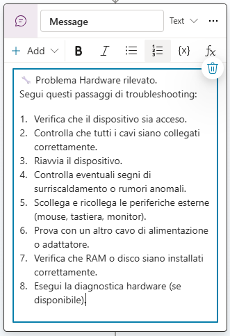

7. Ripetere il processo per le varie opzioni con i seguenti messaggi:

- Software:

```
💻 Problema Software rilevato.
Segui questi passaggi di troubleshooting:

1. Chiudi e riapri l’applicazione.
2. Riavvia il computer.
3. Verifica la presenza di aggiornamenti software.
4. Disinstalla e reinstalla l’applicazione.
5. Controlla i requisiti di sistema.
6. Verifica eventuali messaggi di errore.
7. Aggiorna i driver del dispositivo.
8. Esegui una scansione antivirus/malware.
```

- Network:

```
🌐 Problema di Rete rilevato.
Segui questi passaggi di troubleshooting:

1. Controlla che il cavo di rete sia collegato.
2. Riavvia il router o il modem.
3. Verifica che il Wi-Fi sia attivo.
4. Controlla la configurazione IP (ipconfig).
5. Testa la connessione con il comando ping.
6. Svuota la cache DNS.
7. Disattiva temporaneamente la VPN.
8. Controlla le impostazioni del firewall.
```

>[!TIP]
>L’utilizzo di Topic strutturati per la gestione di Conversazioni consente di garantire risposte standardizzate, coerenti e conformi alle policy IT aziendali.  
>A differenza delle risposte generative del modello AI, l’approccio deterministico riduce il rischio di suggerimenti non accurati o non autorizzati.

8. Premere `Add node` sotto `All other conditions` 

9. Selezionare `Topic Management`,  `Go to another topic` e infine `Escalate`.

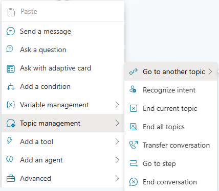

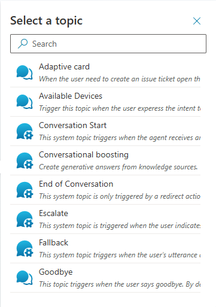

10. Alla chiusura delle conditions premere `Add node`

11. Selezionare `Topic Management` e `End current topic`

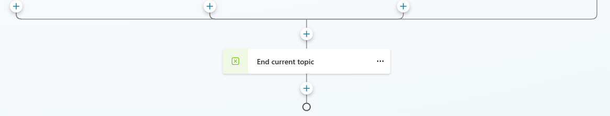

12. Salvare il `Topic` e aprire la finestra di test.

> [!TIP]
> Ricordarsi di premere su `start a new session`, perché facendolo la chat di Test si aggiornerà con le ultime modifiche fatte all'Agente.

13. Inserire la seguente richiesta:

```
Ho un problema tecnico
```

14. Continuare il dialogo con l'agente e vederne il funzionamento.

## Creazione Del Topic con Adaptive Card

1. Andare su [Copilot Studio](https://copilotstudio.microsoft.com/) nella sezione `Agents` selezionare l'Agente `Help Desk ` . Nel menù dell'Agente premere su `Topics`.


2. Premere `Add a topic` e successivamente `From blank`.


3. Per prima cosa cambiare il nome del `Topic`, selezionando `Untitled` in alto a sinistra e inserendo il seguente nome:

```
Ticket Card
```

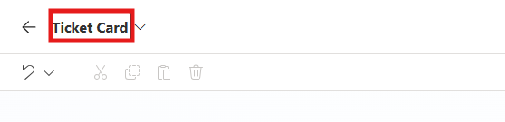

4. Ora aggiungere il `trigger` con la seguente descrizione:

```
Questo Topic guida gli utenti verso la creazione di un ticket di support per il reparto IT.
```

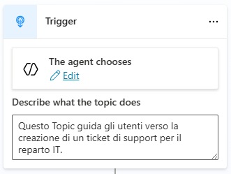

5. Premere su `Add Node` (l'icona + sotto a trigger) e selezionare `Ask with adaptive card`.

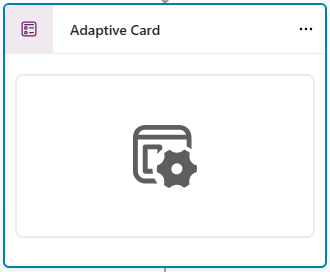

>[!NOTE]
>**Tips**
>
> Puoi personalizzare le adaptive card direttamente da Copilot Studio o tramite siti esterni come [Designer Adaptive Cards](https://adaptivecards.io/designer/)

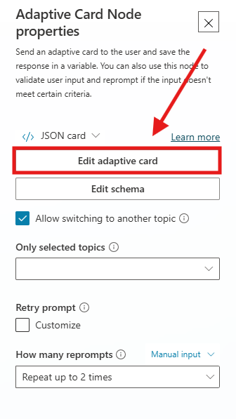

6. Aprire i dettagli dell'Adaptive card, premere **Edit adaptive card** 

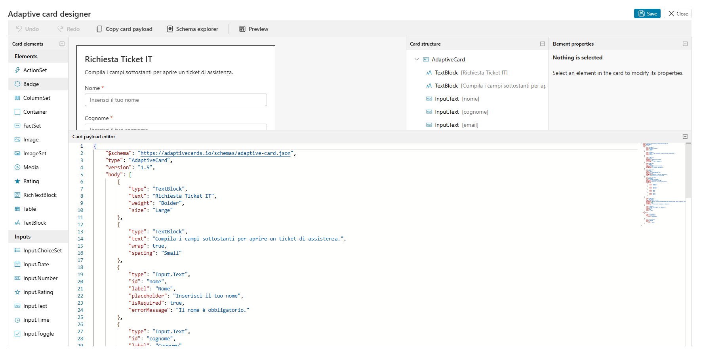

7. Si aprirà l'Adaptive card Designer,

L’**Adaptive Card Designer** consente di progettare una scheda e visualizzarne il design in tempo reale.

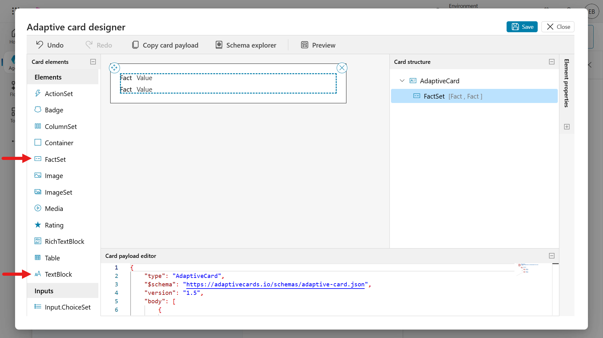

Trascinando gli elementi della scheda **TextBlock** e **FactSet** nell’area di creazione, ovvero il visualizzatore della scheda, si noterà che la struttura della scheda e l’editor del payload si aggiornano automaticamente con l’aggiunta dei due elementi. È possibile aggiornare direttamente sia l’editor del payload della scheda sia il riquadro delle proprietà degli elementi.

Selezionando **Preview** è possibile visualizzare la scheda con larghezze diverse.

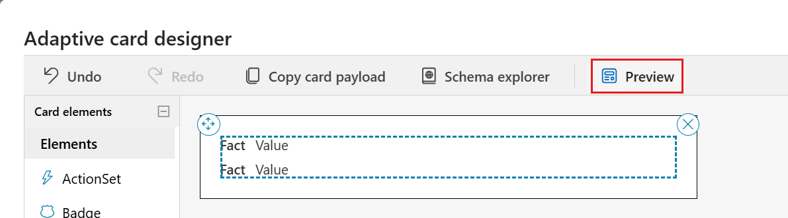

Verrà caricata l’anteprima, nella quale saranno mostrati diversi output della scheda in base alla larghezza.

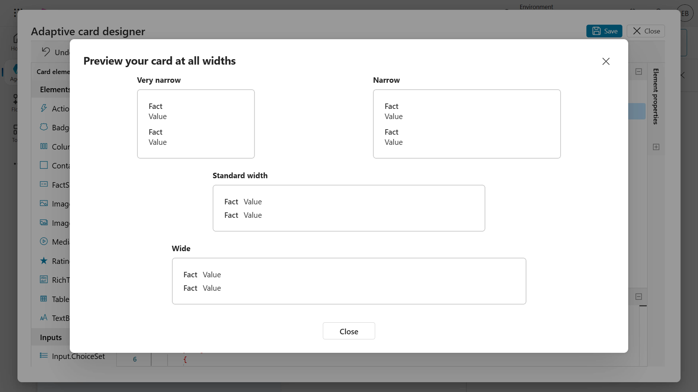

Per uscire dall’anteprima, selezionare l’icona **X** e utilizzare il comando **Undo** nel designer per rimuovere i due elementi della scheda precedentemente aggiunti.

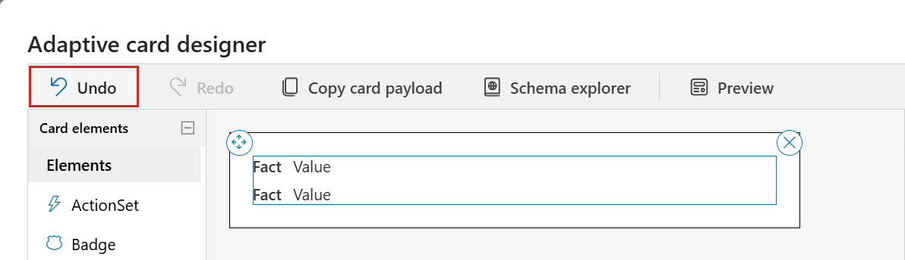


8. Accedere all’editor del **Card payload** e selezionare tutte le righe utilizzando la combinazione di tasti **Ctrl + A** su Windows oppure **Command + A** su Mac, quindi eliminare le righe selezionate. Successivamente, incollare il codice **JSON**.

```
{
    "$schema": "https://adaptivecards.io/schemas/adaptive-card.json",
    "type": "AdaptiveCard",
    "version": "1.5",
    "body": [
        {
            "type": "TextBlock",
            "text": "Richiesta Ticket IT",
            "weight": "Bolder",
            "size": "Large"
        },
        {
            "type": "TextBlock",
            "text": "Compila i campi sottostanti per aprire un ticket di assistenza.",
            "wrap": true,
            "spacing": "Small"
        },
        {
            "type": "Input.Text",
            "id": "nome",
            "label": "Nome",
            "placeholder": "Inserisci il tuo nome",
            "isRequired": true,
            "errorMessage": "Il nome è obbligatorio."
        },
        {
            "type": "Input.Text",
            "id": "cognome",
            "label": "Cognome",
            "placeholder": "Inserisci il tuo cognome",
            "isRequired": true,
            "errorMessage": "Il cognome è obbligatorio."
        },
        {
            "type": "Input.Text",
            "id": "email",
            "label": "Email",
            "placeholder": "esempio@azienda.com",
            "style": "Email",
            "isRequired": true,
            "errorMessage": "Inserisci un indirizzo email valido.",
            "regex": "^[\\w.+-]+@([\\w-]+\\.)+[\\w-]{2,}$"
        },
        {
            "type": "Input.ChoiceSet",
            "id": "tipologia",
            "label": "Tipologia di problema",
            "placeholder": "Seleziona una tipologia",
            "isRequired": true,
            "errorMessage": "Seleziona una tipologia di problema.",
            "choices": [
                {
                    "title": "Hardware",
                    "value": "Hardware"
                },
                {
                    "title": "Software",
                    "value": "Software"
                },
                {
                    "title": "Rete",
                    "value": "Rete"
                },
                {
                    "title": "Altro",
                    "value": "Altro"
                }
            ]
        },
        {
            "type": "Input.Text",
            "id": "descrizione",
            "label": "Descrivi il problema",
            "isMultiline": true,
            "placeholder": "Fornisci una descrizione dettagliata del problema (sintomi, quando si verifica, eventuali messaggi di errore, ecc.)",
            "maxLength": 2000,
            "isRequired": true,
            "errorMessage": "La descrizione del problema è obbligatoria."
        },
        {
            "type": "TextBlock",
            "text": "I campi contrassegnati sono obbligatori.",
            "size": "Small",
            "isSubtle": true,
            "wrap": true,
            "spacing": "Small"
        }
    ],
    "actions": [
        {
            "type": "Action.Submit",
            "title": "Invia ticket",
            "data": {
                "action": "submitTicket"
            }
        },
        {
            "type": "Action.Submit",
            "title": "Annulla",
            "data": {
                "action": "cancel"
            }
        }
    ]
}
```

8. L'adaptive card verrà visualizzata in questo modo:

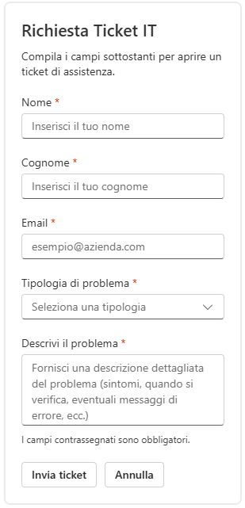

9. Sotto l'adaptive card premere `Add node`, selezionare `send a message`

10. Dentro il messaggio scrivere il seguente testo:

```
Il seguente Ticket è stato inviato al Reparto IT
```

11. Sempre all'interno del messaggio premere `+ Add `

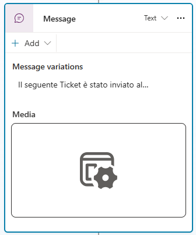

12. Selezionare `Adaptive card` e nella schermata di edit cambiare da Json a formula card.

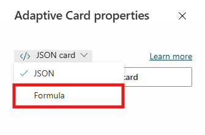

> [!NOTE]
> Nell'Adaptive card in Json non è possibile inserire variabili, quindi è necessario usare la  Formula Card scritta in [Power Fx](https://learn.microsoft.com/it-it/power-platform/power-fx/overview) 

13. Incollare la seguente card:

```
{ type: "AdaptiveCard", body: [ { type: "TextBlock", size: "Medium", weight: "Bolder", text: "Riepilogo dati inseriti" }, { type: "FactSet", facts: [ { title: "Nome", value: Text(Topic.nome) }, { title: "Cognome", value: Text(Topic.cognome) }, { title: "Email", value: Text(Topic.email) }, { title: "Tipologia di problema", value: Text(Topic.tipologia) }, { title: "Descrizione", value: Text(Topic.descrizione) } ] } ], '$schema': "http://adaptivecards.io/schemas/adaptive-card.json", version: "1.5" }
```

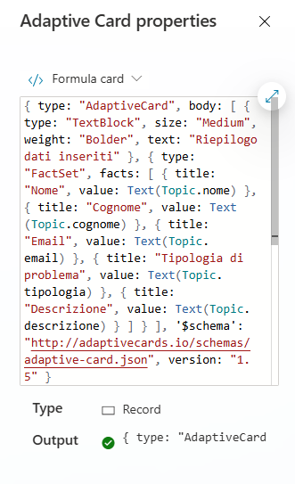

14. Dopo aver salvato il Topic premere il tasto Test e inserire la seguente richiesta:

```
Voglio aprire un ticket
```

15. Continuare il dialogo con l'agente e vederne il funzionamento del Topic.

> [!NOTE]
> Se l'agente riporta al topic errato è possibile disabilitare il primo topic creato tramite il checkbox nella sezione Topics. 


>[!IMPORTANT]
>**Lab Completato**
>
>Con questo ultimo passaggio, il laboratorio per la creazione dei Topics in Copilot Studio è completato.

