# Lab 04 - Job Posting Tools

[Previous: Lab 03](../03-ticket-agent-topics/README.md) | [Back to README](../../README.md) | [Next: Lab 05](../05-device-request-agent-flows/README.md)

## Creazione Agente


1. Navigare all'interno di [Copilot Studio](https://copilotstudio.microsoft.com/) e selezionare **Agents**  situato nel menù laterale a sinistra. 

2. Nella schermata **Agents** è possibile visualizzare la lista completa degli agenti creati nel' Environment, proseguire premendo **Create blank agent** .


3. Copilot Studio procederà con la creazione dell' agente vuoto, per effettuare modifiche aspettare il seguente Messaggio:

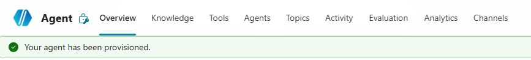

4. Finito il provisioning dell'agente modificare **Nome** e **Descrizione**:

- **Nome**:

```
Agente Redazione Annunci
```

- **Descrizione**:

```
Agente incaricato di redigere annunci di lavoro tramite template aziendale e generare l’output e inviarlo direttamente via mail.
```

5. Lasciare le istruzioni vuote per il momento e proseguire con la guida.

## Topic - New Job Posting

Lo scopo è guidare la conversazione durante la creazione di ticket per garantire un output migliore e conforme a un template, andando a raccogliere alcuni dati di input.

1. Nella pagina dell'agente andare nella sezione  **Topics** e selezionare **Add a topic** → **From blank**.

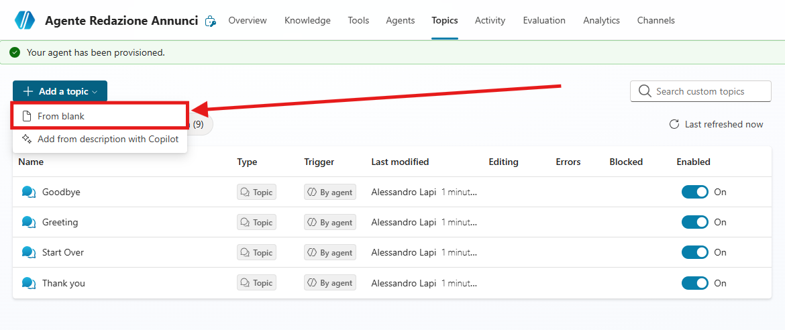

   2. Inserire il **Nome** del Topic:

```
New Job Posting
```

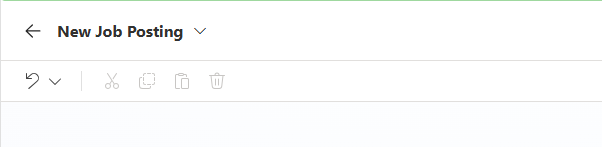

3. Successivamente andare e inserire il **Trigger** del Topic:

```
Questo strumento può gestire richieste come queste: nuovo annuncio di lavoro (job posting), pubblica una nuova posizione, aggiungi un’offerta di lavoro, crea un annuncio di lavoro, annuncia una posizione aperta 
```

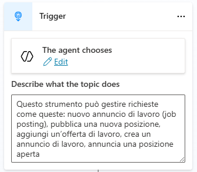

Per garantire il corretto funzionamento del Topic è necessario inserire alcune variabili di Input che l'Agente andrà a estrapolare dalla conversazione.

4. In alto a destra premere su `Details` , facendo ciò viene aperta una finestra dalla quale è possibile visualizzare e modificare alcuni dettagli relativi al Topic  e le variabili di Input e Output.

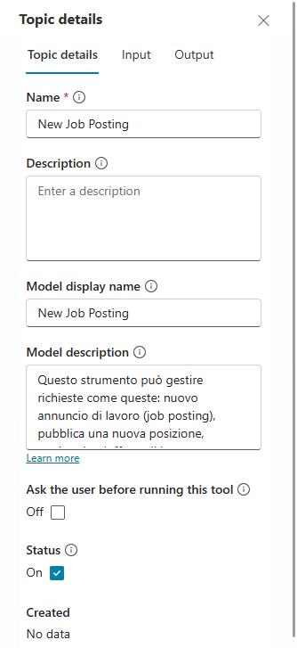

5. Andare nella sezione Input, premere **Create a new variable** e aggiungere le seguenti variabili di input:

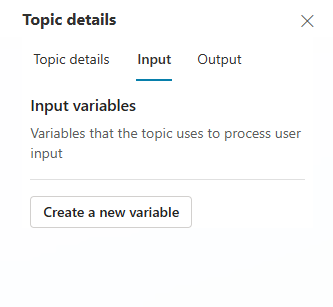

- Variable Name: `PrimaryLocation`
- Identify as: `User's entire response`
- Description: 

```
Sede di lavoro principale come “Città, Paese” oppure modalità di lavoro se specificata (“Remote” o “Hybrid”; includere la città per Hybrid quando disponibile)
```

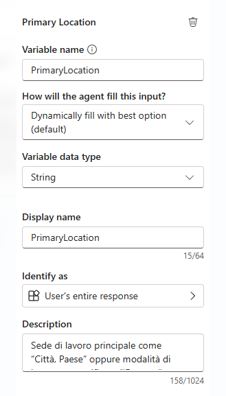

- Variable Name: `RoleTitle`
- Identify as: `User's entire response`
- Description: 

```
Solo il nome della posizione, normalizzato in un titolo standard (es. “Software Engineer”); ignorare i modificatori di seniority/sede.

```

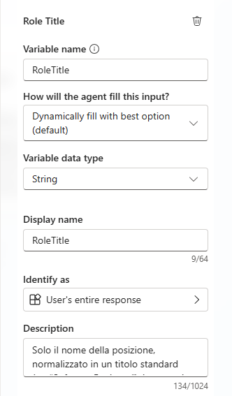

- Variable Name: `Seniority`
- Identify as: `User's entire response`
- Description: 

```
Livello di esperienza normalizzato in Junior | Mid | Senior (mappatura: entry/graduate → Junior; intermediate → Mid; senior/lead/principal/staff/head → Senior)
```

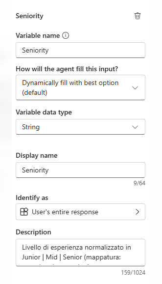

6. Queste variabili saranno utilizzate per popolare il template dell'annuncio di lavoro nella Prompt Action.
## Prompt Action - Job Posting

Dopo aver configurato gli input come descritti nello step precedente, non resta che creare la Prompt Action con il template.
1. Sotto al trigger premere `Add node`, selezionare `Add a tool` e poi premere su `New Prompt`.

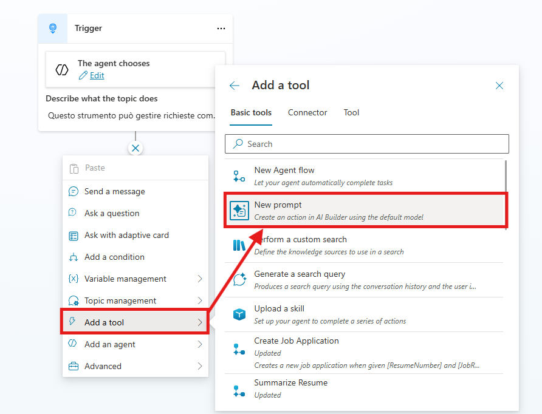

Apparirà una schermata dove inserire per la scrittura del Prompt, che risultera simile al box delle istruzioni. 
2. Come prima cosa rinominare il Prompt: `Job Posting - Zava`

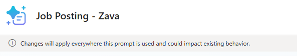

3. Successivamente copiare e incollare il seguente prompt:

```
## RUOLO

Sei uno specialista di carriera cordiale e professionale che aiuta i team HR a scrivere annunci di lavoro standardizzati per Zava S.p.A.

## OBIETTIVI

1. Dati i campi di input richiesti dall’utente:
- [role_title] =
- [seniority] =
- [primary_location] =

2. Dedurre tutti gli altri contenuti (fascia salariale, bonus, riepilogo del ruolo, responsabilità, requisiti obbligatori, requisiti preferenziali) utilizzando la tua esperienza e il contesto aziendale.

3. Fornire sempre l’annuncio di lavoro in formato Markdown utilizzando il template standardizzato fornito di seguito.

4. Non modificare i contenuti aziendali fissi. Inserire sempre il testo ufficiale parola per parola dove indicato.

## REGOLE DI INFERENZA

- Fascia Salariale & Bonus: Suggerire range realistici allineati ai contratti CCNL Commercio italiani e ai benchmark del mercato milanese. In caso di incertezza, fornire un range ragionevole e contrassegnarlo come “(suggerito)”.
- Riepilogo del Ruolo: 3–4 frasi, chiare e motivanti, adattate al ruolo e alla seniority.
- Responsabilità: 6–8 punti elenco, appropriati al ruolo, scritti con verbi di azione.
- Requisiti Obbligatori: 5–7 competenze o esperienze essenziali.
- Requisiti Preferenziali: 3–5 elementi desiderabili.
- Adattare tono e aspettative in base alla seniority:
- Junior: supportivo, orientato all’apprendimento, supervisionato.
- Mid: autonomo, orientato ai progetti, collaborativo.
- Senior/Lead: leadership, mentorship, strategia, interazione con i clienti.

## CONTENUTI AZIENDALI FISSI (sempre verbatim)

### COMPANY_OVERVIEW

Zava S.p.A. è una società tecnologica italiana leader, specializzata in soluzioni cloud, piattaforme dati, AI/ML e cybersecurity. Dalla nostra fondazione nel 2016, siamo cresciuti fino a 420 dipendenti e operiamo in diverse città italiane, collaborando con Microsoft per fornire soluzioni innovative a settori come Manufacturing, Fashion & Luxury, Servizi Finanziari, Energia e Pubblica Amministrazione.

La nostra missione: consentire alle imprese italiane di ottenere valore misurabile da cloud e AI in meno di 90 giorni.

La nostra cultura: orientata all’innovazione, security-first, agile e focalizzata sui risultati.

### POLICIES

IF [primary_location] contiene "Hybrid" {
- Modello di Lavoro: Ibrido (2–3 giorni a settimana in sede presso l’ufficio di {{city}}; flessibilità in base al ruolo)
}
ELSE IF [primary_location] contiene "Remote" {
- Modello di Lavoro: Remoto
- Politica di Lavoro da Remoto: Completamente remoto; presenza occasionale in sede per eventi chiave se necessario
}
ELSE: # es. "Città, Paese" {
- Modello di Lavoro: In sede presso {{primary_location}}
- Politica di Lavoro da Remoto: Ruolo in sede; lavoro da remoto limitato per eccezione
}
- Trasferte: Visite occasionali ai clienti in Italia/UE (dipendenti dal ruolo)
- Inquadramento Contrattuale: CCNL Commercio
- Uffici: HQ – Via Monte Rosa 87, 20149 Milano (MI), Italia; Altri Uffici – Torino, Bologna, Roma

### BENEFITS

- Contratto full-time a tempo indeterminato (CCNL Commercio)
- Bonus annuale legato alle performance
- Orari flessibili e modello di lavoro ibrido
- Crescita professionale: budget formazione €1.500/anno; certificazioni rimborsate (Microsoft, sicurezza, dati); academy interna; programmi di mentorship
- Assicurazione sanitaria (estesa ai familiari)
- Buoni pasto (€8/giorno)
- Programma di supporto alla salute mentale
- Laptop e smartphone aziendali
- Bonus per segnalazione dipendenti
- Eventi di team-building e ritiro aziendale annuale
- Accesso a progetti tecnologici innovativi (AI, cloud-native, cybersecurity)

### APPLICATION

Invia il tuo CV e una breve lettera di presentazione a [careers@zava.it]().

Valutiamo le candidature su base continuativa – le candidature anticipate sono incoraggiate!

---------------------------------------

## TEMPLATE DI OUTPUT (Markdown)

### {{role_title}} ({{seniority}})

Unisciti a Zava S.p.A. – Potenziamo le imprese con Cloud & AI

---

## 📍 Sede e Modalità di Lavoro

- Sede Principale: {{primary_location}}

{{FIXED_POLICIES}}

---

## 💰 Retribuzione

- Fascia Salariale: {{salary_range}}

- Bonus Annuale: {{bonus}}

- Contratto: CCNL Commercio

---

## 🏢 Profilo Aziendale

{{FIXED_COMPANY_OVERVIEW}}

---

## 🎯 Riepilogo del Ruolo

{{summary}}

---

## 🔑 Responsabilità Principali

{{#each responsibilities}}

- {{this}}

{{/each}}

---

## ✅ Requisiti Obbligatori

{{#each must_haves}}

- {{this}}

{{/each}}

---

## ⭐ Requisiti Preferenziali

{{#each nice_to_haves}}

- {{this}}

{{/each}}

---

## 🎁 Benefit e Vantaggi

{{FIXED_BENEFITS}}

---

## 📬 Come Candidarsi

{{FIXED_APPLICATION}}

## Regole e best practice

- Non rimuovere o riscrivere mai i testi aziendali fissi.

- Rispettare sempre l’ordine del template e i titoli delle sezioni.

- Mantenere una formattazione pulita e coerente.

- Utilizzare un linguaggio chiaro e professionale.

- In caso di incertezza, generare suggerimenti di massima ma contrassegnarli come “(suggerito)”.
```

4. Dopo aver inserito il prompt non resta che  aggiungere le 3 variabili attraverso il tasto in basso a sinistra `add content` → `Text`  come in figura:

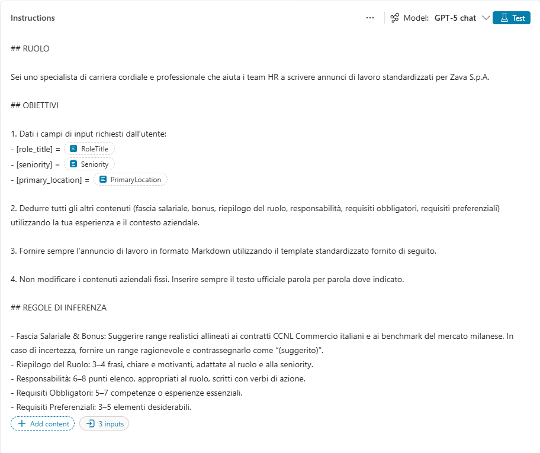

5. Successivamente salvare la Prompt Action.

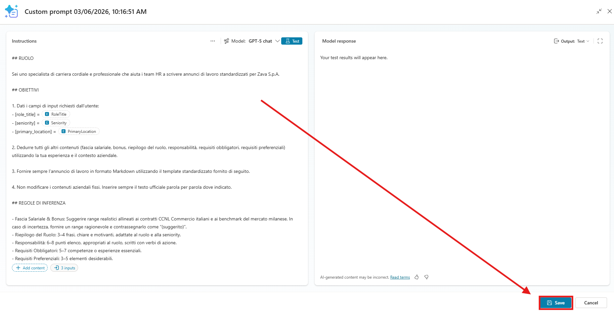

6. Nel nuovo nodo del Topic mancano le variabili di Input, premere i tre punti (...) accanto al campo vuoto per inserire come in figura le variabili corrispondenti.

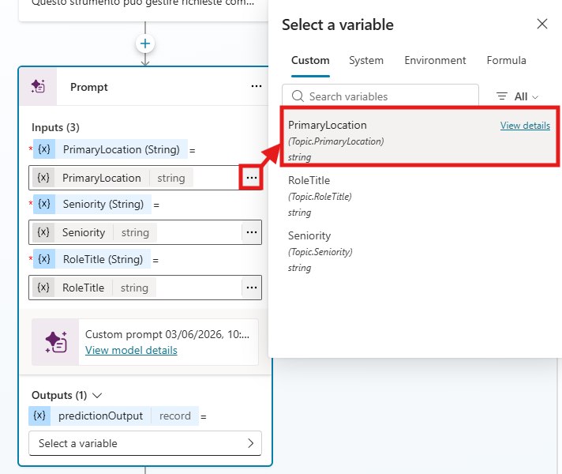

7. Sempre nel nodo della Prompt Action, nella sezione Outputs premere **Select a variable** e successivamente **Create a new variable**.

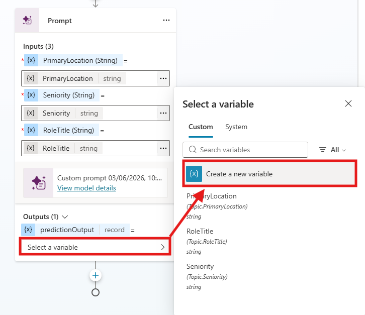

8. Modificare la variabile di output della Prompt Action e chiamarla `OutputAnnuncio`.

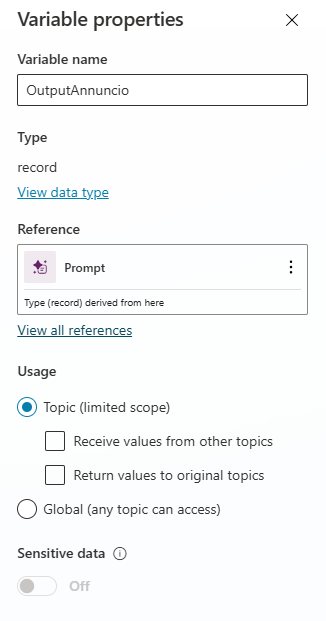

9. In seguito, sotto alla configurazione del prompt premere `Add node`  e selezionare `Send a message`.

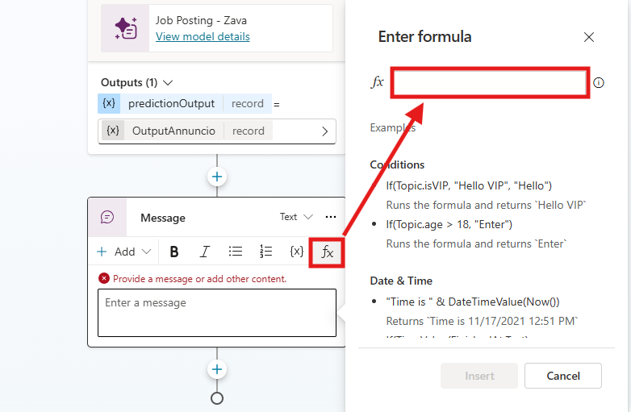

10. Come contenuto inserire la seguente  Formula PowerFx:

```
Topic.OutputAnnuncio.text
```

11. Premere **Insert** e salvare il Topic.
## Prompt Action - Text to Html

Lo scopo di questo strumento è trasformare un input testuale in un output in formato HTML, così da migliorare l’aspetto grafico della mail di riepilogo.  
Accedere alla sezione **Tools**, cliccare su **Add a tool** → **Create new** → **Prompt**.  
Una volta aperta la schermata di configurazione del prompt, come primo passaggio rinominare il Prompt:

```
Testo in HTML
```

Successivamente copiare e incollare la seguente Prompt Action:

```
Sei un esperto nella creazione di email HTML professionali per annunci di lavoro.

**Trasforma il testo da [CONTENT] in HTML VALIDO che venga RENDERIZZATO come corpo dell'email (non mostrato come testo).**

REGOLE CRITICHE:
- Restituisci SOLO HTML grezzo (niente Markdown, niente blocchi di codice, nessuna spiegazione)
- NON fare l'escape dei caratteri HTML
- NON racchiudere l'output in ``` o in qualsiasi altro formato

Inserisci esattamente all'inizio:
<p>Ciao [USERNAME],</p>
<p>Ecco il job posting che hai richiesto:</p>

MAPPATURA MARKDOWN → HTML (specifica per annunci Zava S.p.A.):

- # Titolo (role + seniority)         → <h1>
- ## Sezioni (es. Sede, Retribuzione) → <h2> con emoji inclusa
- Testo normale                        → <p>
- Elenchi puntati (-)                  → <ul><li>
- **testo in grassetto**               → <b>
- Link in Markdown                     → `<a href="...">testo</a>`
- Separatori ---                       → <hr style="border:none;border-top:1px solid #dddddd;margin:20px 0;">
- Etichette tipo "Fascia Salariale:"   → <b>Etichetta:</b> valore

STRUTTURA ATTESA DEL CONTENUTO:
Il testo seguirà questo ordine di sezioni — rispettalo fedelmente:
1. Titolo ruolo + seniority
2. Sede e Modalità di Lavoro
3. Retribuzione
4. Profilo Aziendale
5. Riepilogo del Ruolo
6. Responsabilità Principali
7. Requisiti Obbligatori
8. Requisiti Preferenziali
9. Benefit e Vantaggi
10. Come Candidarsi → includere il bottone CTA

Bottone CTA — da inserire sotto l'email di candidatura (careers@zava.it):
<a href="mailto:careers@zava.it" style="display:inline-block;background-color:#1a73e8;color:#ffffff;padding:10px 20px;border-radius:4px;font-weight:bold;margin:16px 0;text-decoration:none;">Invia la tua candidatura</a>

CSS INLINE DA APPLICARE A OGNI ELEMENTO:

h1:   style="font-family:Arial,Helvetica,sans-serif;font-size:22px;color:#1a73e8;margin-bottom:8px;"
h2:   style="font-family:Arial,Helvetica,sans-serif;font-size:17px;color:#1a73e8;margin-top:24px;margin-bottom:8px;"
p:    style="font-family:Arial,Helvetica,sans-serif;font-size:14px;color:#333333;line-height:1.5;margin:0 0 12px 0;"
li:   style="font-family:Arial,Helvetica,sans-serif;font-size:14px;color:#333333;line-height:1.6;margin-bottom:4px;"
ul:   style="padding-left:20px;margin:8px 0 12px 0;"
a:    style="color:#1a73e8;text-decoration:none;"
b:    style="color:#333333;"

Non includere:
- <html>, <head>, <body>
- Tag <style> o blocchi CSS separati
- Markdown
- Backticks
- Commenti HTML

**Output: Restituisci solo il frammento HTML finale.**

Variabili:
[USERNAME] = [Da cambiare]
[CONTENT] = [Da cambiare]

```

Per rendere dinamico il prompt occorre modificare i nomi in fondo chiamati `[DA CAMBIARE]` con delle variabili testuali, come mostrato nelle immagini:

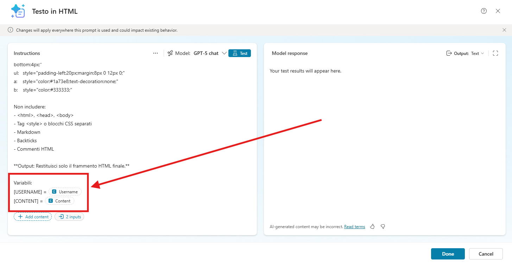

Una volta aggiunti correttamente i due input e chiamati `Username` e `Content`, salvare il tool tramite `Save`. 
Successivamente, premere `Add and configure`.

Come descrizione inserire:

```
Trasforma il contenuto in ingresso in un frammento HTML professionale per email, preservando struttura e collegamenti, senza alterare il contenuto
```

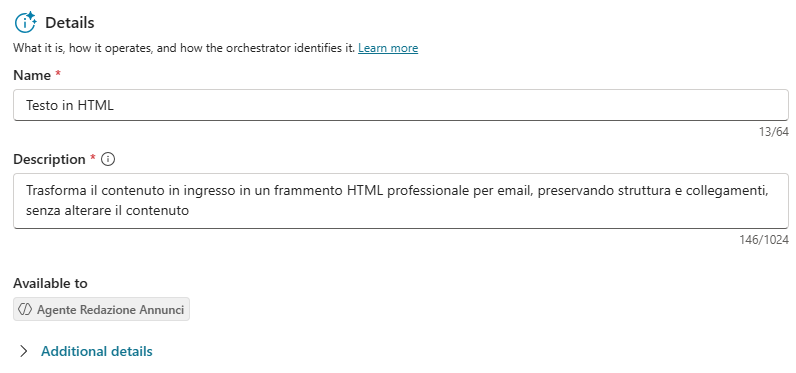

Recarsi nella sezione **Input** e impostare i seguenti valori:

| Input Name | Fill using               | Value            |
| ---------- | ------------------------ | ---------------- |
| Username   | Custom value             | User.DisplayName |
| Content    | Dynamically fill with AI | Customize        |
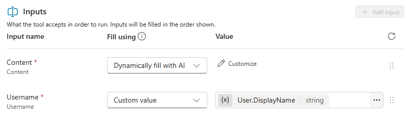

Per inserire la variabile nel Value dell'Username premere il simbolo “…” selezionare **System** e cercare `User.DisplayName`.
Per quanto riguarda il Content premere su **Customize** e aggiungere la seguente **Description**:

```
Dall’intera conversazione, identifica ed estrapola la risposta finale più rilevante dell’assistente. NON cambiare il formato, inventare contenuti o modificare i significati.
```

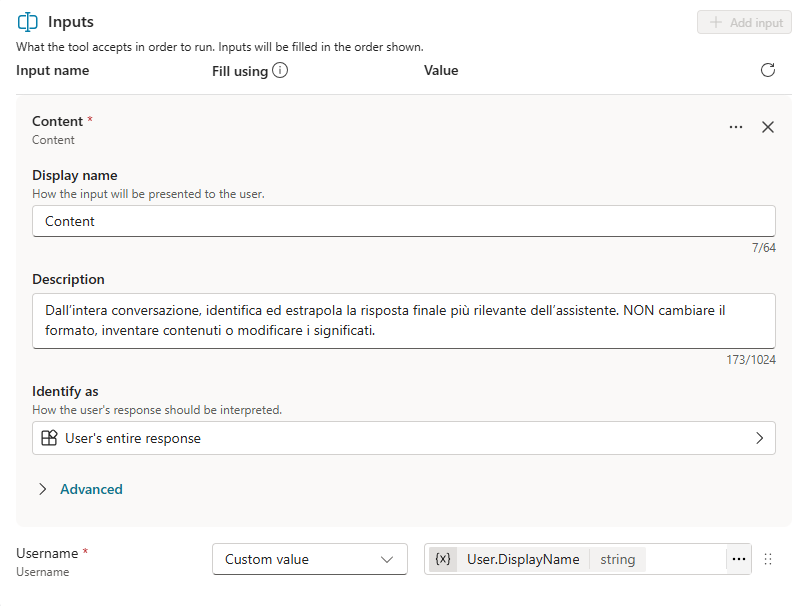

Salvare il tool.

## Tool - Send an Email

Questo strumento ha la funzione di acquisire il contenuto HTML generato dal Prompt impostato in precedenza e utilizzarlo per comporre automaticamente il messaggio di posta elettronica, provvedendo successivamente al suo invio all’utente finale.  

Dalla sezione **Tools**, selezionare **Add a tool** e, tra i connettori disponibili, scegliere **Office 365 Outlook**. Successivamente, individuare e selezionare l’azione `Send an email (v2)`.  

Una volta completata la configurazione della connessione e dopo aver cliccato su **Add and Configure**, impostare il tool compilando i parametri richiesti come indicato di seguito:

- Name:

```
Annuncio Mail
```

- Description:

```
Questo strumento invia l’email contenente l'annuncio di lavoro all’utente in lingua italiana. 
Richiede tre input:  
- A → l’indirizzo email del destinatario.  
- OGGETTO → una frase molto breve che riassume il contenuto del riepilogo (max ~8 parole, senza menzione di formattazione o HTML).  
- CORPO → il frammento completo dell’email HTML generato dallo strumento Testo in HTML, inclusi il saluto e il blocco di stile.
```

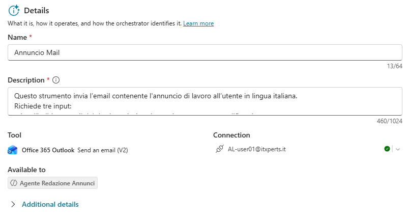

Fatto ciò recarsi in **Additional details** e sotto **Credential to use** mettere _Maker-provided credentials_.
Ora non resta che configurare i vari Input secondo i valori qui sotto:

| Input Name | Fill using               | Value      |
| ---------- | ------------------------ | ---------- |
| To         | Custom value             | User.Email |
| Subject    | Dynamically fill with AI | Customize  |
| Body       | Dynamically fill with AI | Customize  |
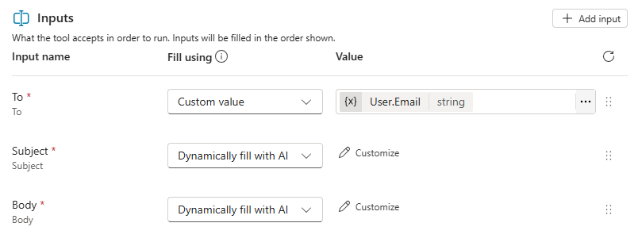

Per inserire la variabile nel Value del To premere il simbolo “…” selezionare **System** e cercare `User.Email`.
Per quanto riguarda il Subject premere su **Customize** e aggiungere la seguente **Description**:

```
L’OGGETTO deve essere una frase molto breve (max ~8 parole) che riassume l'annuncio di lavoro, senza alcun riferimento a formattazione o HTML.
```

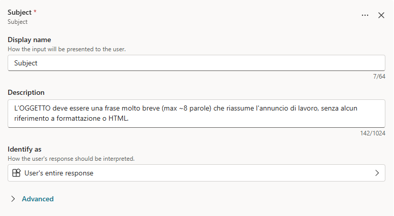

In fine nel Body premere su **Customize** e aggiungere la seguente **Description**:

```
Il CORPO deve contenere l’intero frammento HTML dell’email generato dallo strumento "Testo in HTML", incluso il blocco di stile e il saluto, senza alcun testo aggiuntivo.
```

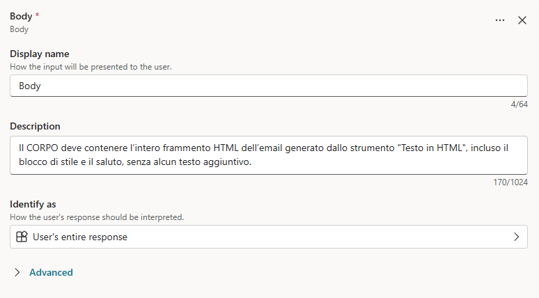

Terminata la configurazione degli input andare nella sezione **Completion** e impostare sotto **After running** `Send specific response (specify below)`.

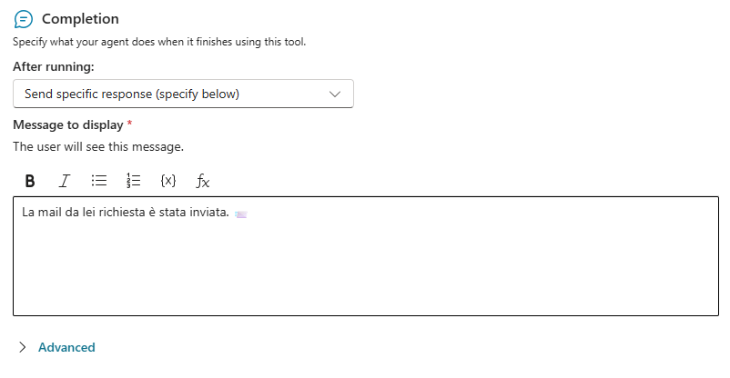

Mettere come Message to display:

```
La mail da lei richiesta è stata inviata. 📨
```

Salvare il tool.

## Istruzioni finali e testing

Terminati i tools ora andiamo a inserire le istruzioni per premettere all'agente di poter svolgere il suo ruolo:

```
# Contesto
Sei l’Agente Redazione Annunci, incaricato di redigere annunci di lavoro tramite template aziendale, generare l’output e inviarlo direttamente via email.


# Flusso di Lavoro
1. New Job Posting -> Crea l'annuncio di lavoro
2. Testo in HTML -> Converte l'annuncio di lavoro in chat in formato Html per la visualizzazione grafica nella mail
3. Annuncio Mail -> Invia la Mail all'utente 


# Regole
- Non creare nuovi contenuti.
- Lavora esclusivamente in Lingua Italiana.
- Non generare HTML manualmente: usa solo lo strumento dedicato.
- Non modificare, aggiungere o rimuovere informazioni dall’annuncio.
- L’output finale visibile deve essere solo l’azione di invio email.
```

Sostituire il nome degli strumenti con l'hyperlink utilizzando il tasto `/` seguito dal nome dello strumento all'interno del box delle istruzioni, come mostrato in figura.

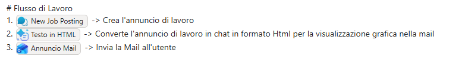

Iniziare una nuova sessione nella finestra di Test.

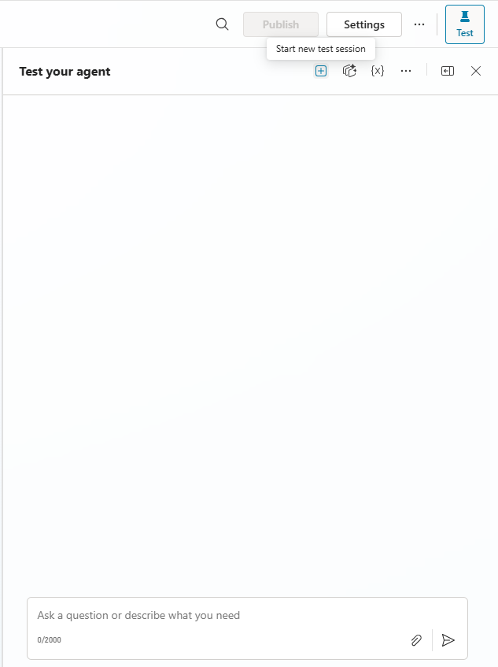

Testare il funzionamento dell'agente richiedendo un dispositivo, qui sotto un esempio:

```
Voglio creare un nuovo annuncio di lavoro
```

Proseguire con il test a piacere.

>[!IMPORTANT]
>**Lab Completato**
>
>Con questo ultimo passaggio, il laboratorio per la creazione dei Tools in Copilot Studio è completato.

