# Lab 06 - Hiring Solution Setup

[Previous: Lab 05](../05-device-request-agent-flows/README.md) | [Back to README](../../README.md) | [Next: Lab 07](../07-multi-agent-hiring/README.md)

## Setup

Per questo scenario, sono state preconfigurate delle tabelle Dataverse contenenti le strutture dati per gestire candidati, posizioni lavorative e flussi di lavoro relativi alle assunzioni.

### Importare la soluzione

1. Navigare su Copilot Studio
2. Selezionare la `...` nella navigazione di sinistra e selezionare **Solutions**

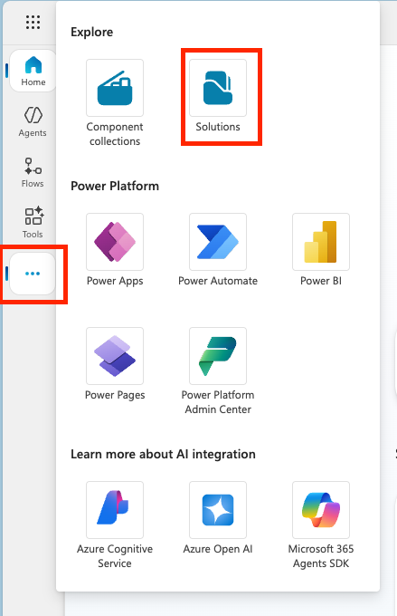

3. Selezionare il bottone in alto **Import Solution**
4. [Scaricare](https://raw.githubusercontent.com/microsoft/agent-academy/refs/heads/main/docs/operative/01-get-started/assets/Operative_1_0_0_0.zip) la soluzione demo
5. Selezionare **Browse** e selezionare la soluzione scaricata nei punti precedenti
6. Selezionare **Next**

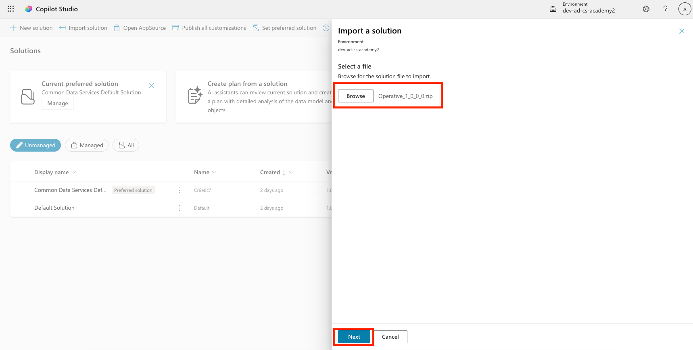

7. Selezionare **Import**
8. Dopo una breve attesa, controllare il contenuto della soluzione importata (`Operative`) nella lista delle soluzioni.

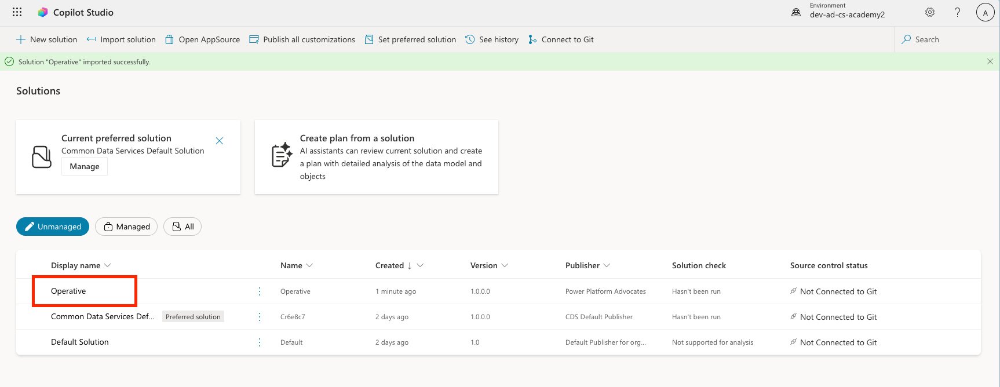

Controllare che all'interno della soluzioni si trovino le seguenti componenti:

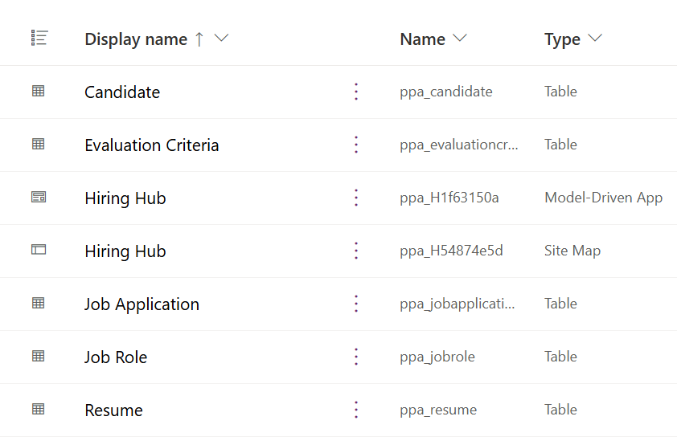

Come ultimo passaggio, selezionare il tasto **Publish all customizations** in cima alla pagina:

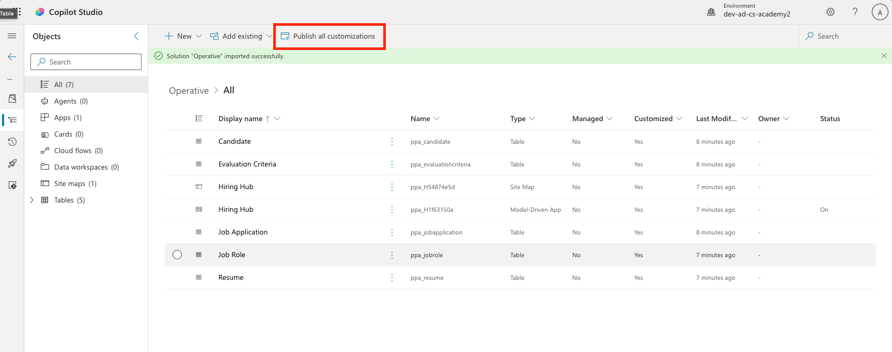

### Importare dati di esempio

Il prossimo compito è di caricare alcuni dati di esempio all'interno delle strutture dati che sono state importate nel punto precedente.

### Scaricare i file

1. [Scaricare](https://raw.githubusercontent.com/microsoft/agent-academy/refs/heads/main/docs/operative/01-get-started/assets/evaluation-criteria.csv) il file CSV contenente i criteri di valutazione
2. [Scaricare](https://raw.githubusercontent.com/microsoft/agent-academy/refs/heads/main/docs/operative/01-get-started/assets/job-roles.csv) il file CSV contenente i ruoli lavorativi
### Importare i dati Job Role

1. Tornare nella solution importata nell'ultimo punto
2. Selezionare la Model-Driven App utilizzando il checkmark
3. Premere il bottone **Play** in alto

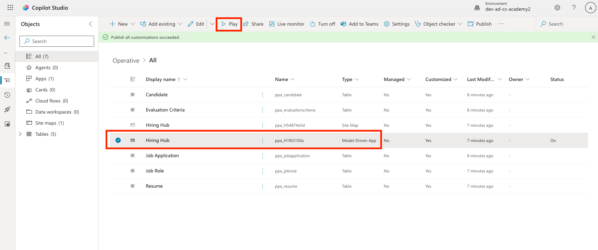

>[!warning] Attenzione
>Il sistema potrebbe chiedere una login a questo punto. Fare di nuovo l'accesso e questo dovrebbe mostrare il contenuto dell'app Hiring Hub.

4. Selezionare **Job Roles** nella navigazione di sinistra
5. Selezionare l'icona **More** (i tre punti) nella barra di comando
6. Selezionare la **freccia destra** accanto a *Import from Excel*

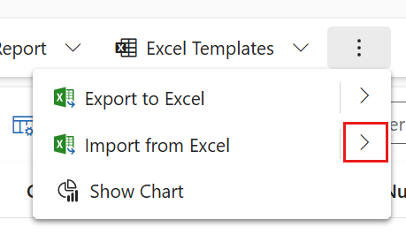

7. Selezionare **Import from CSV**

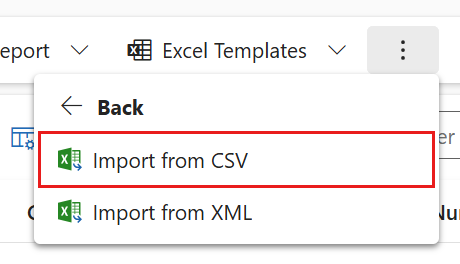

8. Selezionare il bottone **Choose File** e scegliere il file appena scaricato **job-roles.csv** e premere **Open**
9. Selezionare **Next**
10. Lasciare tutti i passaggi successivi inalterati e selezionare **Review Mapping**

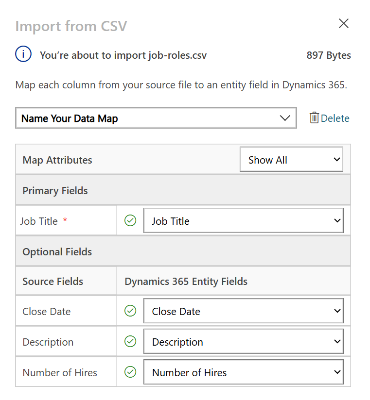

11. Assicurarsi che il mapping è corretto e selezionare **Finish Import**
12. Selezionare **Done**

>[!warning] Caricamento
>Potrebbe volerci qualche secondo di caricamento, ma si può premere il tasto **Refresh** per prendere nota della buona riuscita dell'operazione.

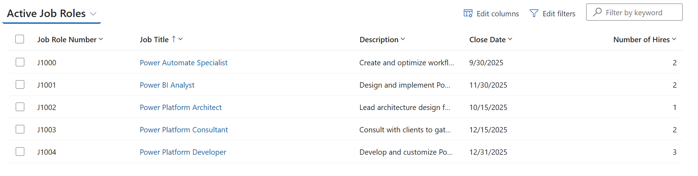

### Importare i dati Evaluation Criteria

1. Selezionare **Evaluation Criteria** nella navigazione di sinistra
2. Selezionare l'icona **More** (i tre punti) nella barra di comando
3. Selezionare la **freccia destra** accanto a *Import from Excel*


4. Selezionare **Import from CSV**


5. Selezionare il bottone **Choose File** e scegliere il file appena scaricato **evaluation-criteria.csv** e premere **Open**
6. Selezionare **Next**
7. Lasciare tutti i passaggi successivi inalterati e selezionare **Review Mapping**

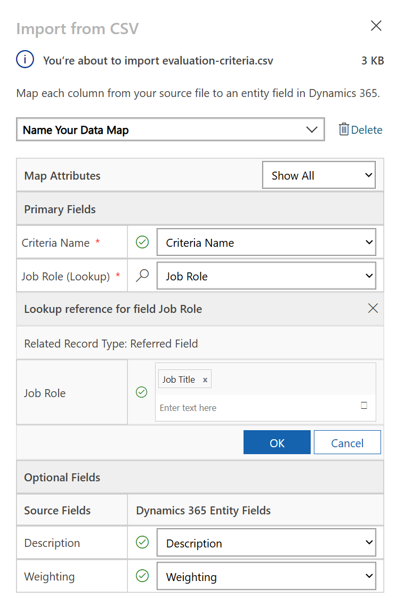

8. Per il mapping occorre fare del lavoro extra. Selezionare la lente di ingrandimento accanto al campo *Job Role*

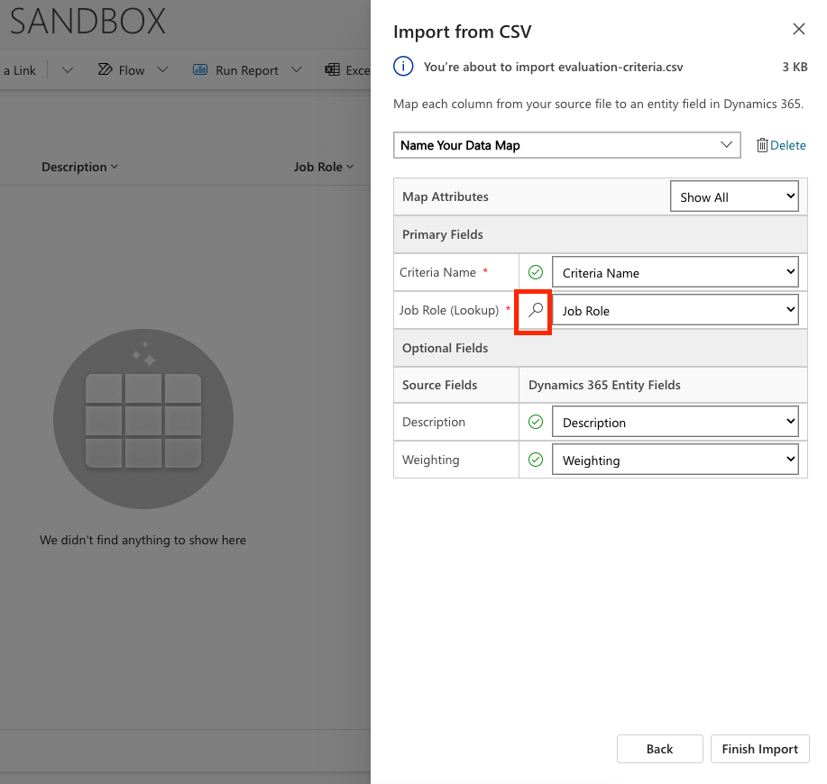

9. Assicurarsi che **Job Title** è selezionato, altrimenti aggiungerlo
10. Selezionare **OK**

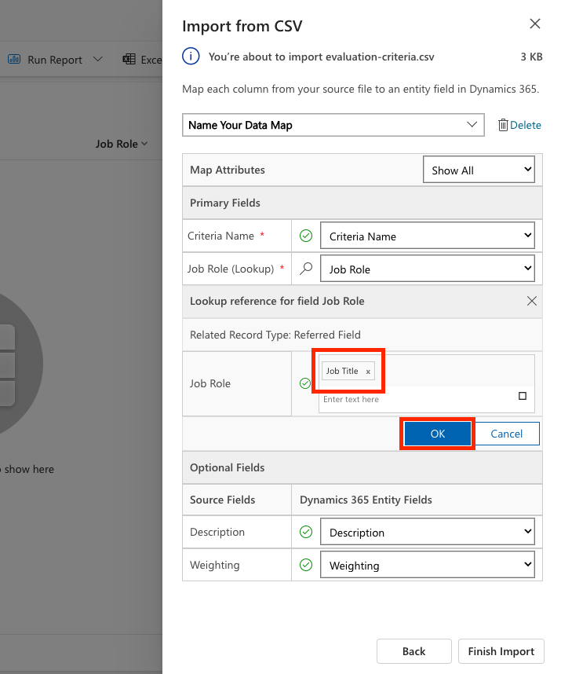


11. Assicurarsi che il mapping è corretto e selezionare **Finish Import**
12. Selezionare **Done**

Potrebbe volerci del tempo, ma controllare premendo **Refresh** che l'import sia andato a buon fine

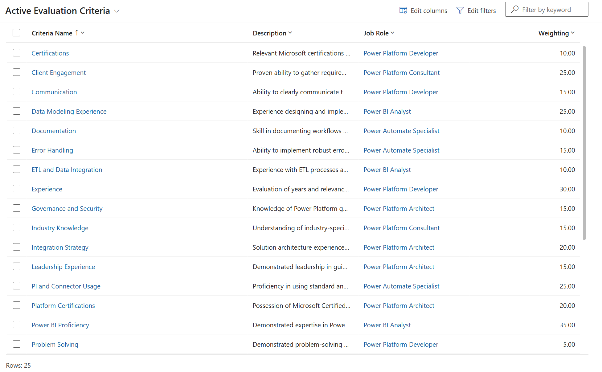

### Creare Hiring Agent

Finalmente il setup è terminato ed è possibile iniziare a creare i primi agenti.

1. Navigare su Copilot Studio facendo attenzione ad essere nello stesso environment sui cui è stata importata la soluzione nei punti precedenti
2. Selezionare **Agenti** nella navigazione di sinistra
3. Aprire l'icona a freccia verso il basso accanto a *Create blank agent* e selezionare **Advanced create**

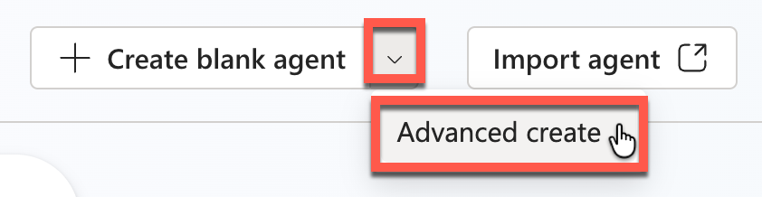

4. Per *soluzione*, selezionare **Operative** (la soluzione appena importata)
5. Per *schema name*, inserire `hiringagent` dopo il prefisso *ppa_* 

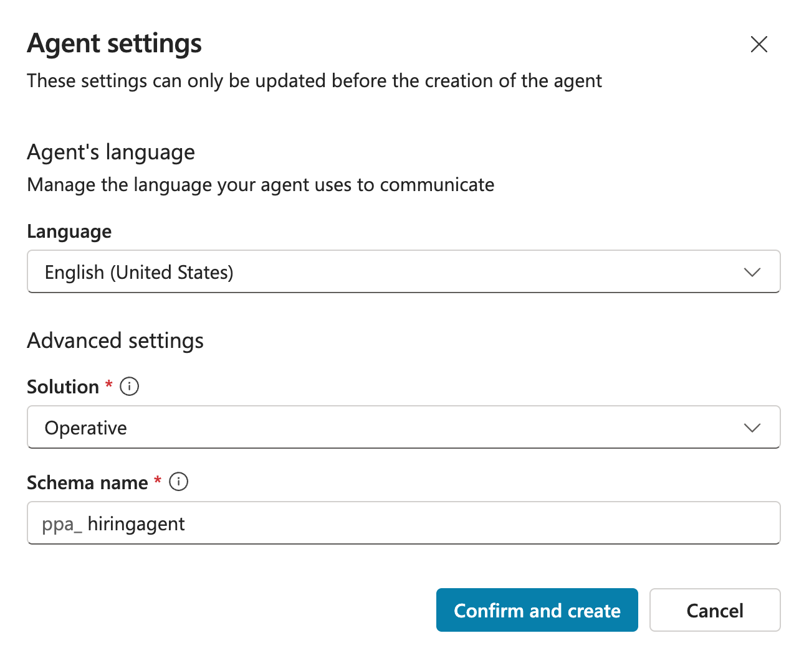

6. Selezionare **Confirm and create**

Questo dovrebbe essere il primo agente nella soluzione *Operative* e ricevere il nome *Agent 1*. Non è un grande nome quindi verrà subito cambiato.

7. Nella carta *Details* in cima, selezionare **Edit**
8. Come **Nome**, inserire:

```
Hiring Agent
```

9. Come **Descrizione**, inserire:

```
Central orchestrator for all hiring activities
```

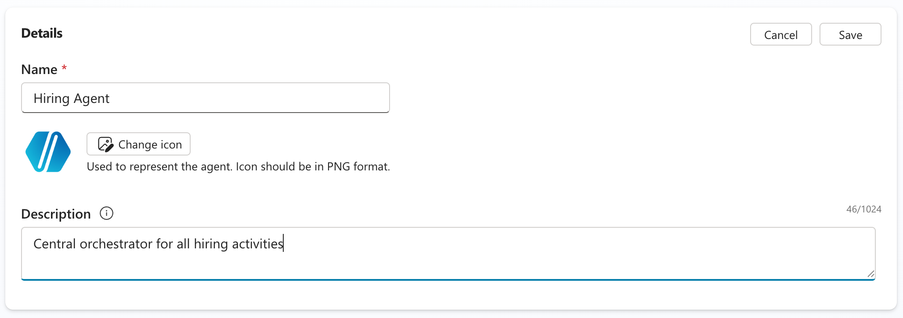

10. Selezionare **Salva** per salvare l'agente.

>[!success] Successo
>Il setup è terminato!

