# Lab 07 - Multi-Agent Hiring

[Previous: Lab 06](../06-hiring-solution-setup/README.md) | [Back to README](../../README.md) | [Next: Lab 08](../08-autonomous-hiring-agent/README.md)

>[!WARNING]
>**Prerequisito**
>
>Per svolgere questo lab occorre avere terminato il precedente ed avere creato lo *Hiring Agent*.

## Application Intake Agent
### Solution setup

1. All'interno di Copilot Studio, selezionare il tasto **...** sotto *Tools* nella navigazione di sinistra
2. Selezionare **Solutions**
3. Trovare la soluzione **Operative**, selezionare i tre punti **...** e scegliere **Set preferred solution**. Selezionare **Apply** nella finestra di dialogo che esce fuori. Questo assicurerà che tutto il prossimo lavoro sarà aggiunto in questa soluzione.

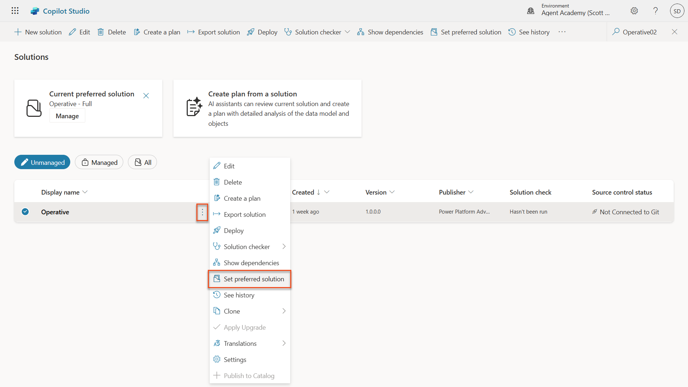

### Configurare le istruzioni di Hiring Agent

1. Navigare indietro su Copilot Studio. Assicurarsi che l'environment giusto sia selezionato.
2. Aprire **Hiring Agent** precedentemente creato
3. Selezionare **Edit** nella sezione *Instructions*. Copiare ed incollare le seguenti istruzioni:

```
You are the central orchestrator for the hiring process. You coordinate activities, provide summaries, and delegate work to specialized agents.
```

4. Selezionare **Save**
5. Selezionare il bottone **Settings** in alto a destra dello schermo
6. Revisionare la pagina ed assicurarsi che le seguenti impostazioni siano applicate:

|Setting|Value|
|---|---|
|Use generative AI orchestration for your agent's responses|**Yes**|
|Deep Reasoning|**Off**|
|Let other agents connect to and use this one|**On**|
|Continue using retired models|**Off**|
|Content Moderation|**Moderate**|
|Collect user reactions to agent messages|**On**|
|Use general knowledge|**Off**|
|Use information from the Web|**Off**|
|File uploads|**On**|
|Code Interpreter|**Off**|

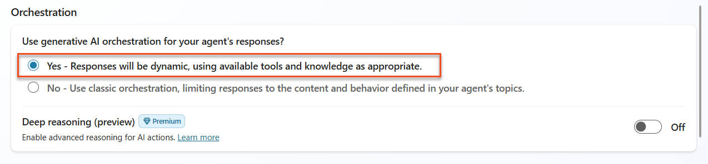

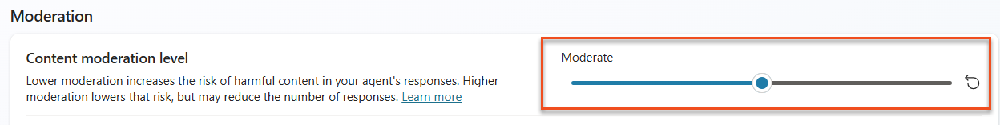

7. Premere **Save**

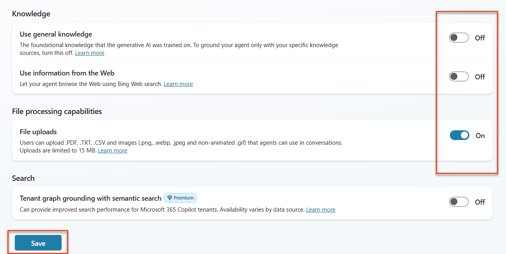

8. Cliccare la **X** in alto a destra e chiudere il menu delle impostazioni

### Aggiungere il child agent Application Intake

1. Navigare nella scheda **Agents** all'interno dell'Hiring Agent e selezionare **Add**

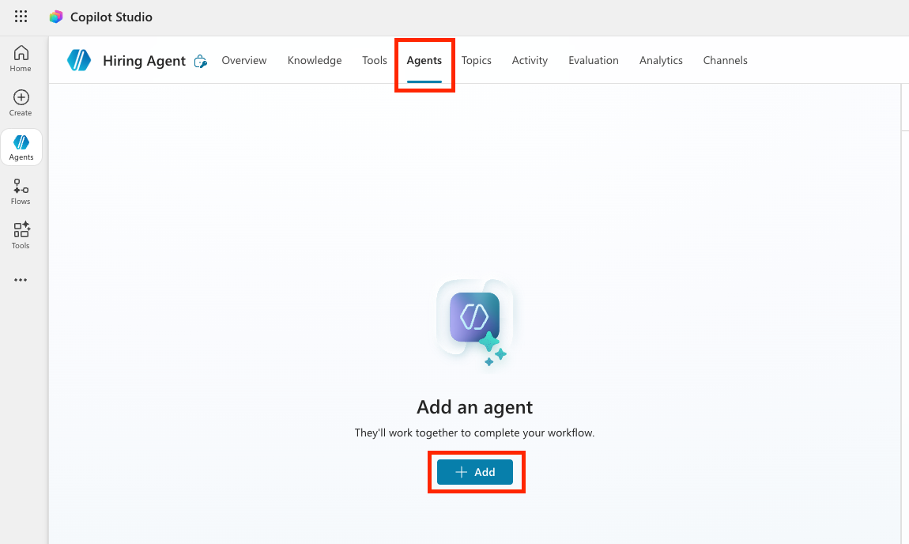

2. Selezionare **New child agent**

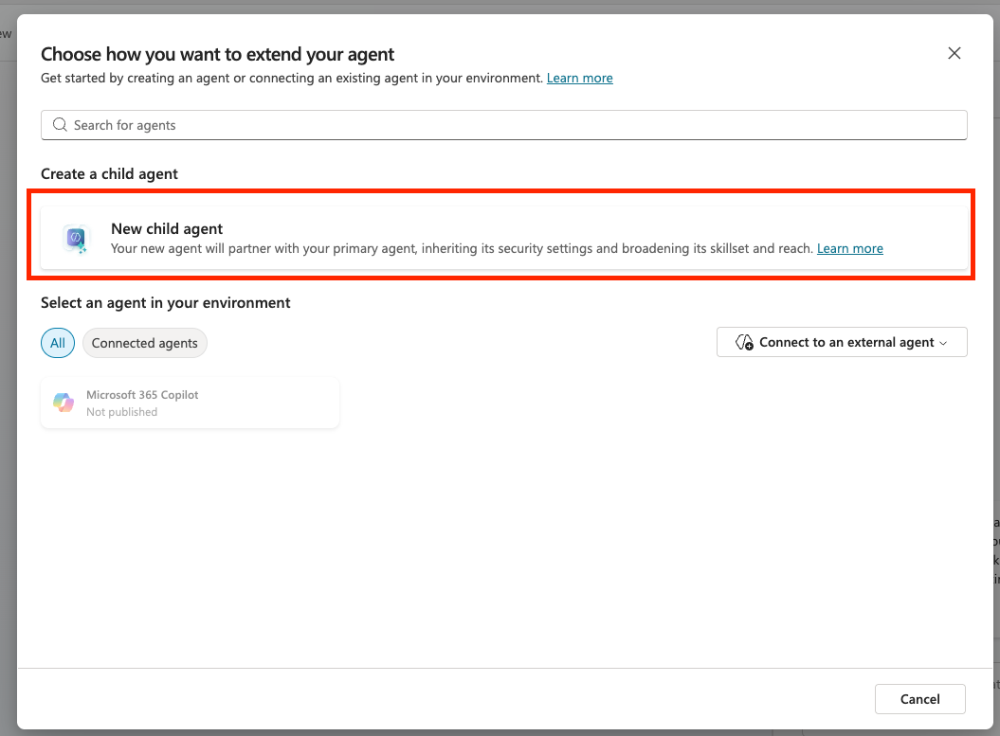

3. Nel campo **Name** inserire `Application Intake Agent`
4. Nel campo **When will this be used?** selezionare **The agent chooses** all'interno del menu a tendina. Queste opzioni sono simili ai trigger che possono essere configurati per i topics.
5. Nel campo **Description**, inserire:

```
Processes incoming resumes and stores candidates in the system
```

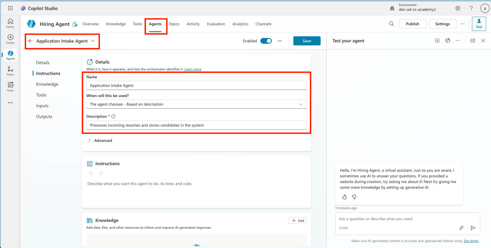

6. Espandere **Advanced** ed impostare la *Priority* a `10000`. Questo garantisce in seguito che l'agente *Interview Agent* verrà utilizzato per rispondere a domande generali prima di questo. Si potrebbe anche impostare una specifica condizione, ad esempio assicurandosi che ci sia almeno un allegato.

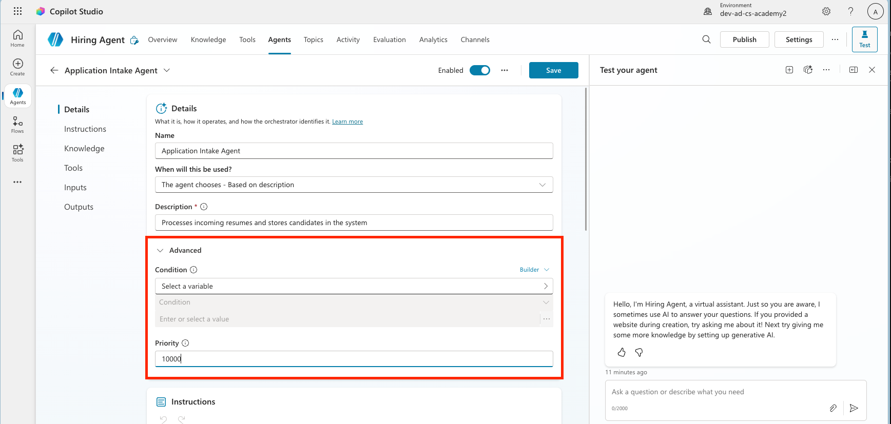

7. Assicurarsi che l'opzione **Web Search** sia impostata su **Disable**. In questo modo le informazioni verranno esclusivamente dall'agente padre
8. Selezionare **Save**

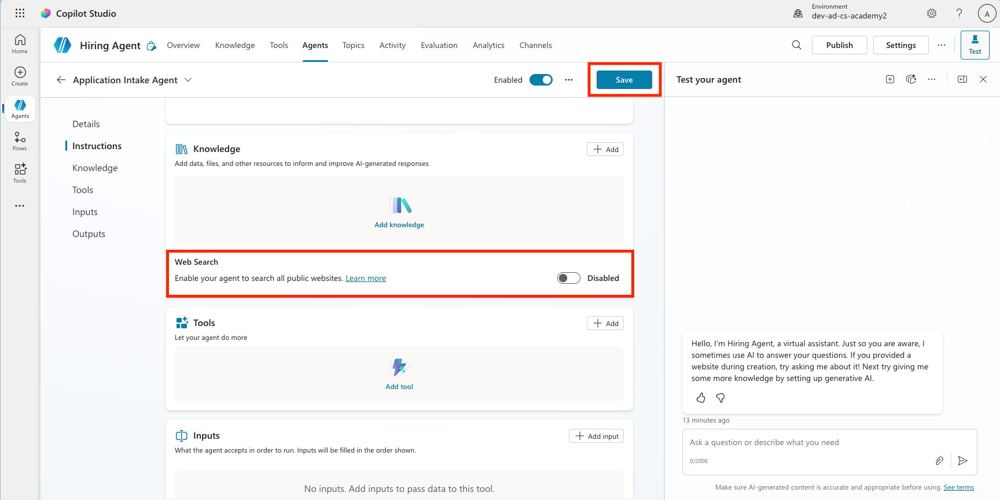

### Configurare l'agent flow Resume Upload

Gli agenti non possono effettuare alcuna azione senza dare loro tools o topics.

In questo caso, viene utilizzato un **Agent Flow** rispetto ad un topic, perché occorre realizzare un processo di back-end con multipli passaggi e non c'è bisogno di interagire con l'utente nel mezzo.

1. All'interno dell'agente *Application Intake* cercare la sezione **Tools**. 

>[!WARNING]
>**Attenzione**
>
>Questa non è la scheda Tools dell'agente padre, si trova scorrendo le istruzioni del child agent

2. Selezionare **+ Add**


3. Selezionare **+ New tool**

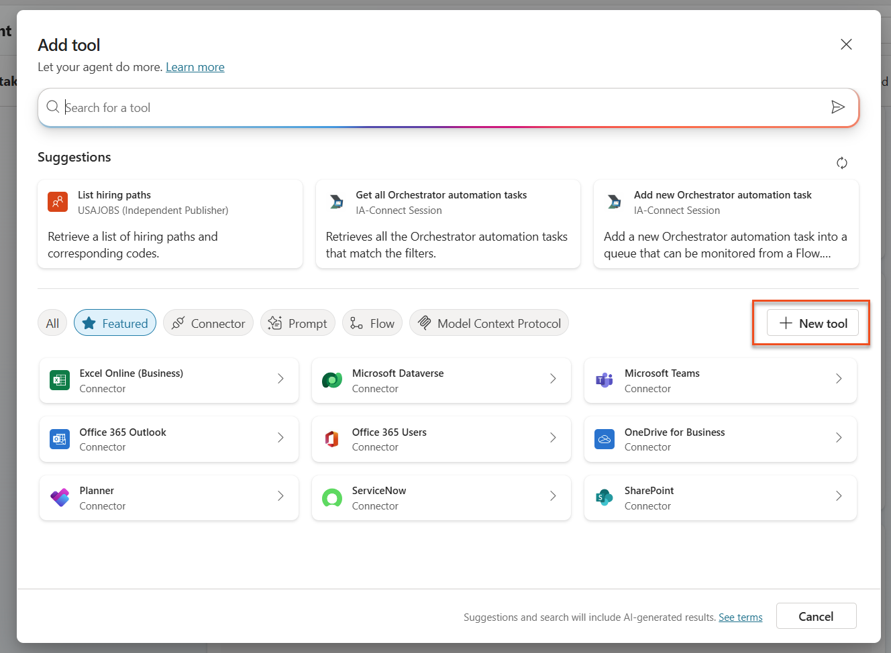

4. Selezionare **Agent flow**. Si aprirà la scheda del designer, ed è qui che verrà aggiunta la logica di caricamento cv. 

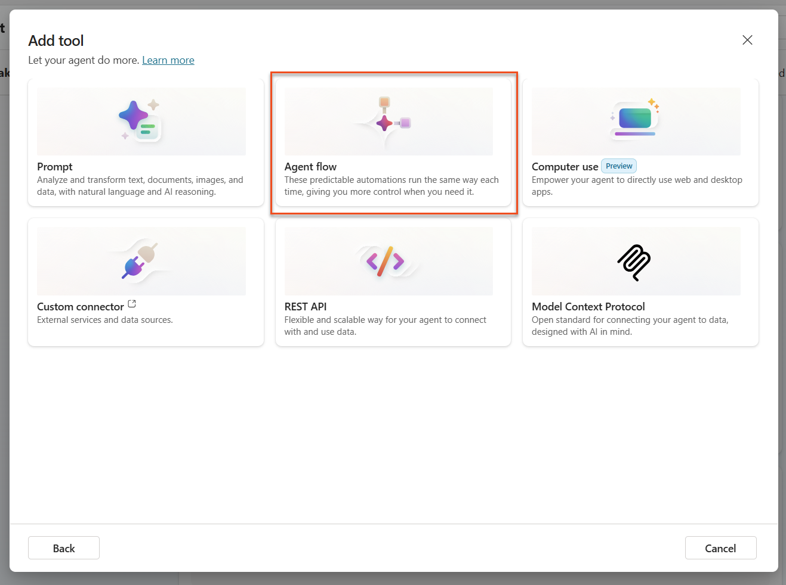

5. Selezionare il nodo **When an agent calls the flow**, e premere **+ Add an input**

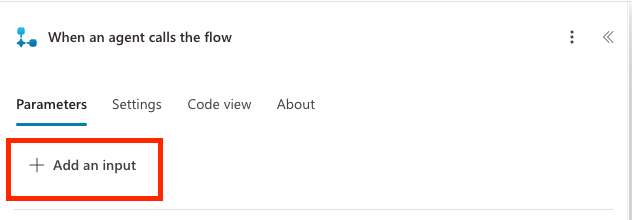

6. Aggiungere un input per ognuno dei parametri contenuti nella tabella in basso. Selezionare il tipo di input opportuno ed inserire nome e descrizione. La descrizione è importante perché aiuterà l'agente a sapere come riempire i campi.

| Type | Name        | Description                                                                                                                                              |
| ---- | ----------- | -------------------------------------------------------------------------------------------------------------------------------------------------------- |
| File | `Resume`    | `The Resume PDF file`                                                                                                                                    |
| Text | `Message`   | `Extract a cover letter style message from the context. The message must be less than 2000 characters.`                                                  |
| Text | `UserEmail` | `The email address that the Resume originated from. This will be the user uploading the resume in chat, or the from email address if received by email.` |

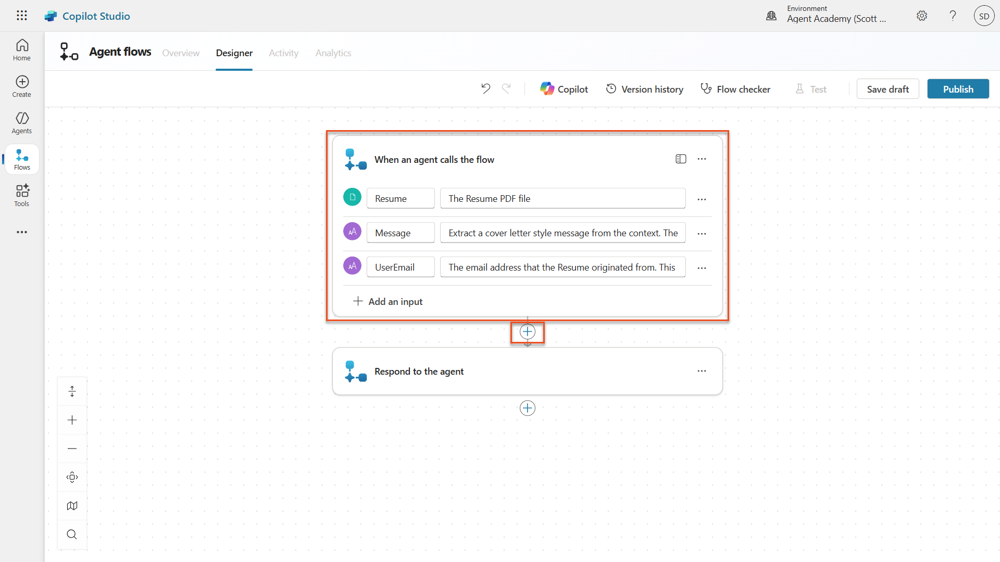

7. Selezionare l'icona **+** sotto il nodo di partenza e cercare `Dataverse add`, quindi selezionare l'azione **Add a new row** all'interno della collezione di connettori *Microsoft Daverse*

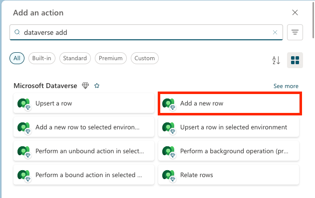

>[!NOTE]
>**Nota**
>
>E' probabile che il sistema chieda una login su Dataverse dopo avere inserito l'azione. In tal caso inserire un nome qualsiasi e premere *add* per creare la nuova connessione

8. Selezionare il nuovo nodo e cambiare il nome in **Create Resume**

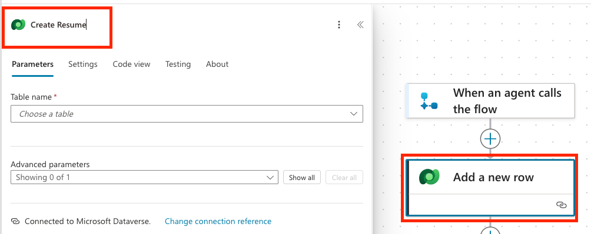

9. Impostare il campo **Table name** con *Resumes*, quindi selezionare **Show all** per mostrare tutti i parametri

10. Impostare le seguenti **properties**:

| Property                 | How to Set                      | Details / Expression                                                                                                                                          |
| ------------------------ | ------------------------------- | ------------------------------------------------------------------------------------------------------------------------------------------------------------- |
| **Resume Title**         | Dynamic data (thunderbolt icon) | **When an agent calls the flow** → **Resume name** If you don't see the Resume name, make sure you have configured the Resume parameter above as a data type. |
| **Cover letter**         | Expression (fx icon)            | `if(greater(length(triggerBody()?['text']), 2000), substring(triggerBody()?['text'], 0, 2000), triggerBody()?['text'])`                                       |
| **Source Email Address** | Dynamic data (thunderbolt icon) | **When an agent calls the flow** → **UserEmail**                                                                                                              |
| **Upload Date**          | Expression (fx icon)            | `utcNow()`                                                                                                                                                    |

>[!NOTE]
>**Formule PowerFx utilizzate**
>
>- `length(triggerBody()?['text'])` → calcola la lunghezza del testo.
>- `greater(..., 2000)` → verifica se è maggiore di 2000 caratteri.
>- `substring(triggerBody()?['text'], 0, 2000)` → prende solo i primi 2000 caratteri.
>- `if(condizione, valore_se_vero, valore_se_falso)` → in questo caso: se l'input supera il limite di caratteri, prende un valore troncato ai primi 2000 caratteri
>- `utcNow()` → restituisce **la data e l’ora corrente in formato UTC (Coordinated Universal Time)** nel momento in cui il flusso viene eseguito. Esempio: 2026-03-03T12:45:30Z

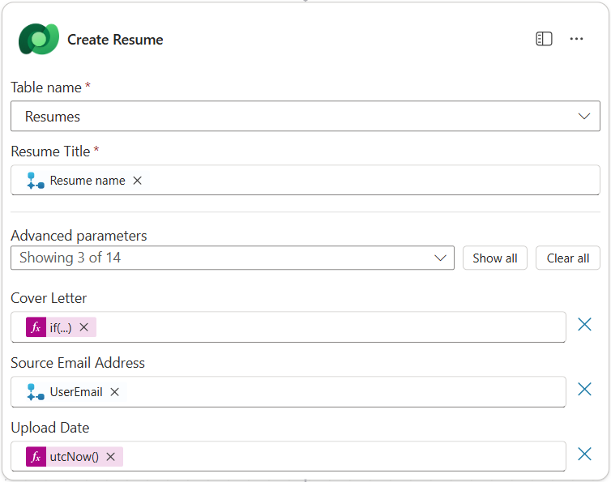

11. Selezionare il tasto **+** sotto il nodo *Create Resume*, cercare `Daverse upload` e selezionare l'azione **Upload a file ora an image**

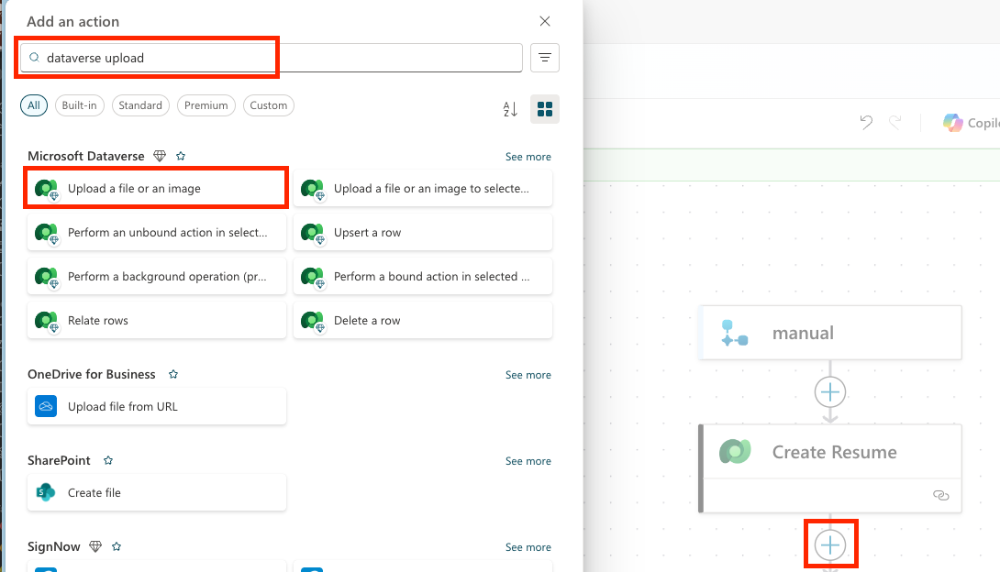

>[!WARNING]
>**Attenzione**
>
>Fare attenzione a non scegliere l'azione dal nome molto simile chiamata *Upload a file for an image to the selected environment*

12. Chiamare il nuovo nodo **Upload Resume File**
13. Impostare le seguenti **proprietà**:

|Property|How to Set|Details|
|---|---|---|
|**Content name**|Dynamic data (thunderbolt icon)|When an agent calls the flow → Resume name|
|**Table name**|Select|Resumes|
|**Row ID**|Dynamic data (thunderbolt icon)|Create Resume → See more → Resume|
|**Column Name**|Select|Resume PDF|
|**Content**|Dynamic data (thunderbolt icon)|When an agent calls the flow → Resume contentBytes|

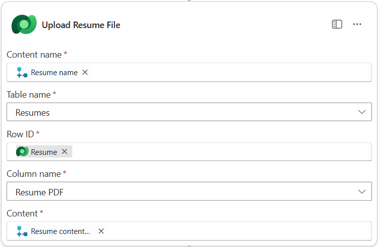

14. Selezionare il nodo **Respond to the agent** e premere **+ Add an output**. Creare un output con le proprietà definite nella seguente tabella:

|Property|How to Set|Details|
|---|---|---|
|**Type**|Select|`Text`|
|**Name**|Enter|`ResumeNumber`|
|**Value**|Dynamic data (thunderbolt icon)|Create Resume → See More → Resume Number|
|**Description**|Enter|`The [ResumeNumber] of the Resume created`|

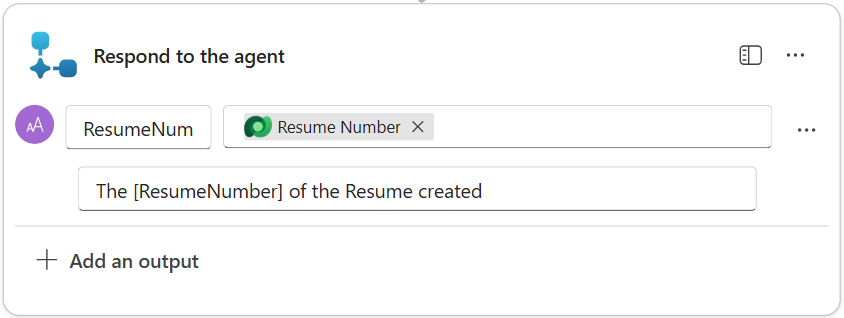

15. Selezionare **Save draft** in alto a destra

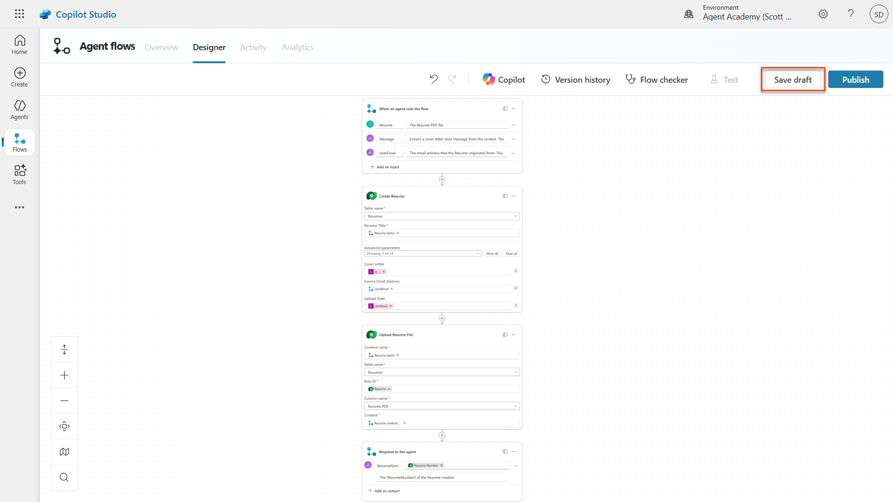

16. Navigare nella tab di **Overview** e selezionare **Edit** all'interno del pannello *Details*. Aggiungere nome e descrizione come sotto e premere **Save**:
	- **Flow name**: `Resume Upload`
	- **Description**: `Uploads a Resume when instructed`

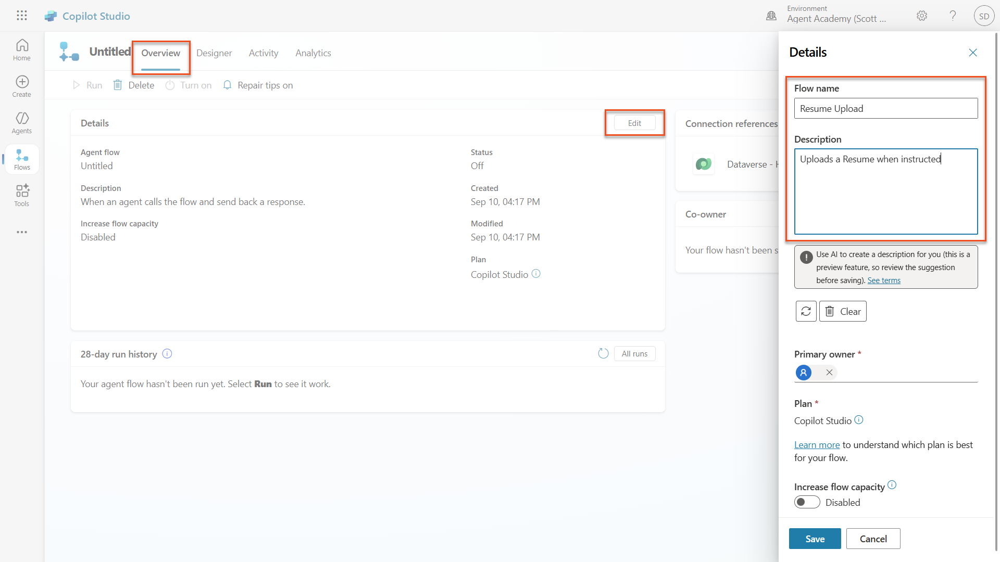

17. Selezionare nuovamente la scheda **Designer** e premere **Publish**

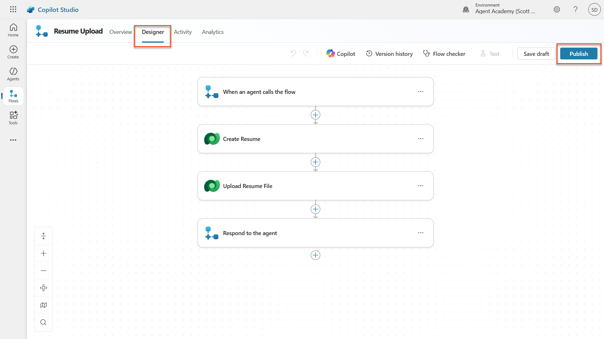

### Connettere il flow all'agente

E' il momento di connettere il flusso appena pubblicato all'agente Application Intake.

1. Tornare all'interno dell'**Hiring Agent** e selezionare la scheda **Agents**. Aprire **Application Intake Agent**, e scorrere fino al pannello **Tools**.

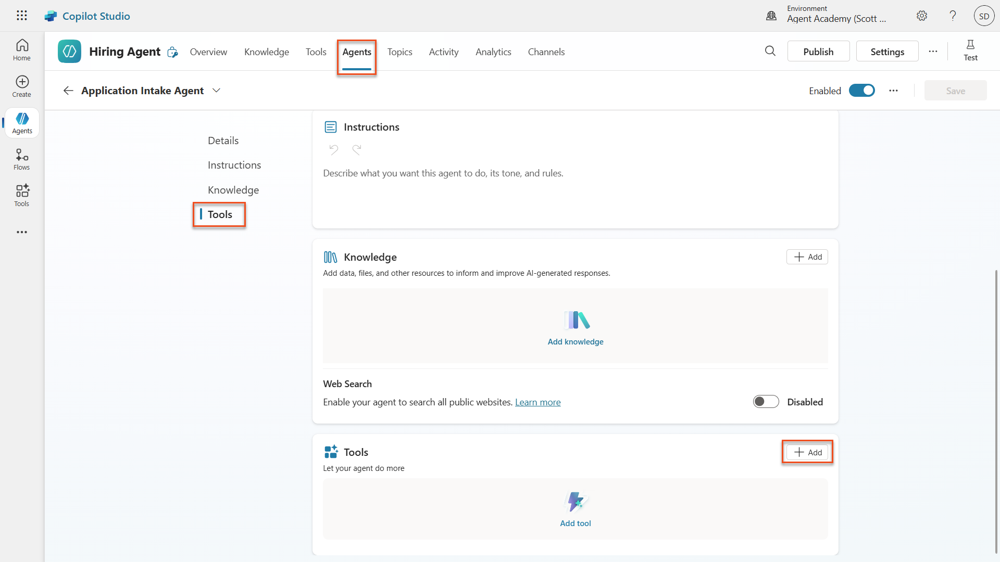

2. Premere **+ Add**

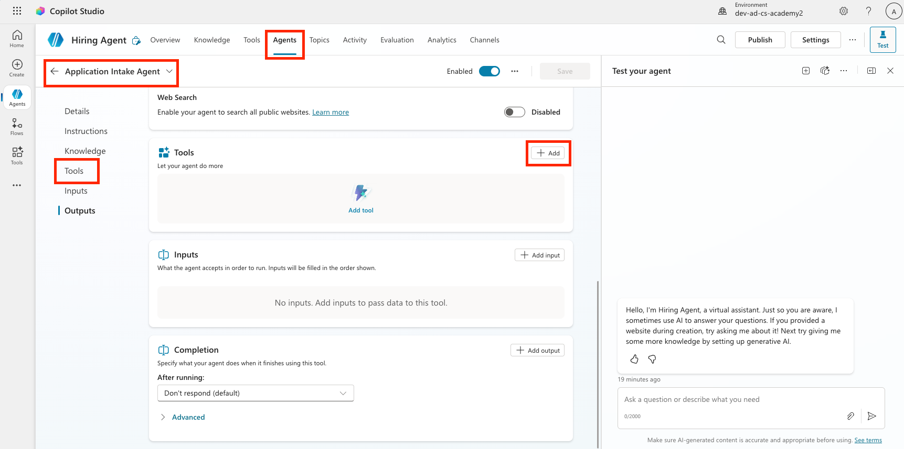

3. Filtrare per **Flow** e selezionare il nuovo flusso **Resume Upload**

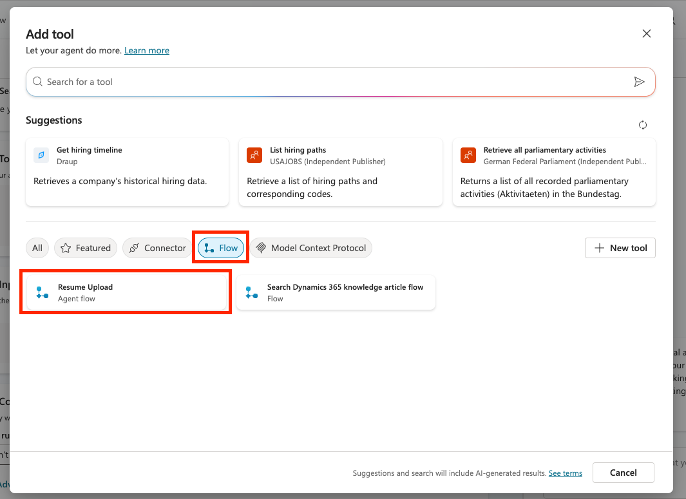

4. Selezionare **Add and configure**
5. Riempire i seguenti parametri:

| Parameter                                           | Value                                                                                                                                      |
| --------------------------------------------------- | ------------------------------------------------------------------------------------------------------------------------------------------ |
| **Description**                                     | `Uploads a Resume when instructed. STRICT RULE: Only call this tool when referenced in the form "Resume Upload" and there are Attachments` |
| **Additional details → When this tool may be used** | `only when referenced by topics or agents`                                                                                                 |

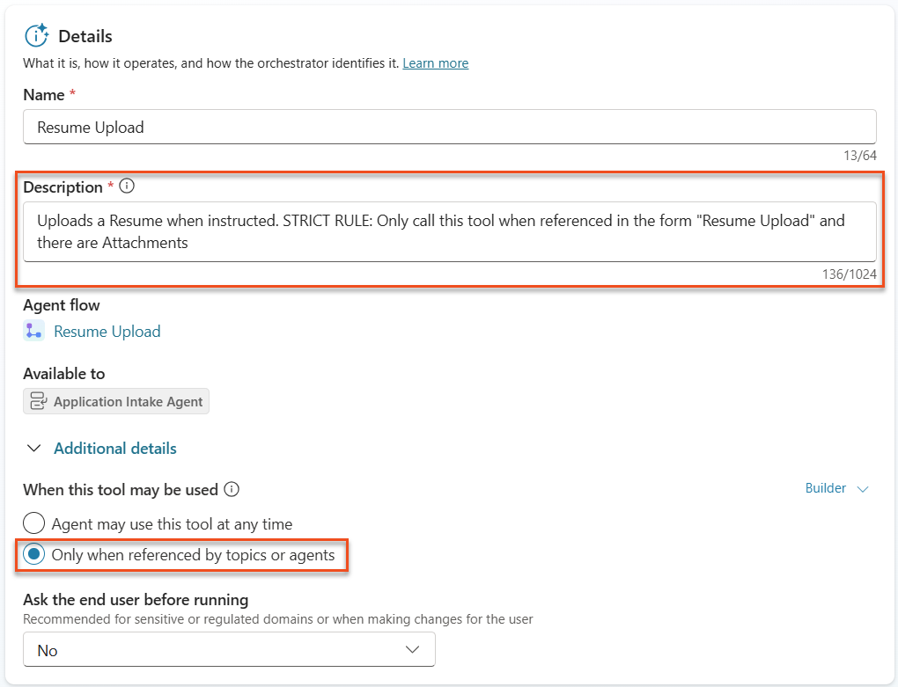

>[!NOTE]
>**Nota**
>
>La descrizione spiega all'agente in che situazione chiamare lo strumento. Notare l'uso della "STRICT RULE" nella descrizione. Questo è un trucco per fornire ulteriori restrizioni su come utilizzare lo strumento, in questo caso solo in presenza di allegati e nel contesto di conversazione relativo a "Resume Upload". 
>Scegliere quando lo strumento può essere utilizzato è un altro aspetto importante. Nel contesto di un'architettura multi agente è fondamentale essere certi che lo strumento possa essere chiamato SOLO dal child agent e non dal padre. Impostare il valore *Only when referenced by topics or agents* assicura questo comportamento.

6. Scorrere in basso nella sezione degli input e selezionare **Add Input** per aggiungere i seguenti valori:

| Parameter              | Value          |
| ---------------------- | -------------- |
| **Inputs → Add Input** | `contentBytes` |
| **Inputs → Add Input** | `name`         |

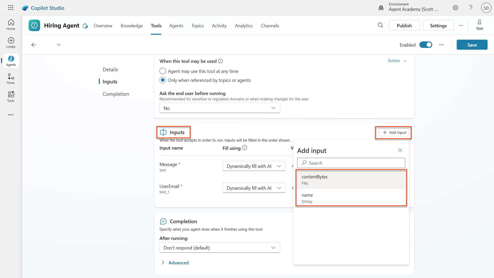

7. Occorre adesso impostare le proprietà degli input. Il valore **contentBytes** andrà a contenere l'effettivo file (CV). Selezionare **Custom value** dal menu a tendina **Fill using**
8. Nel campo **Value**, premere sui tre punti **...** e selezionare la scheda **Formula**. Inserire la seguente formula che estrapola il file dalla chat e premere il tasto **Insert**

```
First(System.Activity.Attachments).Content
```

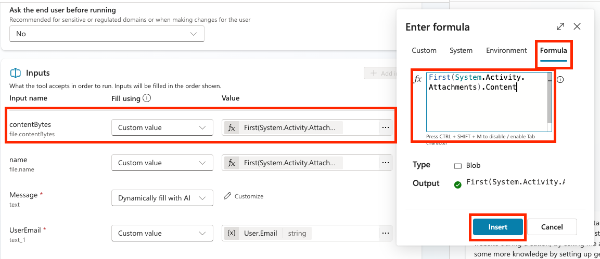

>[!NOTE]
>**Formule utilizzate**
>
>- `System.Activity.Attachments` → Collezione che contiene tutti gli allegati inviati nel messaggio corrente (es. file, immagini, documenti).
>- `First(...)` → Seleziona il primo elemento della collezione (in questo caso, il primo allegato)
>- `.Content` → accede al contenuto dell'elemento selezionato (in particolare, nel caso di un file si tratta di una stringa codificata in Base64 a partire dai bytes)

9. Configurare ora il valore **name** che conterrà il nome del file relativo al cv. Anche in questo caso, il valore sarà estrapolato direttamente dalle variabili di sistema, quindi selezionare l'opzione **Custom value** nella colonna **Fill using**
10. Selezionare i tre punti **...** nella colonna **Value** e selezionare la scheda **Formula**. Inserire la seguente formula che estrapolerà il nome del file dal messaggio corrente ed infine premere il tasto **Insert**

```
First(System.Activity.Attachments).Name
```

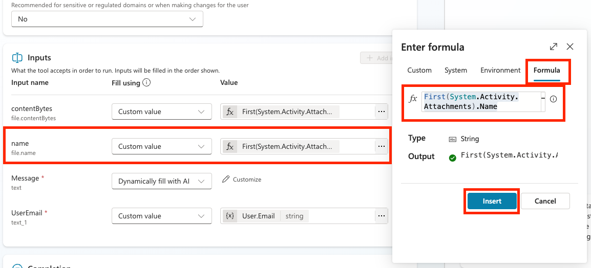

11. Adesso occorre configurare l'input **Message**. In questo caso va bene riempire il campo dinamicamente con l'AI per questo motivo la colonna **Fill using** può essere lasciata così com'è. Premere il tasto **Customize** nella colonna **Value** per aggiungere ulteriori dettagli utili all'agente per riempire il campo con un valore appropriato.

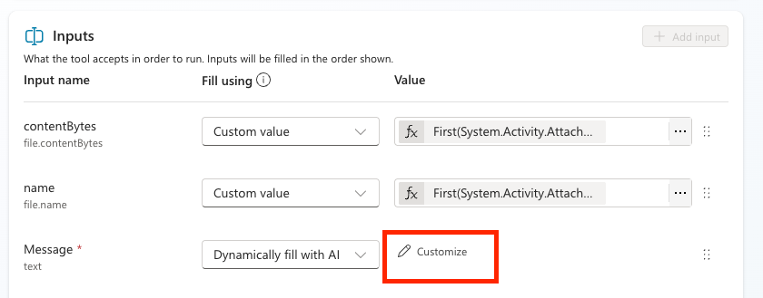

12. Inserire il seguente valore nel campo **Description**:

```
Extract a cover letter style message from the context. Be sure to never prompt the user and create at least a minimal cover letter from the available context. STRICT RULE - the message must be less than 2000 characters.
```

>[!NOTE]
>**Nota**
>
>Utilizzare una buona descrizione dei campi di input dinamici è un passaggio cruciale per assicurarsi che l'agente conosca come riempire gli input correttamente.

13. Espandere la sezione **Advanced** per configurare alcune proprietà addizionali relative a questo input. Nella sezione **How many reprompts**, selezionare **Don't repeat**

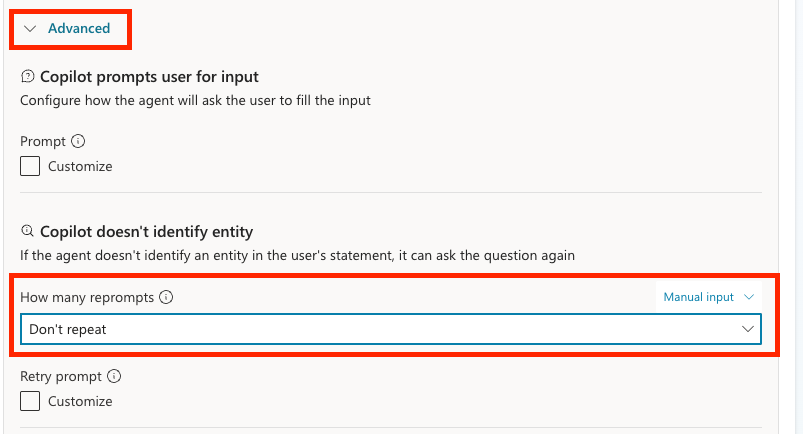

>[!NOTE]
>**Nota**
>
>Questa impostazione va a migliorare l'esperienza utente, in modo da non fare chiedere all'agente la stessa domanda multiple volte se non riesce ad identificare il dato corretto. Il compromesso è accettare che raramente inserirà un valore predefinito in questo campo, che verrà configurato nel prossimo passaggio.

14. Scorrere in basso fino alla sezione **No valid entity found**. Nel menu a tendina **Action if no entity found** selezionare l'opzione **Set variable to value**. Scrivere `Resume upload` nel campo **Default entity value**.

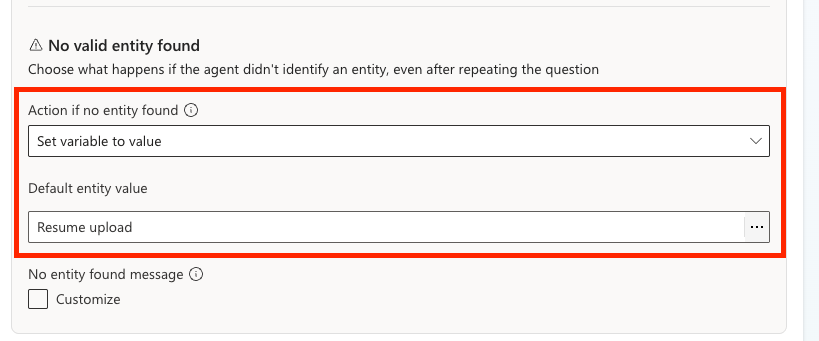

15. Infine, riempire l'ultimo input **UserEmail** selezionando nella colonna **Fill using** l'opzione **Custom value** e premendo i tre puntini **...** nella colonna **Value**. Selezionare questa volta la scheda **System** e cercare **User**. Selezionare la variabile **User.Email** che contiene il valore email dell'utente che sta interagendo con l'agente.

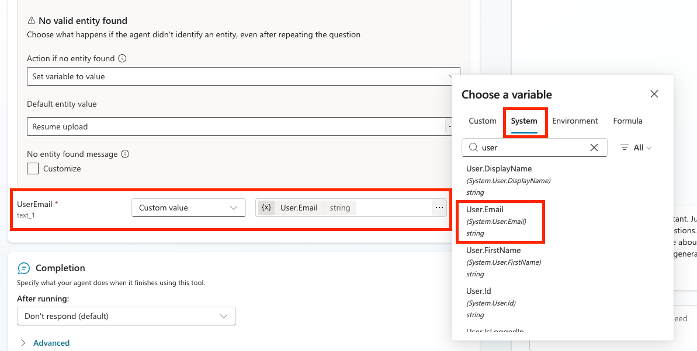

16. Premere **Save**

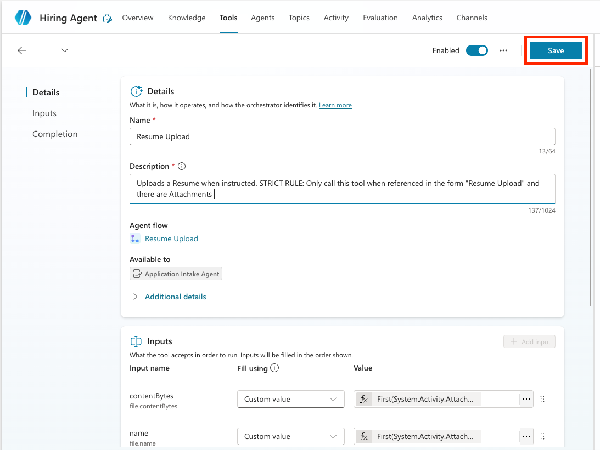

### Definire le istruzioni dell'agente

1. Selezionare la scheda **Agents** e tornare indietro all'**Application Intake Agent**, e individuare il pannello contenente le **Instructions**
2. Nel campo **Instructions**, incollare le linee guida per il child agent:

```
You are tasked with managing incoming Resumes, Candidate information, and creating Job Applications.  
Only use tools if the step exactly matches the defined process. Otherwise, indicate you cannot help.  

Process for Resume Upload via Chat  
1. Upload Resume  
  - Trigger only if /System.Activity.Attachments contains exactly one new resume.  
  - If more than one file, instruct the user to upload one at a time and stop.  
  - Call /Upload Resume once. Never upload more than once for the same message.  

2. Post-Upload  
  - Always output the [ResumeNumber] (R#####).
```

3. Nei punti in cui le istruzioni contengono un nome preceduto dallo slash in avanti (`/`), selezionare il testo che segue il carattere `/` e selezionare il nome dinamico. Impostare:
	- `System.Activity.Attachments` (Variabile)
	- `Upload Resume` (Tool)

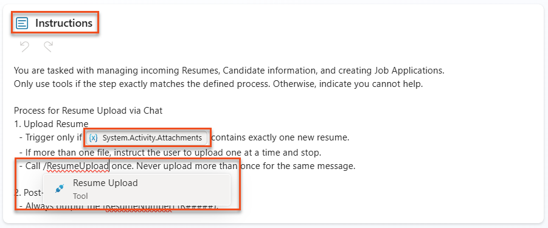

4. Selezionare **Save**

### Testare l'agente

E' arrivato il momento di verificare che l'agente funzioni correttamente, chiamando il child agent seguendo le istruzioni fornite.

1. **Scaricare** i CV demo (`cv_fictitious.zip` nella cartella demo-material)
2. Abilitare il pannello di test di Copilot Studio tramite il tasto **Test** in alto a destra
3. Caricare due CV in chat inserendo anche il seguente prompt:

```
Process these resumes
```

L'agente dovrebbe rispondere con un errore indicando che può processare solo un file alla volta, questo indica che le istruzioni stanno funzionando correttamente!

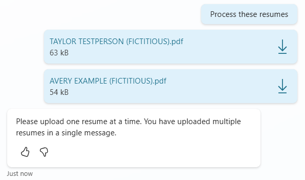

4. Ora, caricare un solo CV con il messaggio `Process this resume`

	L'agente dovrebbe rispondere con un messaggio simile a *The resume for Avery Example has been successfully uploaded. The resume number is R10026.*

5. Nell'**Activity map**, si dovrebbe vedere l'agente figlio **Application Intake Agent** gestire il caricamento del nuovo CV. 

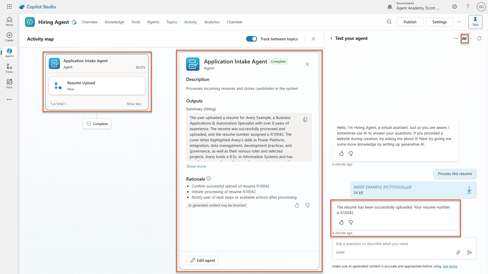

6. Per verificare l'output, navigare su make.powerapps.com, assicurandosi di trovarsi nell'environment corretto.
7. Selezionare **Apps** > **Hiring Hub** > menu espandibile **...** > **Play**

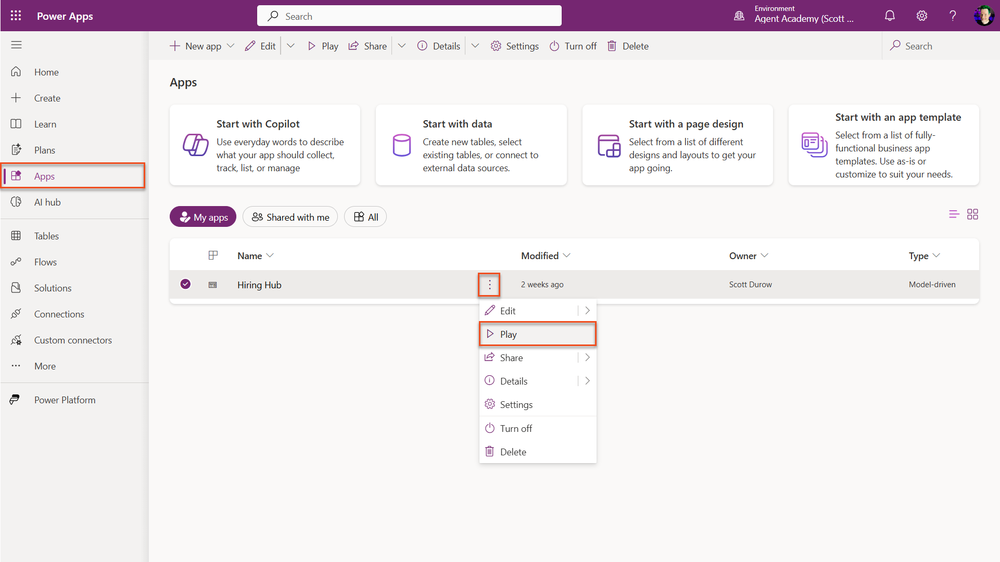

>[!NOTE]
>**Nota**
>
>Se il bottone play è grigio e non interagibile vuol dire che la soluzione non è stata pubblicata nel lab precedente di setup.
>

8. Navigare su **Resumes**, e controllare che il file è stato caricato e la cover letter è stata riempita di conseguenza

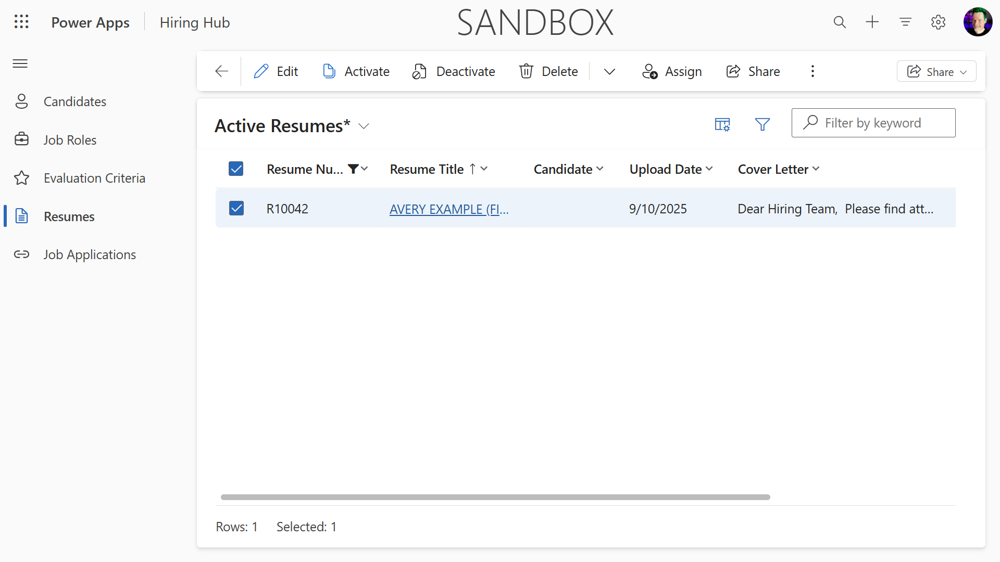

## Interview Prep Agent

In questa sezione del lab verrà creato il connected agent da aggiungere al nostro sistema di agenti.

### Create the connected Interview Agent

1. Navigare su Copilot Studio. Assicurarsi che l'environment selezionato sia quello contenente gli agenti precedentemente creati.
2. Selezionare **Agenti** nella navigazione di sinistra
3. Aprire l'icona a freccia verso il basso accanto a *Create blank agent* e selezionare **Advanced create**


4. Per *soluzione*, selezionare **Operative** (la soluzione appena importata)
5. Per *schema name*, inserire `interviewagent` dopo il prefisso *ppa_* 

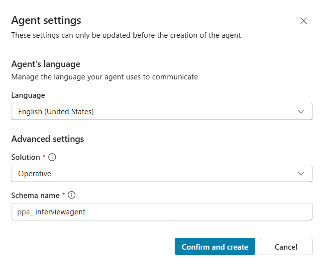

6. Selezionare **Confirm and create**

Questo dovrebbe essere il primo agente nella soluzione *Operative* e ricevere il nome *Agent N*. Non è un grande nome quindi verrà subito cambiato.

7. Nella carta *Details* in cima, selezionare **Edit**
8. Come **Nome**, inserire:

```
Interview Agent
```

9. Come **Descrizione**, inserire:

```
Assists with the interview process.
```

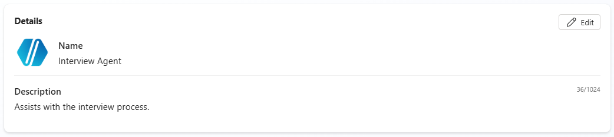

4. Nella sezione **Instructions**, premere **Edit** ed inserire:

```
You are the Interview Agent. You help interviewers and hiring managers prepare for interviews. You never contact candidates. 
Use Knowledge to help with interview preparation. 

The only valid identifiers are:
  - ResumeNumber (ppa_resumenumber)→ format R#####
  - CandidateNumber (ppa_candidatenumber)→ format C#####
  - ApplicationNumber (ppa_applicationnumber)→ format A#####
  - JobRoleNumber (ppa_jobrolenumber)→ format J#####

Examples you handle
  - Give me a summary of ...
  - Help me prepare to interview candidates for the Power Platform Developer role
  - Create interview assistance for the candidates for Power Platform Developer
  - Give targeted questions for Candidate Alex Johnson focusing on the criteria for the Job Application
  
How to work:
    You are expected to ask clarification questions if required information for queries is not provided
    - If asked for interview help without providing a job role, ask for it
    - If asking for interview questions, ask for the candidate and job role if not provided.

General behavior
- Do not invent or guess facts
- Be concise, professional, and evidence-based
- Map strengths and risks to the highest-weight criteria
- If data is missing (e.g., no resume), state what is missing and ask for clarification
- Never address or message a candidate
```

5. Nella sezione **Knowledge**, assicurarsi che **Web Search** sia impostata su **Disabled**.
### Configurare la Knowledge

1. Navigare all'interno della scheda **Knowledge** e premere **+ Add knowledge**

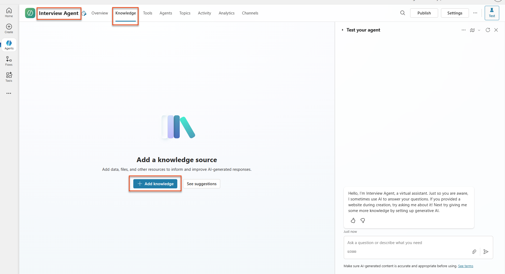

2. Selezionare **Dataverse**

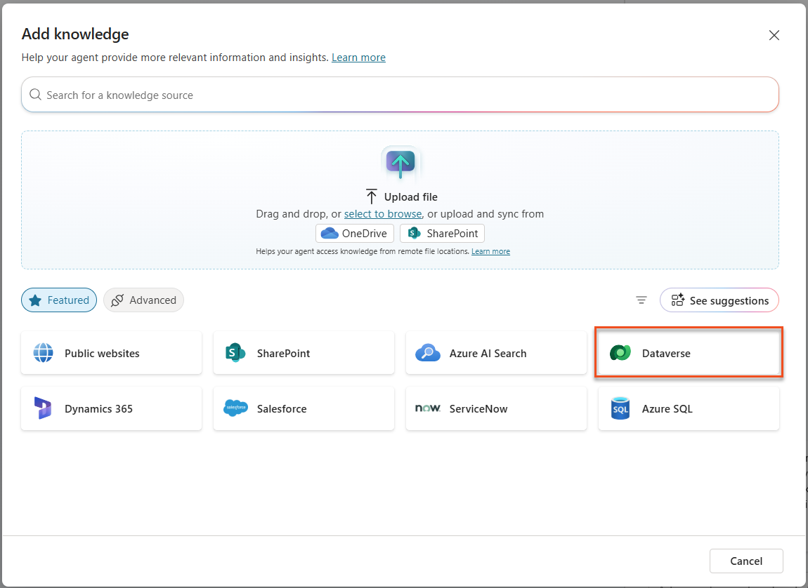

3. Nel box di ricerca, scrivere `ppa_`. Questo è il prefisso per le tabelle precedentemente importate nel lab di setup.
4. Selezionare tutte le 5 tabelle (Candidate, Evaluation Criteria, Job Application, Job Role, Resume)
5. Selezionare **Add to agent**

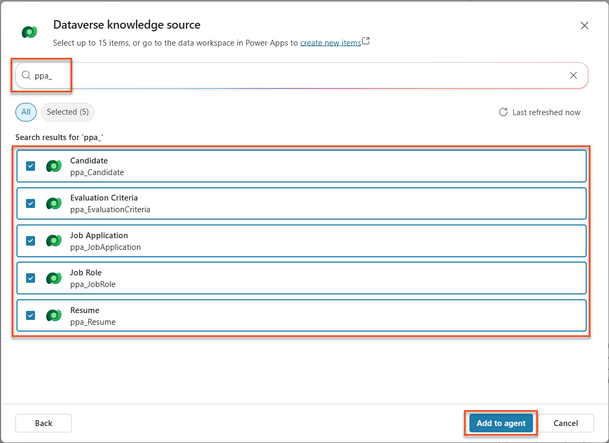

6. Entrare nel menu **Settings** tramite il tasto in alto a destra.

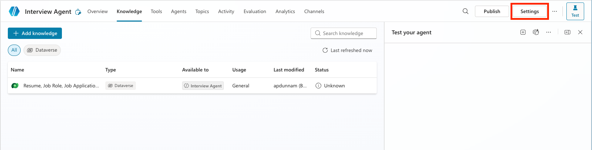

7. Assicurarsi che le seguenti impostazioni siano configurate correttamente:

- **Let other agents connect to and use this one:** `On`
- **Use general knowledge**: `Off`
- **File uploads**: `Off`
- **Content moderation level:** `Medium`

8. Premere **Save** e uscire dal menu delle impostazioni tramite il tasto **X** in alto a destra.

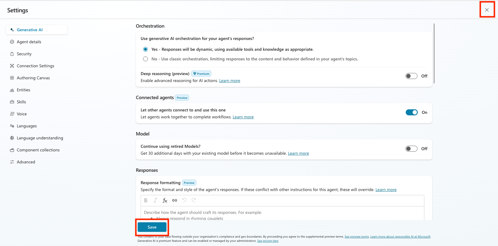

9. Premere **Publish**, e attendere il completamento dell'operazione.

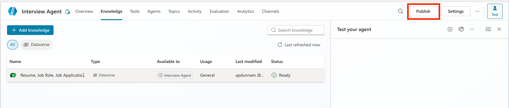

### Connettere Interview Agent ad Hiring Agent

1. Tornare all'interno di **Hiring Agent**
2. Selezionare la scheda **Agents**
3. Premere **+Add an agent** e selezionare l'agente appena creato **Interview Agent**

>[!NOTE]
>**Nota**
>
>Qualora Interview Agent risultasse grigio e non selezionabile, questo indica che l'agente non è ancora stato pubblicato. Tornare indietro e assicurarsi della buona riuscita dell'operazione di publish.

4. Impostare la **Description** in questo modo:

```
Assists with the interview process and provides information about Resumes, Candidates, Job Roles, and Evaluation Criteria.
```

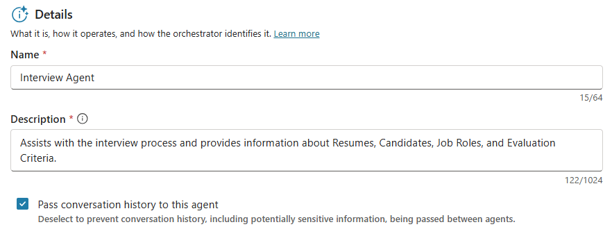

>[!NOTE]
>**Nota**
>
>Notare che l'opzione *Pass conversation history to this agent* è abilitata di base. Questo consente all'agente di partenza di fornire pieno contesto all'agente connesso.

5. Premere **Add agent**
6. Assicurarsi di vedere sia **Application Intake Agent** che **Interview Agent**. Notare come uno sia un *Child agent* e l'altro un *Connected agent*. 

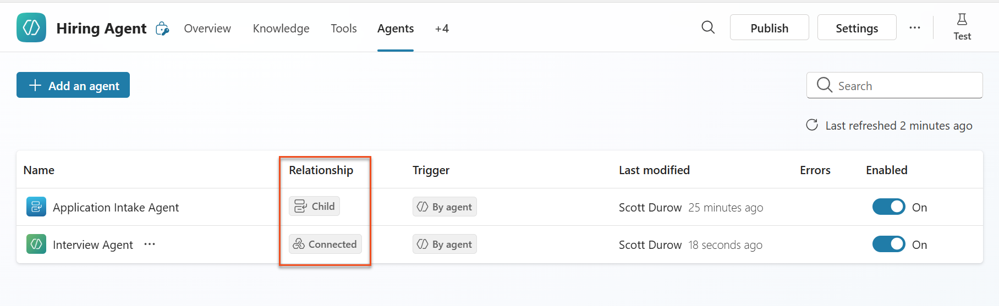

### Testare la collaborazione multi agente

1. Aprire il pannello di **Test**
2. Caricare uno dei CV demo ed inserire la seguente descrizione che rende chiaro all'agente padre cosa delegare all'agente connesso:

```
Upload this resume, then show me open job roles, each with a description of the evaluation criteria, then use this to match the resume to at least one suitable job role even if not a perfect match.
```

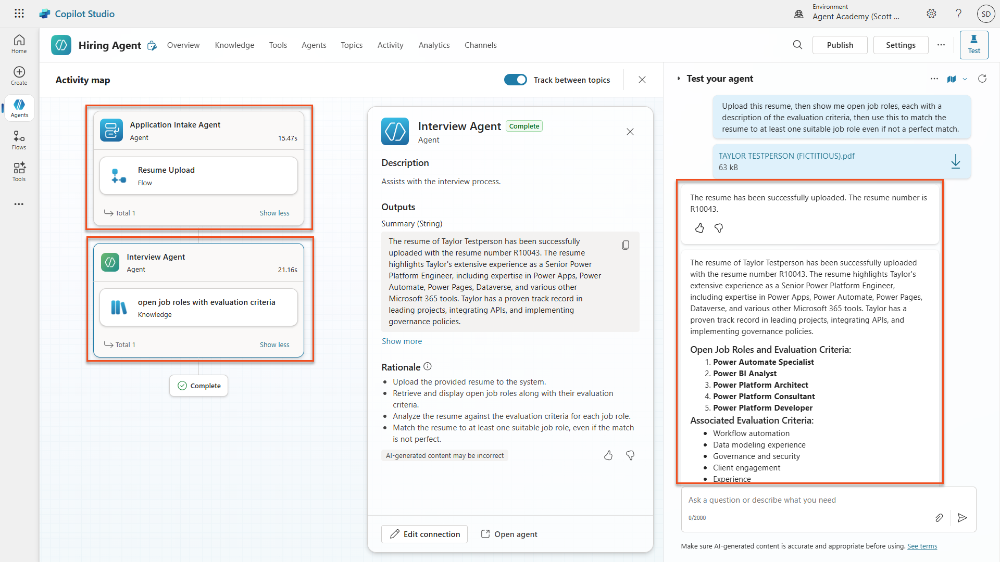

3. Notare come Hiring Agent va a delegare il caricamento del file all'agente figlio, e poi chiede all'Interview Agent di fornire un riassunto e ruoli aperti che potrebbero risultare affini, utilizzando la sua conoscenza. Provare diverse richieste sui Resumes, Job Roles ed Evaluation Criteria, ad esempio:

```
Give me a summary of active resumes
```

```
Summarize resume R10044
```

```
Which active resumes are suitable for the Power Platform Developer role?
```

>[!IMPORTANT]
>**Successo**
>
>Con la primo sistema multi agent funzionante, il laboratorio è terminato! 
>Il prossimo passaggio sarà quello di caricare automaticamente i CV che arrivano via mail.

