# Lab 09 - Multimodal Resume Prompt

[Previous: Lab 08](../08-autonomous-hiring-agent/README.md) | [Back to README](../../README.md) | [Next: Lab 10](../10-advanced-grounding/README.md)

>[!warning] Prerequisito
>Per completare questo lab è necessario avere completato il laboratorio precedente sul sistema *Multi Agente*
## Creare il prompt multi modale

1. Navigare su Copilot Studio e selezionare **Tools** dalla navigazione di sinistra
2. Selezionare **+ New tool**, e premere **Prompt**

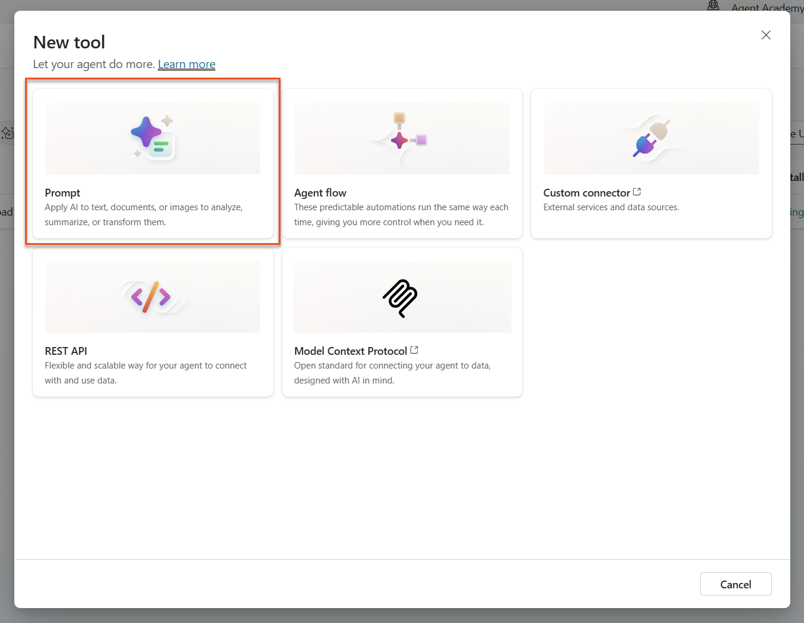

3. Rinominare il prompt dal suo nome predefinito (come *custom prompt 06/03/2026*) a `Summarize Resume`

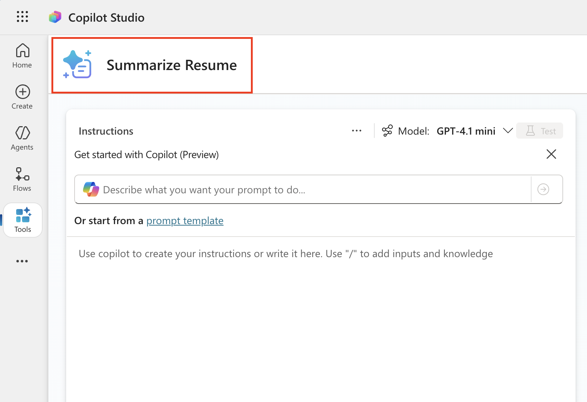

4. Nel campo istruzioni, aggiungere il seguente prompt:

```
You are tasked with extracting key candidate information from a resume and cover letter to facilitate matching with open job roles and creating a summary for application review.

Instructions:
1. Extract Candidate Details:
    - Identify and extract the candidate’s full name.
    - Extract contact information, specifically the email address.
2. Create Candidate Summary:
    - Summarize the candidate’s profile as multiline text (max 2000 characters) with the following sections:
        - Candidate name
        - Role(s) applied for if present
        - Contact and location
        - One-paragraph summary
        - Experience snapshot (last 2–3 roles with outcomes)
        - Key projects (1–3 with metrics)
        - Education and certifications
        - Top skills (Top 10)
        - Availability and work authorization

Guidelines:
- Extract information only from the provided resume and cover letter documents.
- Ensure accuracy in identifying all details such as contact details and skills.
- The summary should be concise but informative, suitable for quick application review.

Resume: /document
CoverLetter: /text
```

5. Configurare i seguenti parametri di input:

| Parametro   | Type              | Name        | Sample Dat                     |
| ----------- | ----------------- | ----------- | ------------------------------ |
| Resume      | Image or document | Resume      | Caricare un CV tra quelli demo |
| CoverLetter | Text              | CoverLetter | Here is a Resume!              |
6. Premere il tasto **Test** per vedere il primo esempio di output per il prompt

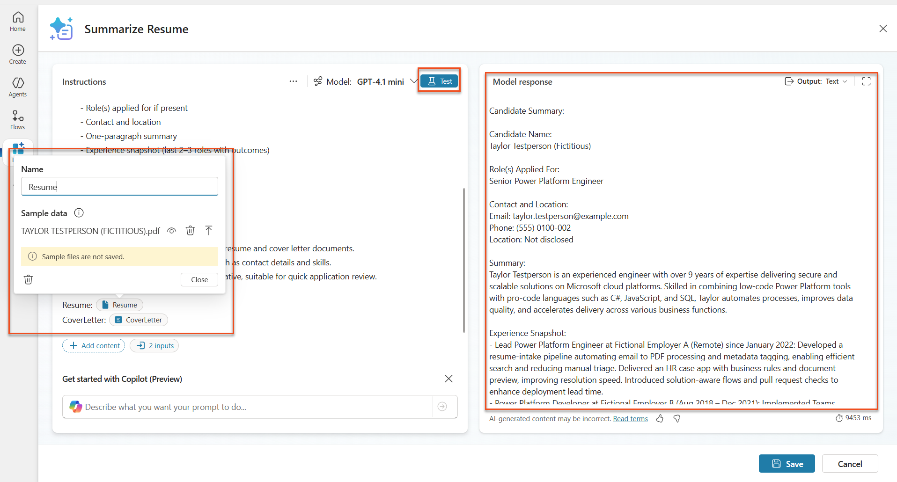

## Configurare l'output in JSON

Per interagire con un sistema interno, invece di semplice testo spesso è conveniente utilizzare un formato più strutturato come un JSON.

1. Sempre all'interno della configurazione della *prompt action*, aggiungere una linea alla fine del prompt

```
Output Format: 
Provide the output in valid JSON format with the following structure:
`
{
"CandidateName": "string",
"Email": "string",
"Summary": "string max 2000 characters",
"Skills": [{"item": "Skill 1"}, {"item": "Skill 2"}],
"Experience": [{"item": "Experience 1"}, {"item": "Experience 2"}]
}
`
```

2. Modificare l'impostazione di **Output** in alto a destra da *Text* a **JSON**

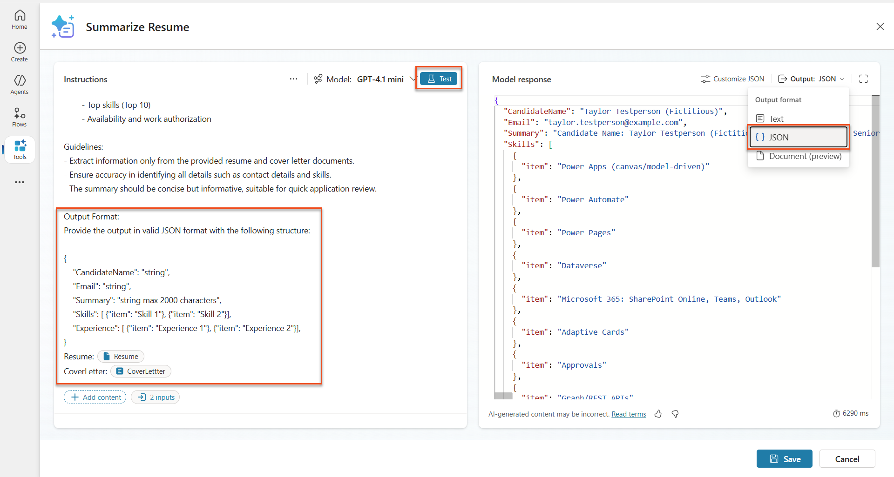

3. Effettuare un nuovo **Test** per verificare che l'output sia correttamente formattato in JSON
4. ***Opzionale***: provare a testare il comportamento con diversi modelli
5. Selezionare **Save** per creare il prompt
6. Nella finestra di dialogo **Configure for use in Agent**, selezionare **Cancel**

>[!info] Nota
>Per avere ancora più controllo sul flusso di estrazione dati, la prompt action appena creata verrà utilizzata all'interno di un agent flow e non data direttamente all'utente come tool

## Aggiungere il prompt ad un Agent Flow

1. Navigare all'interno dell'**Hiring Agent** all'interno di Copilot Studio
2. Navigare nella scheda **Agents** e selezionare l'agente figlio **Application Intake Agent**

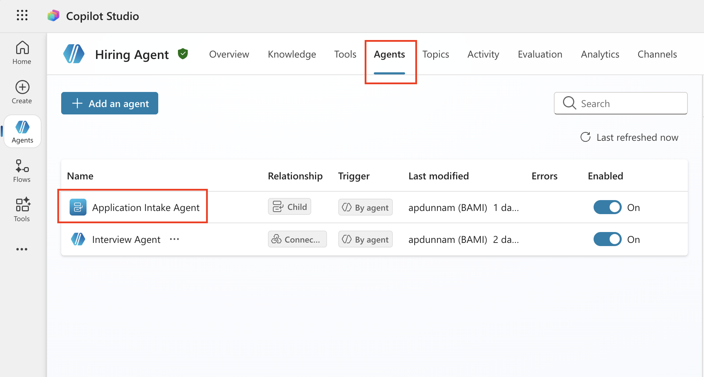

3. All'interno della sezione **Tools**, selezionare **+ Add > + New tool > Agent flow**
4. Nel trigger **When an agent calls the flow**, premere **+Add an input** per aggiungere il seguente parametro:

| Type | Name         | Description                                                             |
| ---- | ------------ | ----------------------------------------------------------------------- |
| Text | ResumeNumber | Be sure to use [ResumeNumber]. This must always start with the letter R |

5. Selezionare il tasto **+** per aggiungere un nuovo nodo, cercare `dataverse list rows` e selezionare l'azione **List rows**

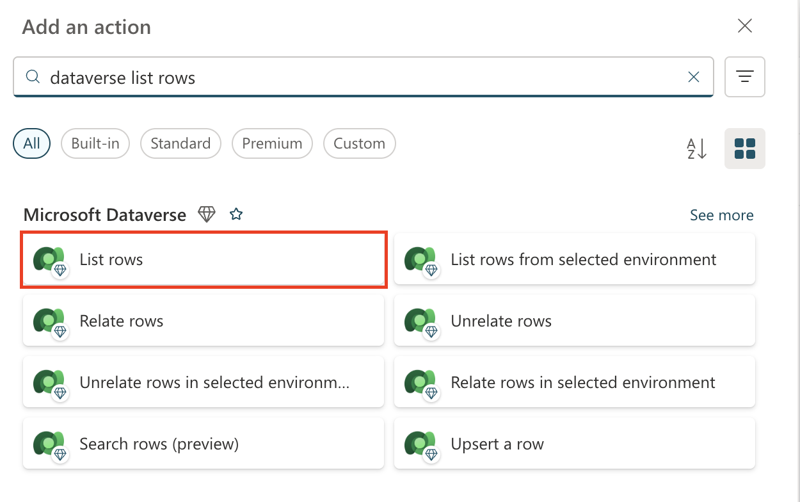

6. Rinominare l'azione appena creata in `Get Resume Record`, ed impostare i seguenti parametri:

| Property        | Come impostare  | Value                                                                                                                                                |
| --------------- | --------------- | ---------------------------------------------------------------------------------------------------------------------------------------------------- |
| **Table name**  | Selezione       | Resumes                                                                                                                                              |
| **Filter rows** | Valore dinamico | `ppa_resumenumber eq 'ResumeNumber'` dove **ResumeNumber** va rimpiazzato con il valore dinamico **When an agent calls the flow** → **ResumeNumber** |
| **Row count**   | Inserimento     | 1                                                                                                                                                    |

>[!tip] Ottimizzare le queries
>Quando si utilizza una tecnica di questo tipo in produzione, è sempre una *best practice* quella di limitare le colonne selezionate ai soli valori richiesti dall'Agent Flow

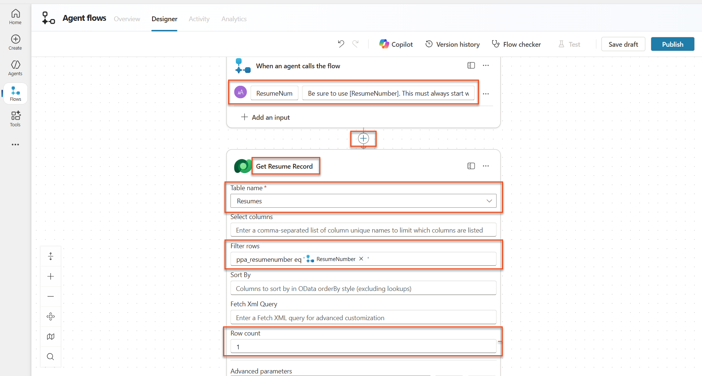

7. Premere il tasto **+** sotto l'azione appena configurata, cercare `dataverse download` e selezionare l'azione **Download a file or an image**

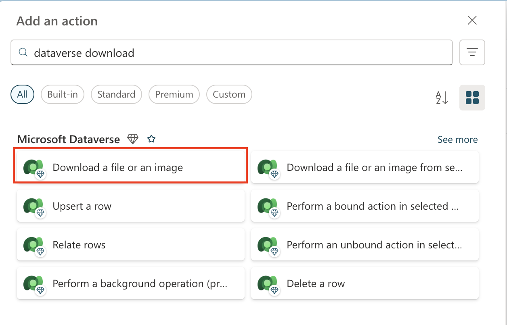

8. Come prima, rinominare la nuova azione in `Download Resume` ed impostare i parametri seguenti

| Property        | Come impostare         | Value                                                         |
| --------------- | ---------------------- | ------------------------------------------------------------- |
| **Table name**  | Selezionare            | Resumes                                                       |
| **Row ID**      | Espressione (icona fx) | `first(body('Get_Resume_Record')?['value'])?['ppa_resumeid']` |
| **Column name** | Selezionare            | Resume PDF                                                    |

>[!tip] Approfondimento: formula PowerFx utilizzata
>**`body('Get_Resume_Record')`**  → Restituisce il **body della risposta** dell’azione *Get Resume Record*
>**`?['value']`** → Accede alla proprietà **value**, che contiene **l’array dei record Dataverse trovati**
>**`first(...)`** → Prende **il primo record** dell’array restituito dalla query
>**`?['ppa_resumeid']`** → Estrae il campo **ppa_resumeid**, cioè **l’ID del file** memorizzato nel record

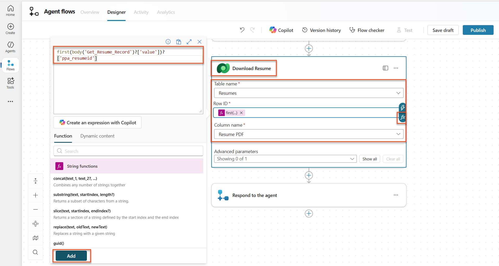

9. Premere il tasto **+** sotto l'azione appena configurata, e selezionare **Run a prompt** sotto la sezione **AI capabilities**

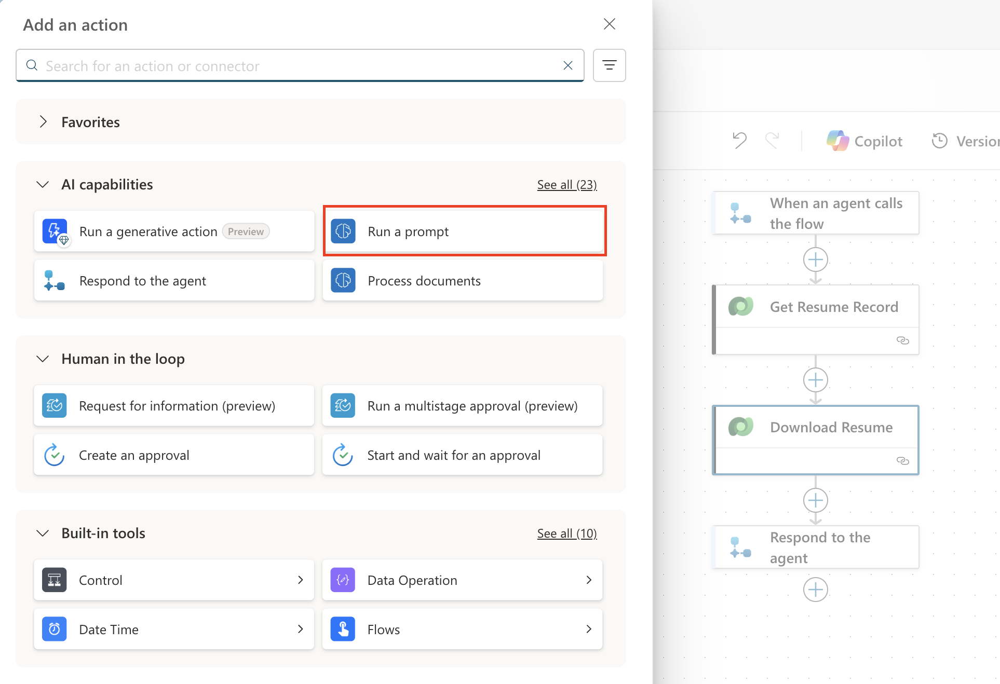

10. Rinominare l'azione in `Summarize Resume` ed impostare i seguenti parametri:

| Property        | Come impostare         | Value                                                            |
| --------------- | ---------------------- | ---------------------------------------------------------------- |
| **Prompt**      | Selezionare            | Summarize Resume                                                 |
| **CoverLetter** | Espressione (icona fx) | `first(body('Get_Resume_Record')?['value'])?['ppa_coverletter']` |
| **Resume**      | Dato dinamico          | Download Resume → File or image content                          |

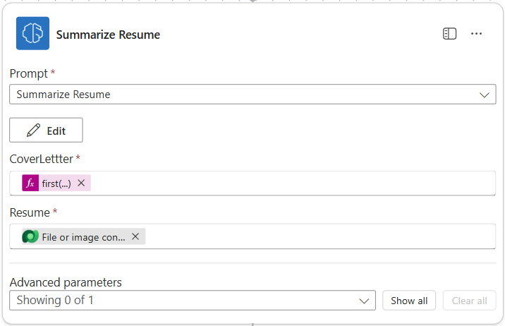

>[!nota] Nota
>Notare come i parametri appena impostati sono gli stessi che sono stati impostati come parametri di input nella configurazione della prompt action

## Creare il record di un candidato

Adesso l'informazione fornita dalla prompt action verrà utilizzata per creare un nuovo record, se non è già presente.

1. Premere il tasto **+** sotto il nodo **Summarize Resume**, cercare `dataverse list` e selezionare l'azione **List rows**
2. Rinominare l'azione appena creata in `Get Existing Candidate`, ed impostare i seguenti parametri:

| Property        | Come impostare | Value                                                                               |
| --------------- | -------------- | ----------------------------------------------------------------------------------- |
| **Table name**  | Selezionare    | Candidates                                                                          |
| **Filter rows** | Dato dinamico  | `ppa_email eq 'Email'` dove `Email` va rimpiazzata con **Summarize Resume → Email** |
| **Row count**   | Inserire       | 1                                                                                   |

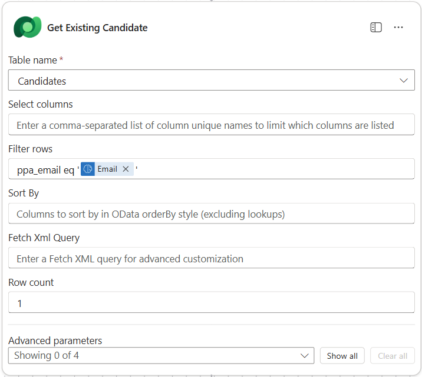

3. Premere il tasto **+** sotto l'azione appena configurata, cercare `control`, selezionare **See more** fino a trovare l'azione **Condition**
4. Nelle proprietà della **Condition** impostare i seguenti valori:

|Condition|Operator|Value|
|---|---|---|
|Expression (fx icon): `length(outputs('Get_Existing_Candidate')?['body/value'])`|is equal to|0|

>[!tip] Approfondimento: formula PowerFx utilizzata
>- **`outputs('Get_Existing_Candidate')`**  → Restituisce **l’output completo** dell’azione *Get Existing Candidate*
>- **`?['body/value']`** → Accede alla proprietà **value** del body della risposta, che contiene l'**array** dei **record Dataverse trovati**.
>- **`length(...)`** → Conta **il numero di elementi presenti nell’array**. 
>
>In questo caso, il valore di ritorno `0` indica che non sono stati trovati candidati corrispondenti ai criteri cercati

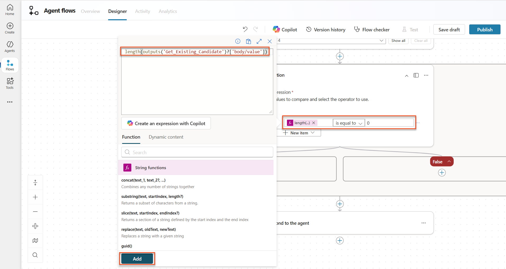

5. Premere il tasto **+** all'interno del ramo **True**, cercare `dataverse add` e selezionare l'azione **Add a new row**
6. Cambiare il nome della nuova azione in `Add a New Candidate`, ed impostare i seguenti parametri:

| Parametro          | Come impostare            | Value                              |
| ------------------ | ------------------------- | ---------------------------------- |
| **Table name**     | Selezionare               | Candidates                         |
| **Candidate Name** | Valore dinamico (fulmine) | Summarize Resume → `CandidateName` |
| **Email**          | Valore dinamico (fulmine) | Summarize Resume → `Email`         |
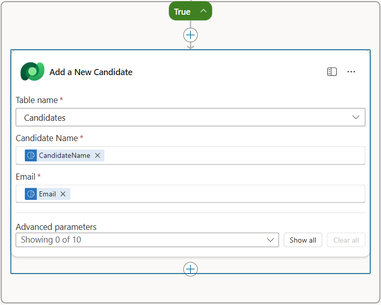

## Aggiornare il CV e configurare gli output

Completare il flusso aggiornando i dati e configurando il valore da restituire all'agente.

1. Premere il tasto **+** per aggiungere una nuova azione sotto il blocco **Condition** (fuori dai rami), cercare `dataverse update` e selezionare l'azione **Update a row**
2. Cambiare il nome della nuova azione in `Update Resume`, selezionare **Show all** ed impostare i seguenti parametri:

| Parametro                  | Come impostare            | Value                                                                                                                                                                                                                                     |
| -------------------------- | ------------------------- | ----------------------------------------------------------------------------------------------------------------------------------------------------------------------------------------------------------------------------------------- |
| **Table name**             | Selezionare               | Resumes                                                                                                                                                                                                                                   |
| **Row ID**                 | Espressione (fx)          | `first(body('Get_Resume_Record')?['value'])?['ppa_resumeid']`                                                                                                                                                                             |
| **Summary**                | Valore dinamico (fulmine) | Summarize Resume → Text                                                                                                                                                                                                                   |
| **Candidate (Candidates)** | Espressione (fx)          | `concat('ppa_candidates/',if(equals(length(outputs('Get_Existing_Candidate')?['body/value']), 1), first(outputs('Get_Existing_Candidate')?['body/value'])?['ppa_candidateid'], outputs('Add_a_New_Candidate')?['body/ppa_candidateid']))` |

>[!tip] Approfondimento: formula PowerFx utilizzata
>- `concat('ppa_candidates/', ...)` → Concatena una stringa per costruire il **percorso della tabella Dataverse**. In questo caso sono nel formato `ppa_candidates/{candidateId}`, dove `ppa_candidates` è il nome logico della tabella Dataverse.
>- `equals(..., 1)` → Verifica se **esiste esattamente un candidato**
>- `first(outputs('Get_Existing_Candidate')?['body/value'])?['ppa_candidateid']` → (Se il candidato esiste) prende l'ID del primo candidato trovato
>- `outputs('Add_a_New_Candidate')?['body/ppa_candidateid']` → (Se il candidato *non* esiste) prende l'ID del candidato appena creato, con l'azione *Add a New Candidate*
>
>La formula restituisce un valore finale nel formato `ppa_candidates/3f8c2c9b-xxxx-xxxx-xxxx-xxxxxxxxxxxx`, indipendentemente dal fatto che il record esistesse già o sia stato appena creato.

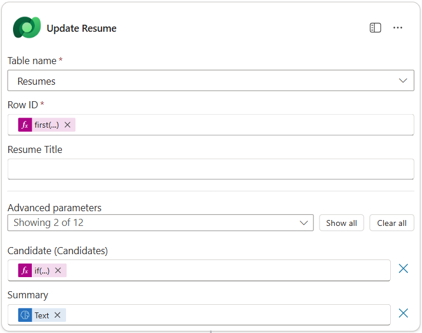

3. Selezionare l'ultimo nodo **Respond to the agent** e premere **+ Add an output** per configurare i seguenti valori di ritorno, scegliendo il tipo appropriato per ognuno:

| Type | Name              | Come impostare            | Value                                                                                                                                                                                                                  | Description                                            |
| ---- | ----------------- | ------------------------- | ---------------------------------------------------------------------------------------------------------------------------------------------------------------------------------------------------------------------- | ------------------------------------------------------ |
| Text | `CandidateName`   | Valore dinamico (fulmine) | Summarize Resume → See more → CandidateName                                                                                                                                                                            | The [CandidateName] given on the Resume                |
| Text | `CandidateEmail`  | Valore dinamico (fulmine) | Summarize Resume → See more → Email                                                                                                                                                                                    | The [CandidateEmail] given on the Resume               |
| Text | `CandidateNumber` | Espressione (fx)          | `if(equals(length(outputs('Get_Existing_Candidate')?['body/value']), 1), first(outputs('Get_Existing_Candidate')?['body/value'])['ppa_candidatenumber'], outputs('Add_a_New_Candidate')?['body/ppa_candidatenumber'])` | The [CandidateNumber] of the new or existing candidate |
| Text | `ResumeSummary`   | Valore dinamico (fulmine) | Summarize Resume → See more → body/responsev2/predictionOutput/structuredOutput                                                                                                                                        | The resume summary and details in JSON form            |
|      |                   |                           |                                                                                                                                                                                                                        |                                                        |


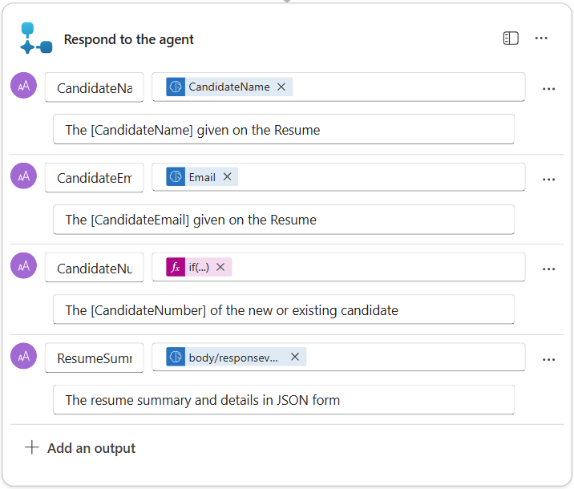

4. Premere **Save draft** in alto a destra. Assicurarsi che il flusso sia uguale a quello mostrato in figura, controllando in particolare che il nodo **Update Resume** sia fuori dal blocco della logica  *Condition*

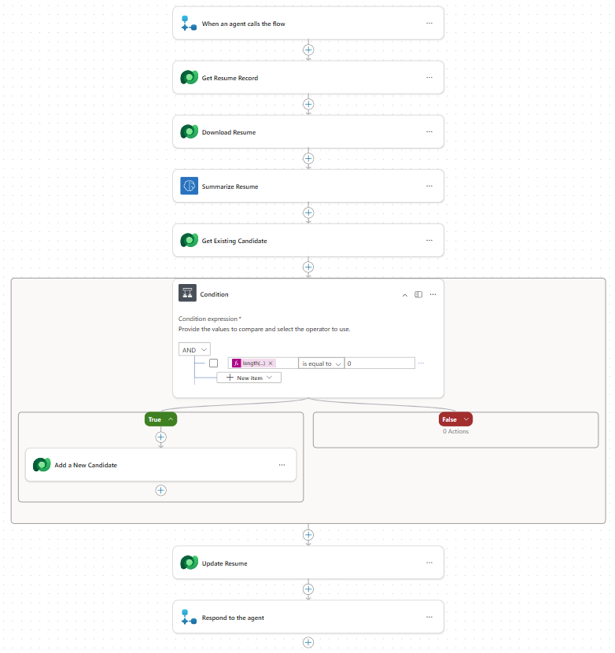

5. Navigare nella scheda di **Overview** e selezionare **Edit** all'interno della sezione **Details**. Modificare i seguenti campi:
- **Flow name**: `Summarize Resume`
- **Description**:
```
Summarize an existing Resume stored in Dataverse using a [ResumeNumber] as input, return the [CandidateNumber], and resume summary JSON
```

6. Premere **Save**
7. Navigare indietro sulla scheda **Designer**, premere **Publish**

## Connettere il flusso all'agente

L'ultimo passaggio sarà quello di connettere il flusso all'agente che deve utilizzarlo.

1. In Copilot Studio, aprire **Hiring Agent**
2. Selezionare la scheda **Agents**, ed aprire **Application Intake Agent**
3. Navigare nel pannello **Tools**, e selezionare **+ Add a tool > Flow > Summarize Resume (Agent Flow)**

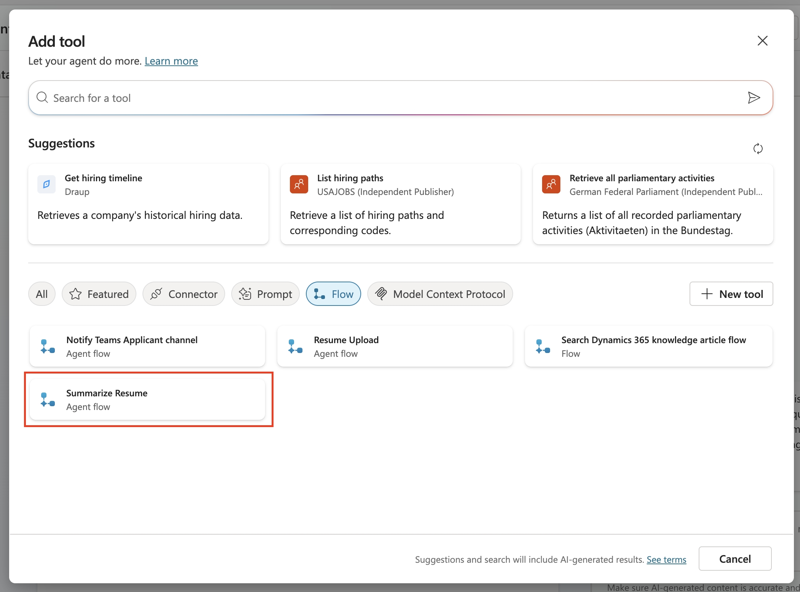

4. Selezionare **Add and configure**
5. Impostare i parametri come in seguito:

- **Description**: `Summarize an existing Resume stored in Dataverse using a [ResumeNumber] as input, return the [CandidateNumber], and resume summary JSON`
- **When this tool may be used**: *Only when referenced by topics or agents*

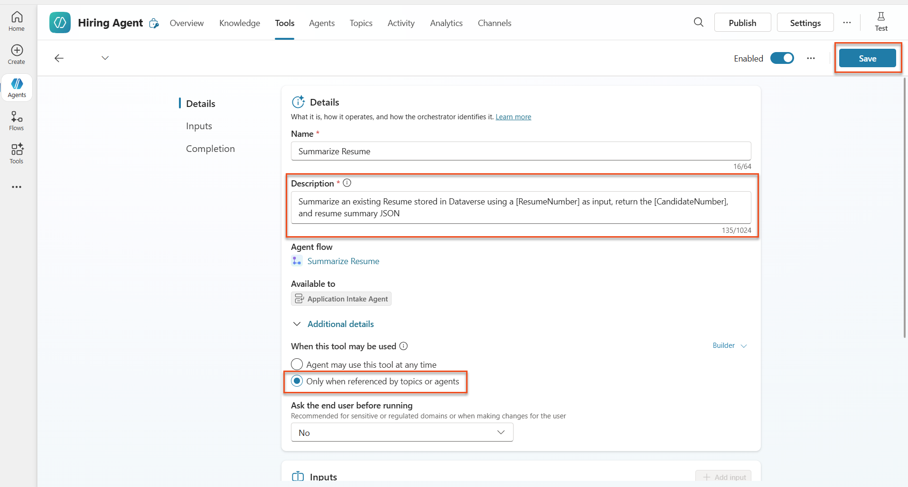

6. Premere **Save**
7. All'interno dei **Tools** di **Hiring Agent**, adesso dovrebbero essere presenti entrambi i flussi configurati, con la dicitura che sono utilizzabili solo da **Application Intake Agent**

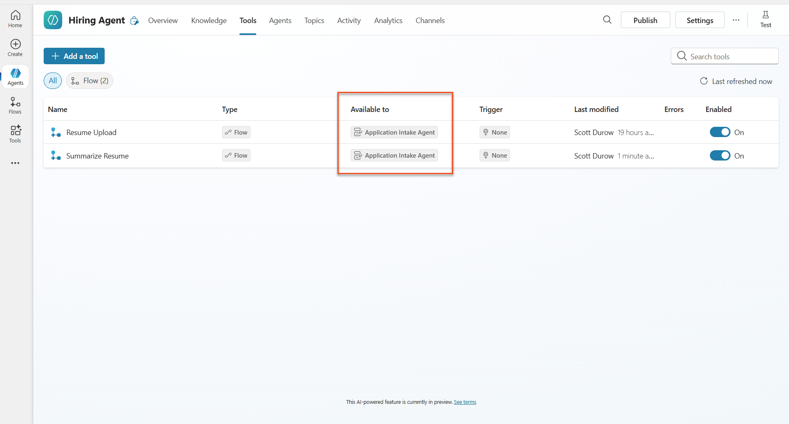

8. Navigare nelle istruzioni di **Application Intake Agent** e *rimuovere* i due paragrafi che iniziano con:
- `2.Post-Upload`
- `Process for Resume Upload via Email`

8. Inserire le seguenti istruzioni all'interno delle istruzioni rimanenti:

```
2. Post-Upload Processing  
    - After uploading, be sure to also output the [ResumeNumber] in all messages
    - Pass [ResumeNumber] to /Summarize Resume  - Be sure to use the correct value that will start with the letter R.
    - Be sure to also output the [CandidateNumber] in all messages
    - Use the [ResumeSummary] to output a summary of the processed Resume and candidate
```

9. Rimpiazzare `/Summarize Resume` con la relativa reference tramite l'uso del comando `/` all'interno delle istruzioni

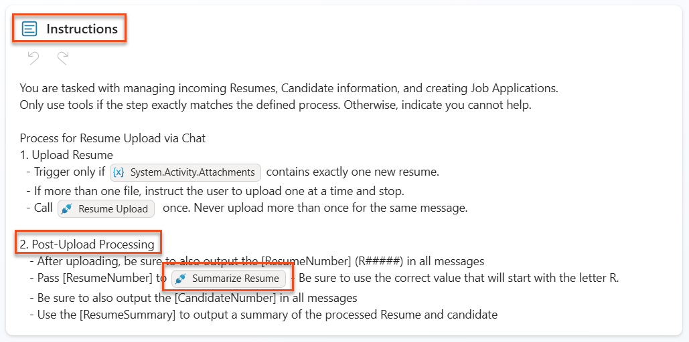

10. Premere **Save**

## Testare l'agente

Testare il sistema completo per controllare che tutto funzioni correttamente.

1. In Copilot Studio, aprire la scheda di **Test**
2. Inserire una richiesta come `Here is a candidate Resume` e caricare un CV demo
3. Verificare il corretto risultato: ricezione di un numero di candidato (in formato R######) e riassunto. Utilizzare l'activity map per controllare il lavoro degli strumenti configurati.

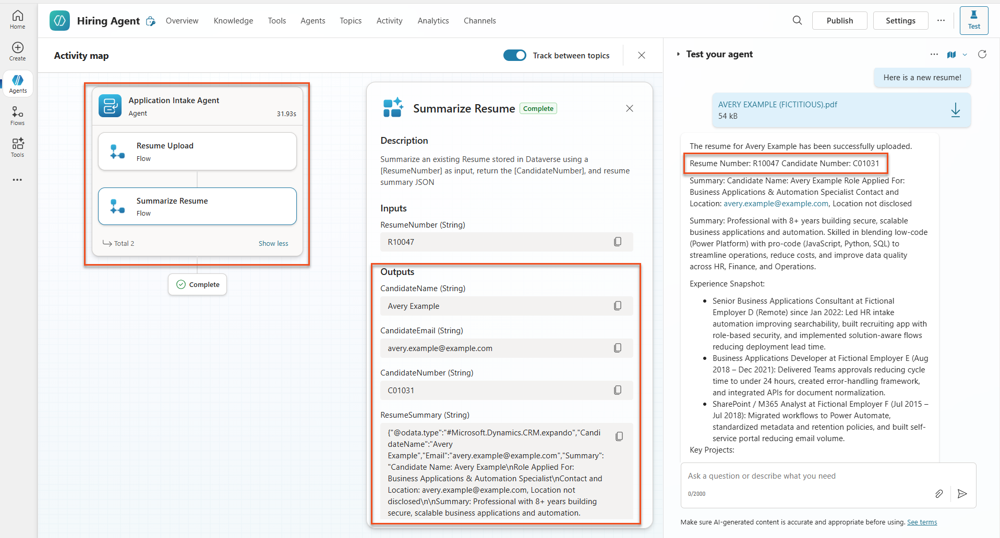

4. Controllare i dati persistenti navigando su **Power App*
5. Selezionare **Apps > Hiring Hub > Play**
6. Navigare su **Resumes** per verificare che il CV sia stato correttamente caricato e processato. Dovrebbe avere sia le informazioni riassuntive che i valori associati.
7. Controllare **Candidates** per vedere le informazioni estratte sul candidato.

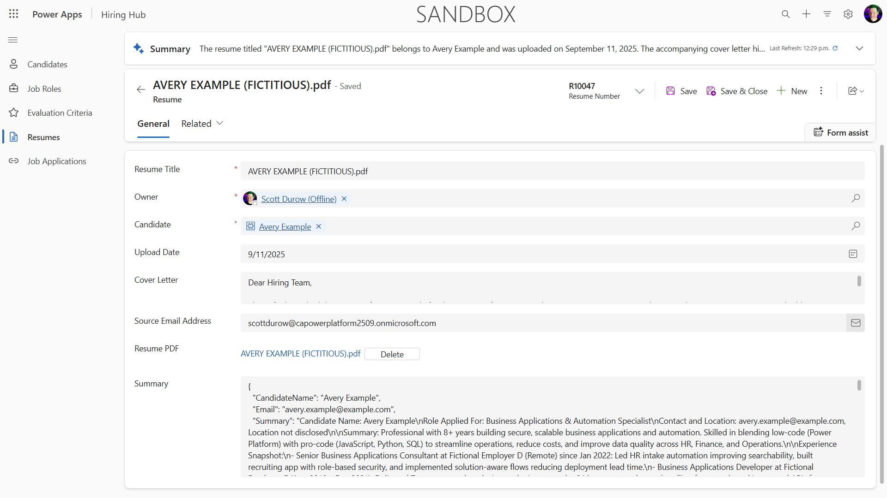

8. Rilanciando lo stesso processo nuovamente, dovrebbe usare il Candidato esistente e non crearne uno nuovo.

>[!bug] Possibili Errori
>- **Il CV non viene processato**: controllare che il file sia in formato PDF e sotto il limite di grandezza
>- **Il candidato non viene creato**: controllare che il campo email sia stato estratto correttamente dal CV
>- **Errori nel formato JSON**: controllare che le istruzioni del prompt includono la struttura *esatta* del JSON
>- **Errori nel flusso**: controllare che tutte le connessioni Dataverse siano attive e le espressioni siano configurate correttamente

>[!tip] Approfondimento: miglioramenti per produzione
>I seguenti punti non fanno parte del laboratorio, ma sono comuni considerazioni da fare prima di rendere l'agente pronto per passare in produzione:
>1. **Gestione degli errori**: se il *Resume Number* non viene trovato, o il prompt fallisce nel parsing del documento, va restituito all'agente un errore chiaro.
>2. **Aggiornamento dei candidati esistenti**: se il candidato viene trovato cercando la sua email, il nome potrebbe essere aggiornato per combaciare con quello nel CV
>3. **Dividere il riepilogo dei CV dalla creazione dei candidati**: questa funzione potrebbe essere divisa in due flussi più piccoli per renderli più facili da mantenere, e aggiornare le istruzioni così da spiegare all'agente come utilizzarli uno dopo l'altro.

>[!success] Successo
>Con la realizzazione del primo sistema multimodale in grado di estrarre informazioni da documenti, il laboratorio è terminato! Su queste fondamenta verranno espanse le capacità di ricerca informazioni nel prossimo laboratorio.

