# Lab 10 - Advanced Grounding

[Previous: Lab 09](../09-multimodal-resume-prompt/README.md) | [Back to README](../../README.md) | [Next: Lab 11](../11-advanced-content-generation/README.md)

>[!warning] Prerequisito
>Per completare questo lab è necessario avere terminato il laboratorio precedente sul *prompt multimodale*
## Scenario

Il **sistema di hiring multi-agent** è operativo, ma è necessario un miglioramento critico nel **data grounding**: i modelli AI devono avere accesso in tempo reale ai **dati strutturati dell’organizzazione** per poter prendere decisioni intelligenti.

Attualmente, il prompt **Summarize Resume** opera con **conoscenza statica**. Ma cosa succederebbe se potesse accedere dinamicamente al **database dei job role** per fornire corrispondenze accurate e sempre aggiornate? E se comprendesse i **criteri di valutazione** senza che questi debbano essere inseriti manualmente nel prompt?

In questo laboratorio verrà migliorata la **prompt action** introducendo il **grounding su Dataverse**, collegando direttamente i prompt a **fonti dati live**. Questo trasforma gli agenti da semplici risponditori statici a **sistemi dinamici e data-driven**, capaci di adattarsi ai cambiamenti.

### Prompt Action vs. Agent Conversation 

Quando nel primo laboratorio sul multi agente è stato configurato l'**Interview Agent**, era in qualche modo possibile ottenere relazioni tra i candidati e le posizioni aperte, ma al prezzo di prompt complessi come:

```
Upload this resume, then show me open job roles,
each with a description of the evaluation criteria, 
then use this to match the resume to at least one suitable
job role even if not a perfect match.
```

Anche se questo tecnicamente può funzionare, un prompt dedicato con grounding su Dataverse offre benefici significativi, ad esempio:

| Aspetto              | Agent Conversations                                                               | Prompt Action                                                     |
| -------------------- | --------------------------------------------------------------------------------- | ----------------------------------------------------------------- |
| **Consistenza**      | Il risultato varia sulla base dell'abilità degli utenti nella scrittura di prompt | Processo standard ogni volta                                      |
| **Specializzazione** | Il ragionamento generale potrebbe fraintendere precise regole interne             | Costruito con uno scopo preciso in mente e con logica ottimizzata |
| **Automazione**      | Richiede interazione e interpretazione umana                                      | Attivabile automaticamente e può restituire JSON strutturati      |

### Comprendere le impostazioni di record retrieval

Quando si configura il **grounding su Dataverse** per i prompt, è fondamentale comprendere l’impostazione **Record Retrieval**, che controlla **quanti dati vengono resi disponibili al modello AI**.

### Cos’è il record retrieval

Il **record retrieval** determina il **numero massimo di record** che il prompt può recuperare dalle **fonti di conoscenza Dataverse (tabelle)** e includere nel **contesto del prompt** inviato al modello AI.

### Configurare il record retrieval: trovare il giusto equilibrio

Sebbene sia possibile recuperare **fino a 1.000 record** da Dataverse, capire **quando e come modificare questa impostazione** è essenziale per ottenere prestazioni ottimali del prompt.

Il limite predefinito è **30 record**, mentre il massimo è **1.000**, un valore generalmente adeguato nella maggior parte degli scenari **se accompagnato da un filtraggio appropriato**.

Ogni record recuperato **consuma token nella finestra di contesto del modello**, con un impatto diretto su:

- **costo**
- **tempo di elaborazione**
- **qualità della risposta**

### Un aspetto importante

Il **grounding su Dataverse** non è progettato per elaborare **grandi dataset direttamente nel prompt**. Anche aumentare il limite a **1.000 record** potrebbe non essere la soluzione corretta se si lavora con **migliaia di record**.

La strategia corretta consiste nell’**utilizzare filtri mirati** per ridurre il dataset **prima che venga inviato al modello AI**.

È quindi consigliato filtrare sempre i dati utilizzando criteri come:

- **stato**
- **intervalli di date**
- **categorie**
- **altri attributi rilevanti**

in modo da includere nel prompt **solo i record realmente pertinenti**.

## Dataverse grounding

In questo laboratorio verrà migliorata notevolmente la prompt action *Summarize Resume* configurata nella fase precedente.

Per prima cosa, visionare le tabelle Dataverse che si andrà ad utilizzare:

1. Navigare su [Power Apps](https://make.powerapps.com/) e selezionare l'environment corretto
2. Selezionare **Tables** ed individuare la tabella **Job Roles**
3. Revisionare le colonne chiave da utilizzare per il grounding:

| Colonna             | Scopo                                               |
| ------------------- | --------------------------------------------------- |
| **Job Role Number** | Identificativo unico per la correlazione            |
| **Job Title**       | Nome del ruolo                                      |
| **Description**     | Informazioni dettagliate sui requisiti per il ruolo |

4. In maniera simile, revisionare le altre tabelle come **Evaluation Criteria**

## Aggiungere dati di grounding al prompt

1. Navigare su Copilot Studio, e selezionare l'environment corretto
2. Selezionare **Tools** dal menu di sinistra
3. Scegliere **Prompt** ed selezionare la prompt action precedentemente configurata **Summarize Resume**
4. Selezionare **Edit** per modificare il prompt, e rimpiazzarlo con la versione migliorata di seguito:

>[!warning] Attenzione
>Assicurarsi che i parametri **Resume** e **Cover Letter** rimangano intatti

```
You are tasked with extracting key candidate information from a resume and cover letter to facilitate matching with open job roles and creating a summary for application review.

### Instructions:
1. **Extract Candidate Details:**
   - Identify and extract the candidate's full name.
   - Extract contact information, specifically the email address.

2. **Analyze Resume and Cover Letter:**
   - Review the resume content to identify relevant skills, experience, and qualifications.
   - Review the cover letter to understand the candidate's motivation and suitability for the roles.

3. **Match Against Open Job Roles:**
   - Compare the extracted candidate information with the requirements and descriptions of the provided open job roles.
   - Use the job descriptions to assess potential fit.
   - Identify all roles that align with the candidate's cover letter and profile. You don't need to assess perfect suitability.
   - Provide reasoning for each match based on the specific job requirements.

4. **Create Candidate Summary:**
   - Summarize the candidate's profile as multiline text with the following sections:
      - Candidate name
      - Role(s) applied for if present
      - Contact and location
      - One-paragraph summary
      - Top skills (8–10)
      - Experience snapshot (last 2–3 roles with outcomes)
      - Key projects (1–3 with metrics)
      - Education and certifications
      - Availability and work authorization

### Output Format

Provide the output in valid JSON format with the following structure:

{
  "CandidateName": "string",
  "Email": "string",
  "MatchedRoles": [
    {
      "JobRoleNumber": "ppa_jobrolenumber from grounded data",
      "RoleName": "ppa_jobtitle from grounded data",
      "Reasoning": "Detailed explanation based on job requirements"
    }
  ],
  "Summary": "string"
}

### Guidelines

- Extract information only from the provided resume and cover letter documents.
- Ensure accuracy in identifying contact details.
- Use the available job role data for matching decisions.
- The summary should be concise but informative, suitable for quick application review.
- If no suitable matches are found, indicate an empty list for MatchedRoles and explain briefly in the summary.

### Input Data
Open Job Roles (ppa_jobrolenumber, ppa_jobtitle): /Job Role 
Resume: {Resume}
Cover Letter: {CoverLetter}
```

5. All'interno dell'editor del prompt, rimpiazzare `/Job Role` premendo **+ Add content** e selezionando **Dataverse** → **Job Role**. Selezionare le seguenti colonne e premere **Add**:
	- **Job Role Number**
	- **Job Title**
	- **Description**

6. All'interno della finestra di dialogo **Job Role**, selezionare l'attributo **Filter**, scegliere **Status** e quindi scrivere `Active` come valore di filtro

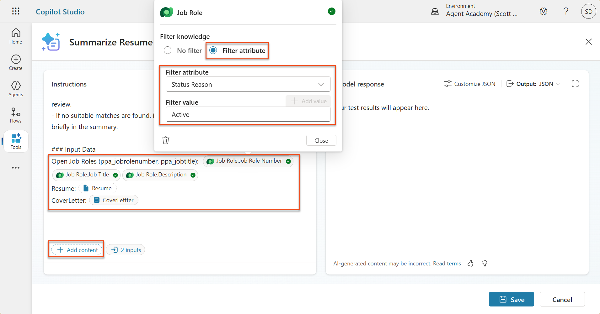

>[!info] Suggerimento
>La funzione **Add value** può essere utilizzata per aggiungere un valore dinamico preso tra gli input. Per esempio, in caso si stesse scrivendo un prompt per il riassumere un determinato record, si potrebbe fornire il *Resume Number* come parametro per poi applicarci il filtro.

7. Successivamente, premere **+ Add content**, cercare **Job Roles** e invece di selezionare le colonne, espandere **Job Role (Evaluation Criteria)** selezionando le colonne seguenti, poi premere **Add**:
	- **Criteria Name**
	- **Description**

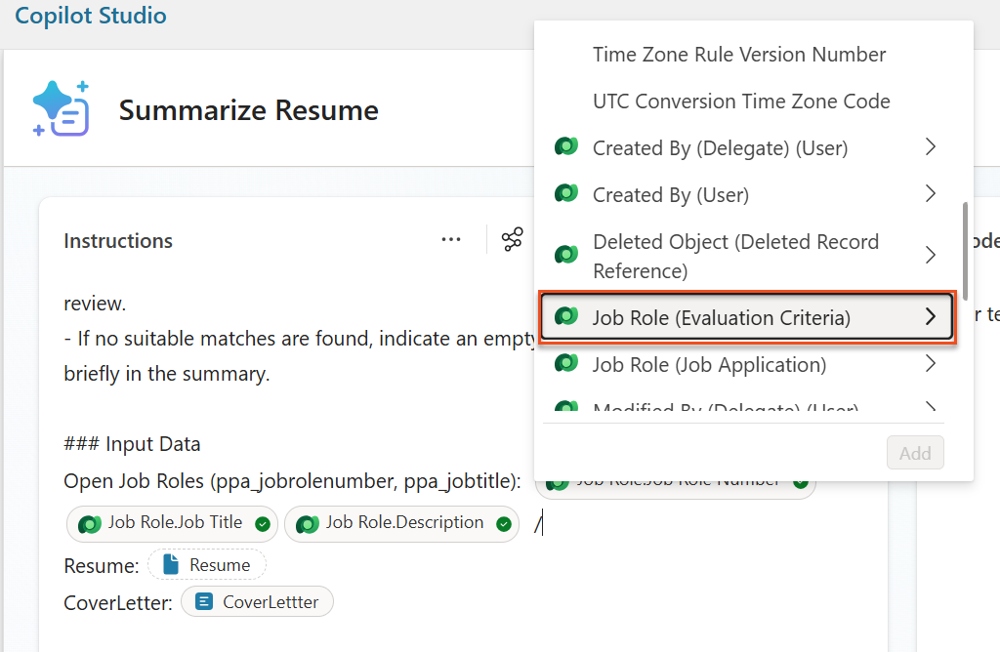

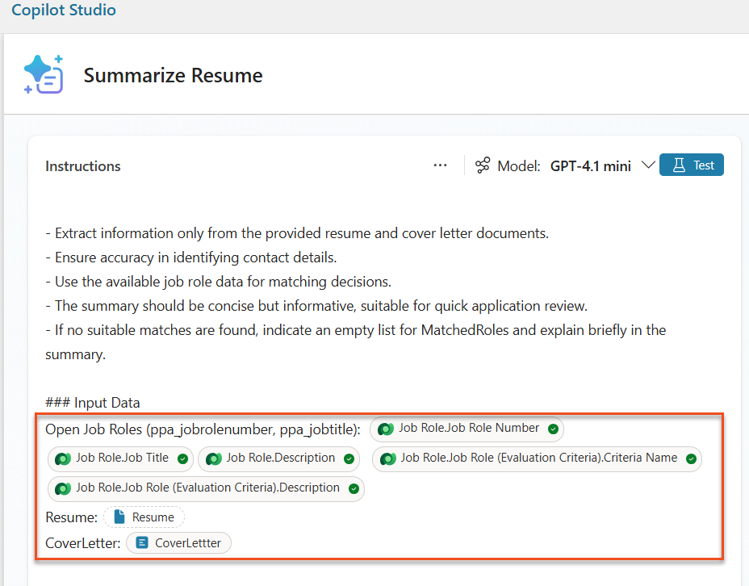

>[!info] Suggerimento
>E' importante selezionare l'**Evaluation Criteria** corretto selezionando *prima* **Job Role** e poi navigare nel menu **Job Role (Evaluation Criteria)**. Questo garantisce che solo i record relativi al Job Role verranno caricati.

8. Selezionare i tre punti (**...**) nel pannello **Istruzioni** e premere **Settings**. Modificare il valore **Record retrieval** fino a 1000: questo consentirà di includere nel prompt il massimo numero di Job Roles ed Evaluation criteria

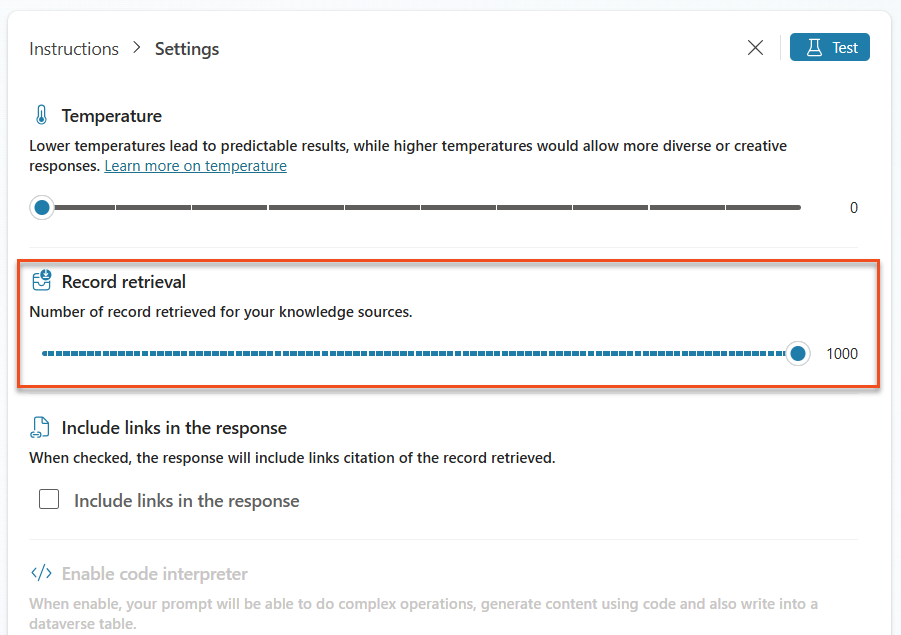

## Testare il prompt migliorato

1. Selezionare il parametro **Resume**, e caricare il CV demo utilizzato precedentemente
2. Premere **Test**
3. Dopo la generazione del test, notare come l'output JSON ora includa i **Matched Roles**
4. Selezionare la scheda **Knowledge used** per visionare i dati presi da Dataverse che sono stati uniti al prompt prima dell'esecuzione
5. Premere **Save** per salvare il prompt aggiornato. Da ora in poi il sistema integrerà i dati da Dataverse con il prompt ogni volta che è richiamato dal flusso **Summarize Resume**

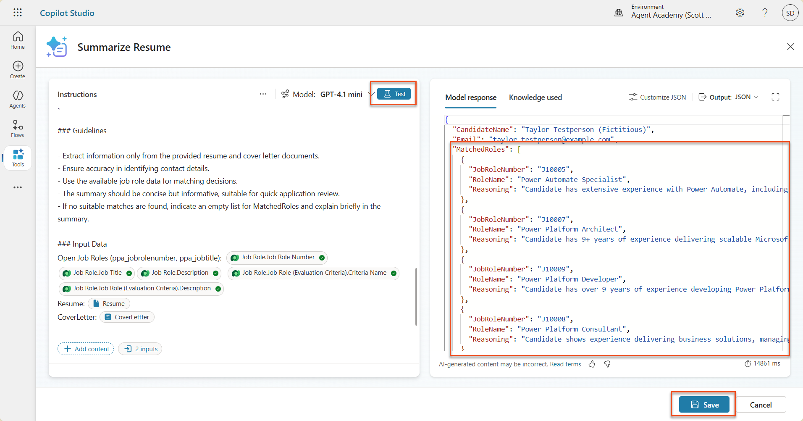

## Aggiungere il flusso Job Application 

L'agente chiamerà questo flusso per ogni job role suggerito al quale il candidato è interessato.

1. In Copilot Studio, all'interno di **Hiring Agent**, selezionare la scheda **Agents** e aprire l'agente figlio **Application Intake Agent** 
2. All'interno del pannello **Tools**, selezionare **+ Add** → **+ New tool** → **Agent Flow**
3. Selezionare il nodo **When an agent calls the flow** ed utilizzare **+ Add an input** per aggiungere i seguenti parametri

| Type | Name            | Description                                                               |
| ---- | --------------- | ------------------------------------------------------------------------- |
| Text | `ResumeNumber`  | Be sure to only use the [ResumeNumber] - it MUST start with the letter R  |
| Text | `JobRoleNumber` | Be sure to only use the [JobRoleNumber] - it MUST start with the letter J |

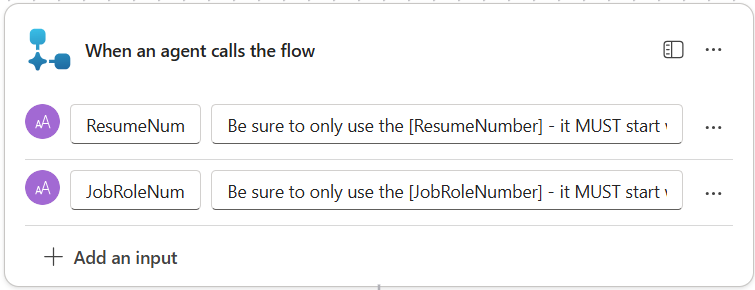

4. Premere il tasto **+** sotto il trigger, cercare `dataverse`, selezionare **See more** e scegliere l'azione **List rows**
5. Cambiare nome all'azione in `Get Resume`, ed impostare i seguenti parametri:

| Proprietà       | Come impostare            | Value                                                                                                                                                |
| --------------- | ------------------------- | ---------------------------------------------------------------------------------------------------------------------------------------------------- |
| **Table name**  | Selezionare               | Resumes                                                                                                                                              |
| **Filter rows** | Valore dinamico (fulmine) | `ppa_resumenumber eq 'ResumeNumber'` dove **ResumeNumber** va rimpiazzato con il valore dinamico **When an agent calls the flow** → **ResumeNumber** |
| **Row count**   | Inserire                  | 1                                                                                                                                                    |
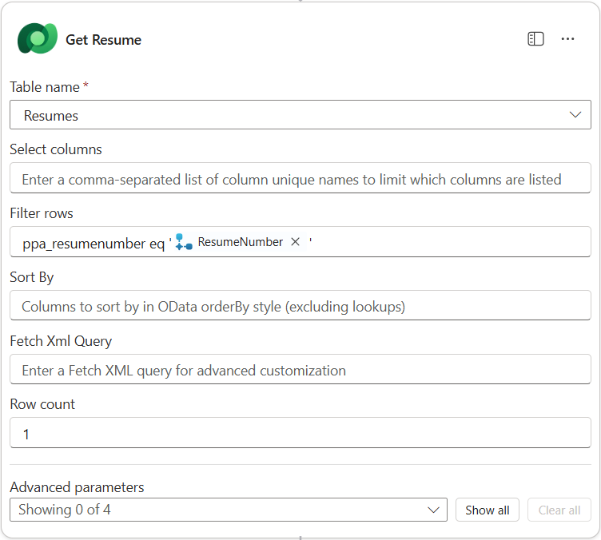

6. Premere il tasto **+** dopo l'azione appena configurata, cercare `dataverse`, selezionare **See more** e scegliere l'azione **List rows**
7. Cambiare il nome dell'azione in `Get Job Role`, ed impostare i seguenti parametri:

| Proprietà       | Come impostare            | Value                                                                                                                                                    |
| --------------- | ------------------------- | -------------------------------------------------------------------------------------------------------------------------------------------------------- |
| **Table name**  | Selezionare               | Job Roles                                                                                                                                                |
| **Filter rows** | Valore dinamico (fulmine) | `ppa_jobrolenumber eq 'JobRoleNumber'` dove **JobRoleNumber** va rimpiazzato con il valore dinamico **When an agent calls the flow** → **JobRoleNumber** |
| **Row count**   | Inserire                  | 1                                                                                                                                                        |

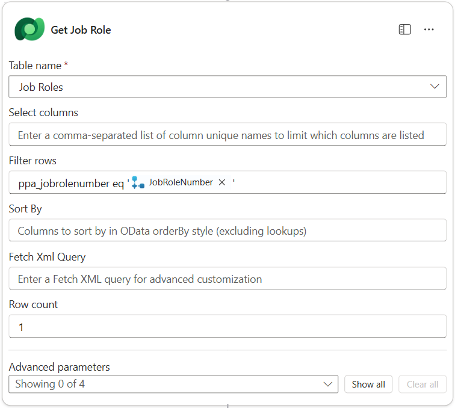

8. Premere il tasto **+** dopo l'azione appena configurata, cercare `dataverse`, selezionare **See more** e scegliere l'azione **Add a new row**
9. Cambiare il nome dell'azione in `Add application`, ed impostare i seguenti parametri:

| Proprietà                               | Come impostare   | Value                                                                                            |
| --------------------------------------- | ---------------- | ------------------------------------------------------------------------------------------------ |
| **Table name**                          | Select           | Job Applications                                                                                 |
| **Candidate (Candidates)**              | Espressione (fx) | `concat('ppa_candidates/',first(outputs('Get_Resume')?['body/value'])?['_ppa_candidate_value'])` |
| **Job Role (Job Roles)**                | Espressione (fx) | `concat('ppa_jobroles/',first(outputs('Get_Job_Role')?['body/value'])?['ppa_jobroleid'])`        |
| **Resume (Resumes)**                    | Espressione (fx) | `concat('ppa_resumes/', first(outputs('Get_Resume')?['body/value'])?['ppa_resumeid'])`           |
| **Application Date** (use **Show all**) | Espressione (fx) | `utcNow()`                                                                                       |

>[!tip] Approfondimento: formule PowerFx utilizzate
>- **`outputs('Get_Resume')?['body/value']`**  → Recupera l’array dei record restituiti dall’azione **Get_Resume**
>- **`first(...)`** → Seleziona **il primo elemento (resume) trovato**
>- **`['_ppa_candidate_value']`** → Estrae **l’ID del candidato collegato** (lookup verso la tabella Candidate)
>- `concat('ppa_candidates/', ...)` → Costruisce il **percorso del record Dataverse** della tabella `ppa_candidates`
>
>La formula restituisce un valore in formato `ppa_candidates/{candidateId}`, cioè il **riferimento al candidato associato al resume**. Le altre formule sono analoghe.

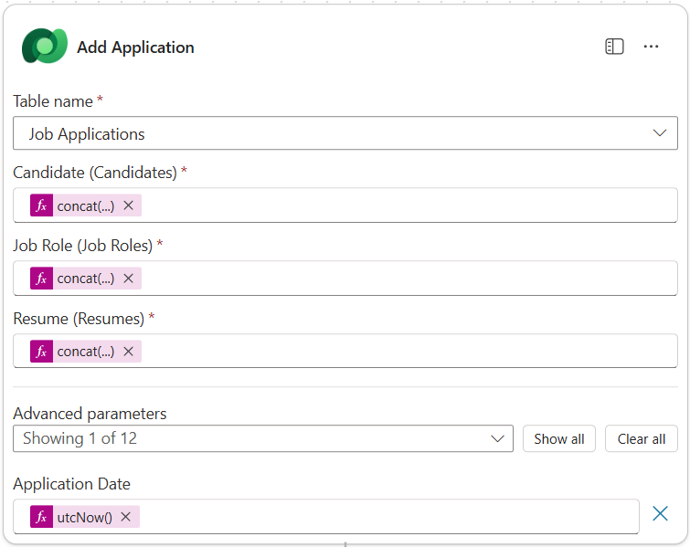

10. Selezionare il nodo **Respond to the agent**, e premere su **+ Add an output** per configurare il valore di ritorno con le seguenti proprietà:

- **Type**: *Text*
- **Name**: `ApplicationNumber`
- **Value**: tra i valori dinamici (fulmine), selezionare **Add Application → See More → Application Number**
- **Description**: `The [ApplicationNumber] of the Job Application created`

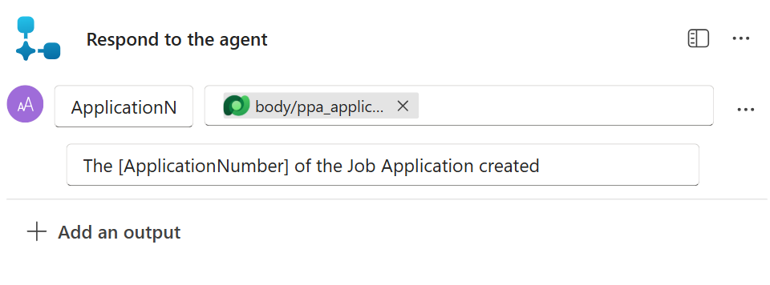

11. Premere **Save draft** in alto a destra
12. Navigare nella scheda di **Overview**,  selezionare **Edit** nel pannello **Details**. Impostare i seguenti valori:

- **Flow name**:`Create Job Application`
- **Description**:`Creates a new job application when given [ResumeNumber] and [JobRoleNumber]`
- **Save**

11. Navigare nuovamente nella scheda **Designer** e selezionare **Publish** in alto a destra

## Aggiungere il flusso all'agente

Una volta pubblicato il flusso, può essere connesso all'agente Application Intake.

1. Navigare su Copilot Studio all'interno di **Hiring Agent** e selezionare la scheda **Agents**. Aprire **Application Intake Agent** ed individuare il pannello **Tools**.
2. Selezionare **+ Add**
3. Selezionare il filtro **Flow**, cercare il nuovo flusso **Create Job Application** e quindi premere **Add and configure**
4. Impostare i seguenti parametri:

- **Description**: `Creates a new job application when given [ResumeNumber] and [JobRoleNumber]`
- **Additional details → When this tool may be used**: *Only when referenced by topics or agents*

5. Selezionare **Save**

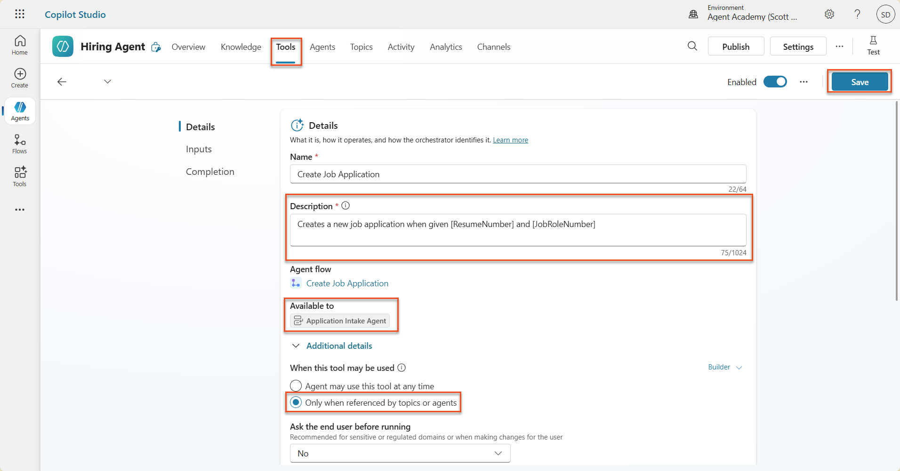

## Modificare le istruzioni dell'agente

Per creare nuove job applications, bisogna spiegare all'agente come utilizzare il nuovo strumento. In questo caso, verrà chiesto all'utente di confermare a quale ruolo, tra i suggeriti, fare application, e l'agente verrà istruito su come lanciare lo strumento per ognuno dei ruoli scelti.

1. Navigare indietro su **Application Intake Agent**, ed individuare il pannello **Instructions**
2. Nel campo **Instructions**, aggiungere la seguente linea guida **in fondo alle istruzioni già presenti**:

```
3. Post Resume Upload
   - Respond with a formatted bullet list of [SuggestedJobRoles] the candidate could apply for.  
   - Use the format: [JobRoleNumber] - [RoleDescription]
   - Ask the user to confirm which Job Roles to create applications for the candidate.
   - When the user has confirmed a set of [JobRoleNumber]s, move to the next step.

4. Post Upload - Application Creation
    - After the user confirms which [SuggestedJobRoles] for a specific [ResumeNumber]:
    E.g. "Apply [ResumeNumber] for the Job Roles [JobRoleNumber], [JobRoleNumber], [JobRoleNumber]
    E.g. "apply to all suggested job roles" - this implies use all the [JobRoleNumbers] 
     - Loop over each [JobRoleNumber] and send with [ResumeNumber] to /Create Job Application   
     - Summarize the Job Applications Created

Strict Rules (that must never be broken)
You must always follow these rules and never break them:
1. The only valid identifiers are:
  - ResumeNumber (ppa_resumenumber)→ format R#####
  - CandidateNumber (ppa_candidatenumber)→ format C#####
  - ApplicationNumber (ppa_applicationnumber)→ format A#####
  - JobRoleNumber (ppa_jobrolenumber)→ format J#####
2. Never guess or invent these values.
3. Always extract identifiers from the current context (conversation, data, or system output).
```

3. Dove le istruzioni includono lo slash in avanti (`/`), selezionare il seguente testo e rimpiazzarlo con il riferimento dinamico allo strumento **Create Job Application**
4. Premere **Save**

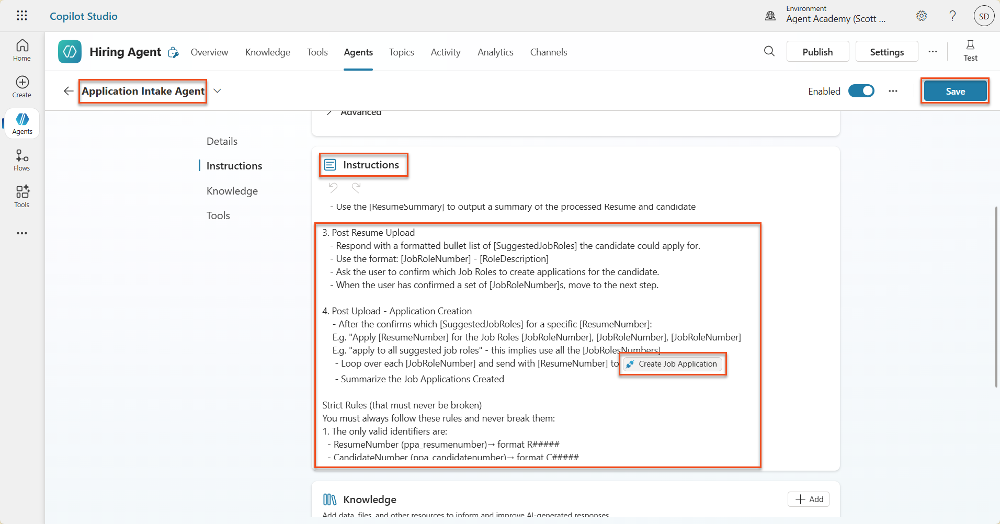

>[!info] Iterare con Orchestrazione Generativa
>Grazie all'orchestratore generativo sotto Copilot Studio, è possibile gestire il caso in cui l'agente deve iterare su multiple righe e prendere decisioni su quali passaggi e strumenti usare. I *Matched Job Roles* verranno automaticamente letti e Application Intake Agent si attiverà per ogni riga. Questa funzione è molto comoda!

## Testare l'agente

1. In Copilot Studio, navigare su **Hiring Agent**
2. Premere su **Test** e caricare un CV demo, scrivendo ad esempio

```
This is a new resume for the Power Platform Developer Role.
```

3. Notare come l'agente restituisce una lista dei *Suggested Job Roles*, ognuno dei quali con un identificativo specifico

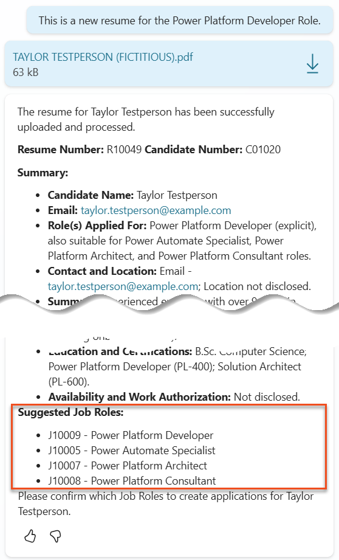

4. E' quindi possibile specificare per quale di questi aggiungere un application. Ad esempio:

```
"Apply for all of those job roles"
"Apply for the J10009 Power Platform Developer role"
"Apply for the Developer and Architect roles"
```

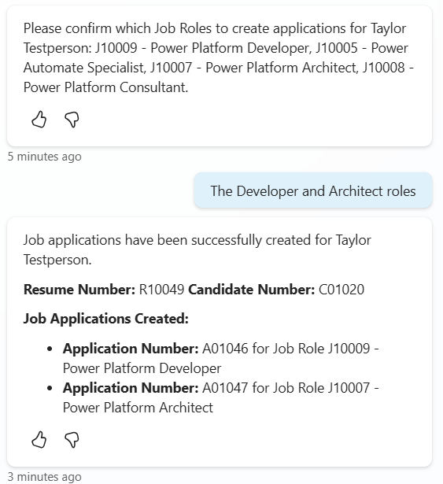

5. All'interno dell'activity map è possibile vedere come lo strumento **Create Job Application** viene lanciato per ognuno dei ruoli specificati. 

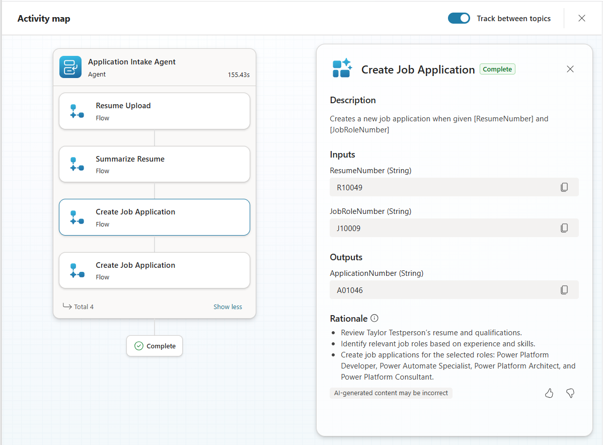

>[!success] Successo
>Con la nuova capacità dell'agente di interagire efficientemente ed in tempo reale con informazioni dal database, il laboratorio è terminato!

