# Lab 11 - Advanced Content Generation

[Previous: Lab 10](../10-advanced-grounding/README.md) | [Back to README](../../README.md) | [Next: Lab 12](../12-mcp-server-integration/README.md)

>[!WARNING]
>**Prerequisito**
>
>Per completare questo lab è necessario avere terminato il laboratorio precedente sul *Dataverse grounding*

### Scenario

Una volta inserita la job application, il prossimo passaggio è quello di realizzare un processo automatico per la creazione di documenti dettagliati di preparazione all'intervista. 

Questo documento dovrà essere un file in formato Word contenente le informazioni principali sul candidato (nome, attuale posizione, esperienza, etc.), sul ruolo (nome, requisiti) e creare anche delle specifiche domande basate sia sul background del candidato che sulla posizione per la quale sta applicando.

## Creazione del prompt

Il primo obiettivo è quello creare una prompt action in grado di analizzare una job description ed un profilo candidato per creare delle domande su misura.

1. All'interno di Copilot Studio, selezionare **Tools** dalla navigazione di sinistra

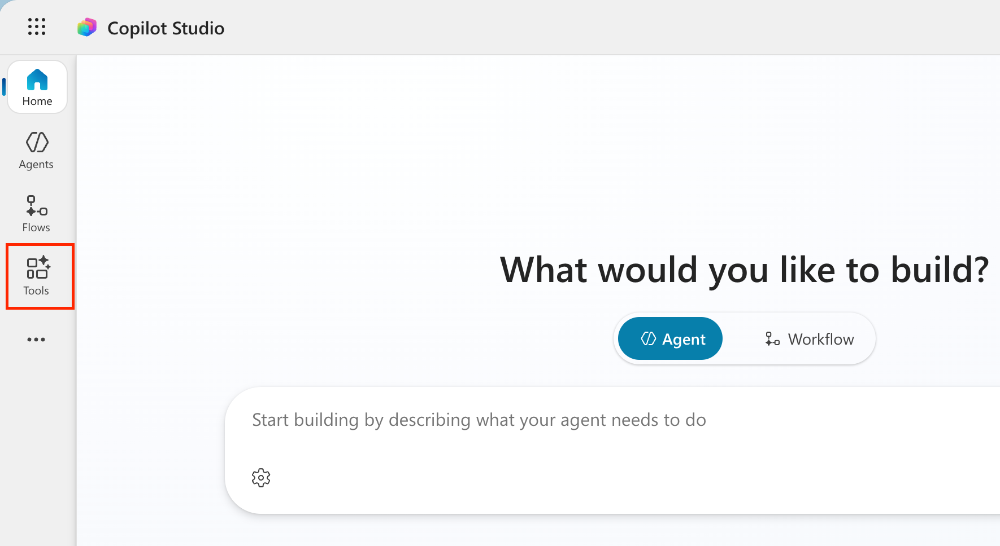

2. Premere il tasto **+ New tool** 
3. Selezionare **Prompt**

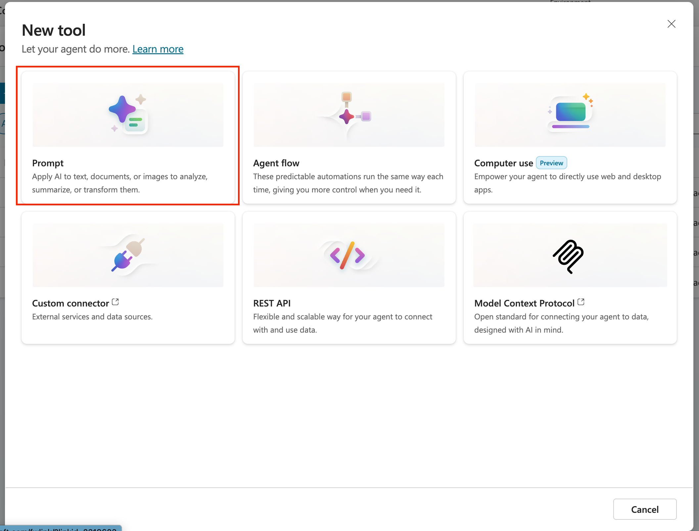

4. Rinominare il prompt in `Interview Question Document Prep`

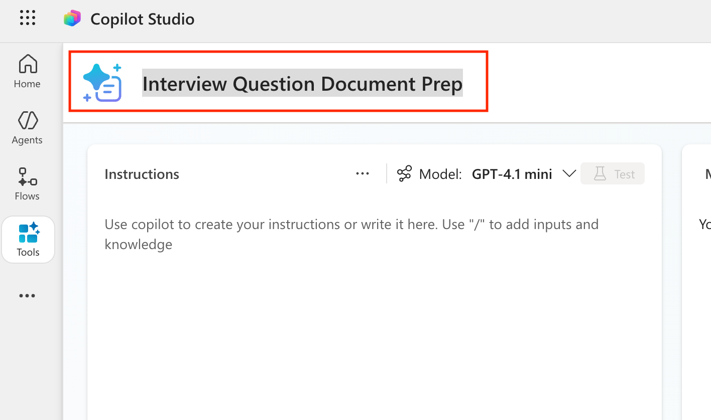

5. All'interno del campo **Instructions**, aggiungere il seguente prompt:

```
You are tasked with evaluating a candidate’s resume against a specific job listing description and generating a targeted set of interview questions to support structured candidate screening.
### Instructions

1. **Extract Candidate Details:**
    - Identify and extract the candidate’s full name.
    - Extract contact information, specifically the email address.
    - Identify the candidate’s current or most recent job title.
    - Extract location if present.
    - Estimate total years of experience only if supported by resume dates.

2. **Analyze the Job Listing Description:**
    - Review the job description to identify:
    - Must-have requirements
    - Nice-to-have requirements
    - Key responsibilities
    - Required tools and technologies
    - Treat must-have requirements as the highest priority for evaluation.

3. **Evaluate Resume Against Job Requirements:**
    - Compare the resume content against each must-have requirement.
    - For each requirement, determine:
        - Evidence level: Strong, Moderate, Weak, or Missing
        - A confidence score from 0–100
        - Supporting evidence using short phrases grounded in the resume text only
    - Do not infer or invent experience.

4. **Assess Overall Candidate Fit:**
    - Identify:
        - Top strengths (up to 5)
        - Key gaps (up to 5)
        - Risks or concerns only when supported by missing or unclear evidence
        - Provide a concise one-paragraph summary suitable for recruiter review.

5. **Generate Interview Questions (Exactly 10):**
    - Generate exactly 10 interview questions based on the job requirements and resume evaluation.
    - Distribute the questions as follows:
        - 5 Core Requirement Questions focused on the most critical must-have requirements.
        - 3 Gap or Clarification Questions targeting weak, missing, or ambiguous areas.
        - 2 Scenario-Based Questions derived directly from key job responsibilities.
    - Avoid generic or culture-only questions unless explicitly required by the job description.

**Interview Question Requirements:**
    - Each question must include:
        - The interview question
        - The job requirement it maps to
     - Questions must be specific, non-duplicative, and grounded in the provided inputs.
     - Produce questions in numbered format (1, 2, 3)

### Input Data

Application Number:  /ApplicationNumber
Candidate Details (Name, Email): /CandidateDetails
Resume Details: /Resume Details
Job Details (Job Number, Title, Description and Requirements): /JobDetails
Evaluation Criteria (Weighting, Evaluation Criteria): /Criteria
```

6. In una nuova scheda del browser, navigare su [Power App](https://make.powerapps.com) e cercare la tabella **Job Application**. Prendere nota di uno dei numeri delle job application presenti. Questo servirà per il testing.

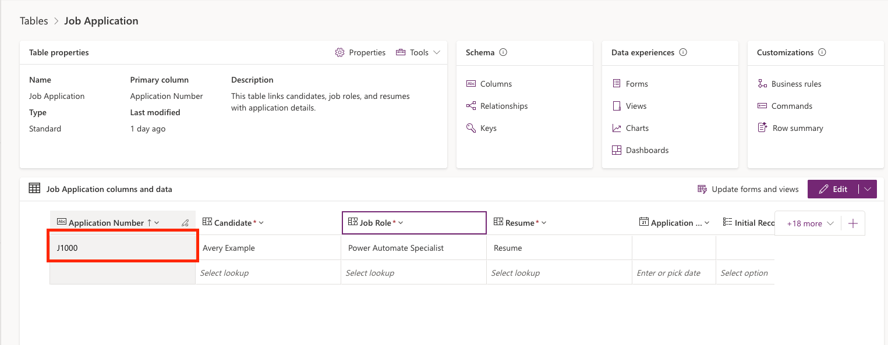

7. Tornare indietro nel prompt e raggiungere la sezione **input data**. Cercare il testo **/ApplicationNumber**, eliminarlo e tramite lo slash in avanti (**`/`**) impostare i seguenti valori:

	- **Parameter Name**:  `ApplicationNumber` 
	- **Type**: *Text*
	- **Sample Data**: Inserire qui il numero della job application copiata dal punto precedente

8. Una volta configurato il numero della Job Application, è necessario prendere altre informazioni rilevanti da Dataverse, come già fatto nel laboratorio precedente. Cercare nella sezione finale del prompt i rimanenti slash (**`/`**) nella sezione **Input Data** e rimpiazzarle secondo la tabella seguente:

| Nome Parametro      | Tabella                                                                               | Colonne                                            | Attributi del filtro | Valore del filtro               |
| ------------------- | ------------------------------------------------------------------------------------- | -------------------------------------------------- | -------------------- | ------------------------------- |
| CandidateDetails    | Dataverse -> Job Application -> Candidate (Candidate)                                 | Candidate Name, Email                              | Application Number   | Add Value -> Application Number |
| ResumeDetails       | Dataverse -> Job Application -> Resume (Resume)                                       | Cover Letter, Resume Number, Resume Title, Summary | Application Number   | Add Value -> Application Number |
| JobDetails          | Dataverse -> Job Application -> Job Role (Job Role)                                   | Description, Job Role Number, Job Title            | Application Number   | Add Value -> Application Number |
| Evaluation Criteria | Dataverse -> Job Application -> Job Role (Job Role) -> Job Role (Evaluation Criteria) | Criteria Name, Description, Weighting              | Application Number   | Add Value -> Application Number |

Una volta completato, la situazione dovrebbe essere uguale rispetto al seguente screenshot:

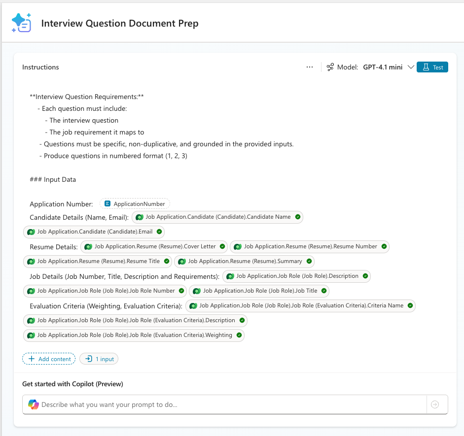

9. Mentre si configura il prompt, è consigliabile testare tramite **Test** per assicurarsi che il sistema riesca a prendere le informazioni corrette da Dataverse

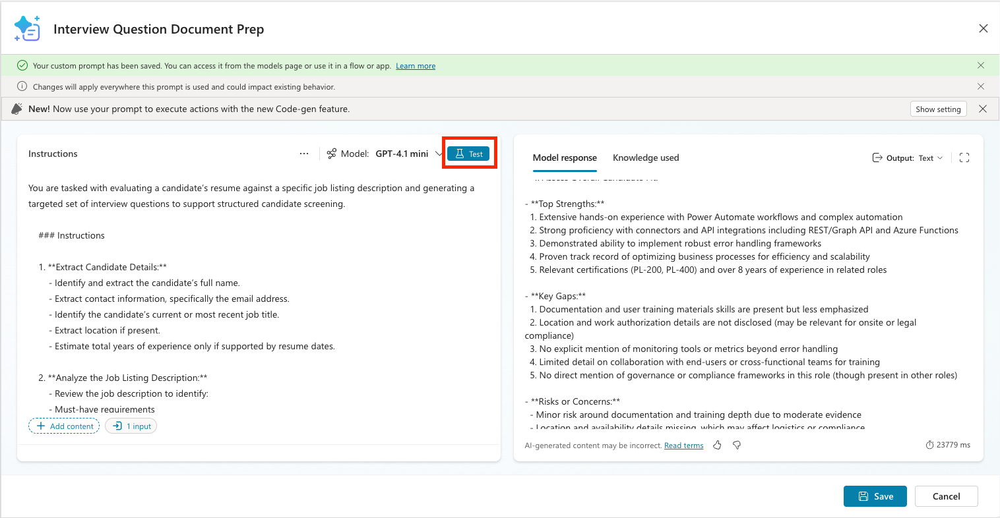

10. Siccome il prompt dev'essere in grado di generare un documento, è fondamentale assicurarsi che il modello usato supporti input ed output multi-modali. Per fare questo, premere sul menu a tendina **Model** e selezionare **GPT-4.1** (oppure **GPT-5 chat**)

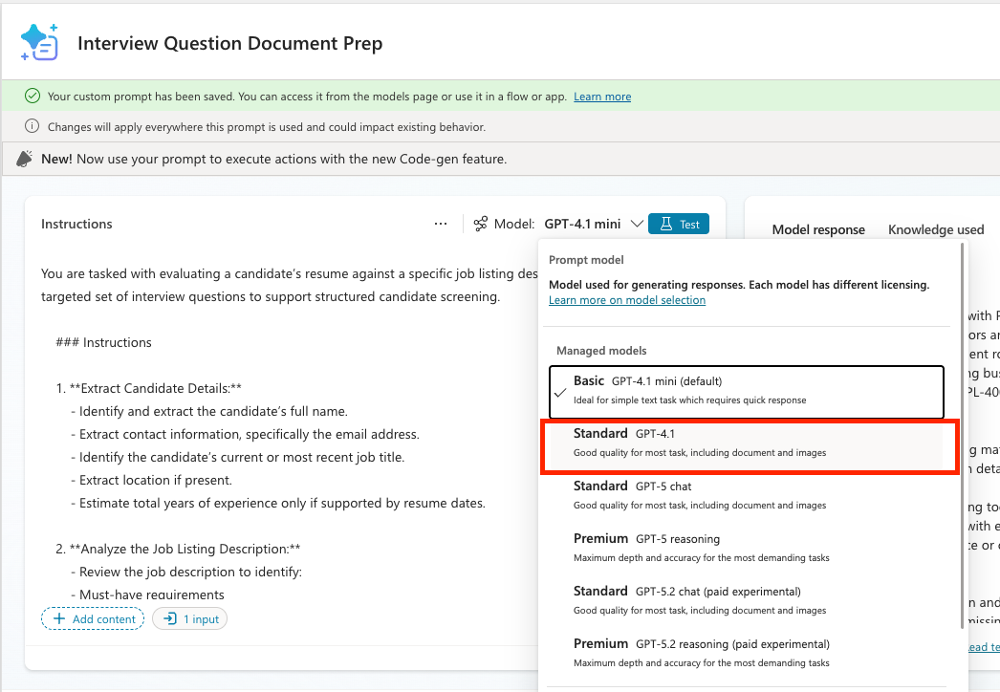

11. Per permettere al prompt di popolare un foglio Word come output, è necessario fornire un template da riempire. Scaricare il template demo e aprirlo. TODO INSERIRE LINK

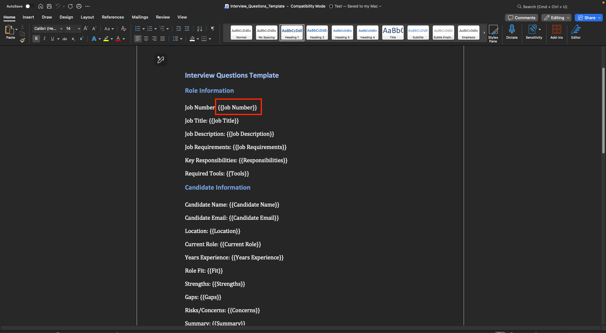

>[!NOTE]
>**Nota**
>
>Il template è un semplice documento Word. Il concetto chiave è quello di aggiungere placeholders nelle posizioni in cui il prompt dovrà aggiungere del testo. Per i valori temporanei è necessario utilizzare una dicitura con doppie parentesi graffe come `{{ JobTitle }}`. I nomi devono essere gli stessi rispetto ai parametri del prompt. [Maggiori informazioni in documentazione](https://learn.microsoft.com/en-us/microsoft-copilot-studio/generate-document-output-prompt) 

12. Al momento la prompt action genera comunque testo. Per rendere lo strumento in grado di generare un documento, selezionare il menu a tendina **Output** in alto a destra e scegliere l'opzione **Document (preview)** 

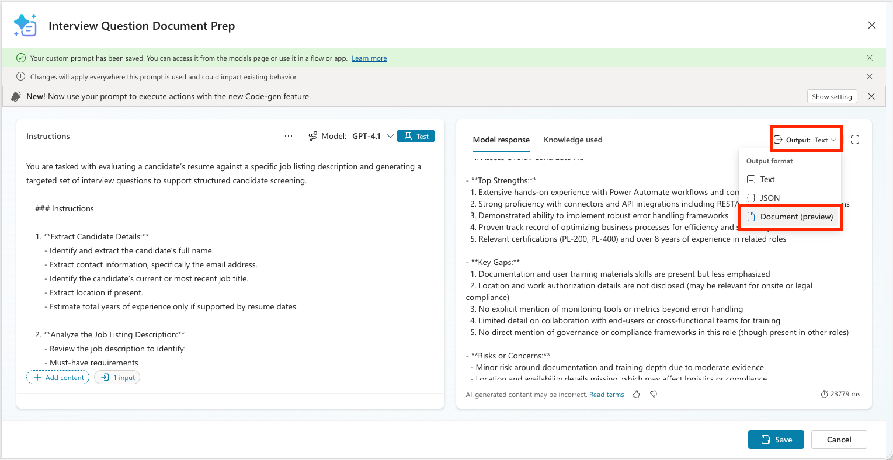

13. Per associare il template con il prompt, selezionare il tasto **Document settings** ed inserirlo tramite drag and drop o browse

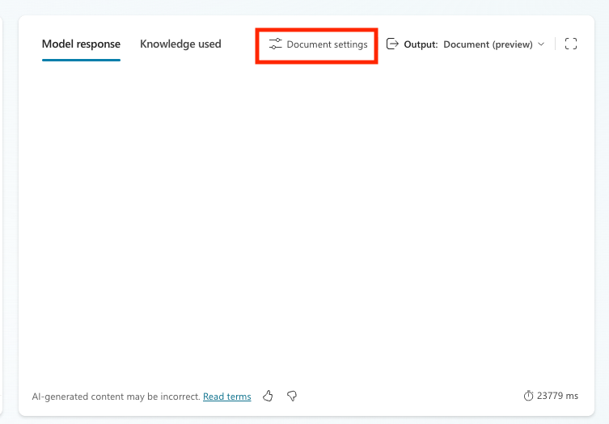

14. Dopo il caricamento del file, dovrebbero essere riconosciuti 19 campi (relativi ai valori messi tra parentesi graffe). Selezionare nuovamente il bottone **test** per vedere se il prompt scrive l'output in formato Word

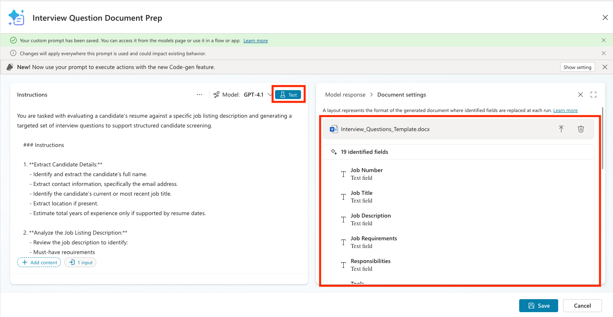

15. La risposta dovrebbe essere simile a quella mostrata sotto. Dovrebbe contenere un collegamento in cima che permette di scaricare il documento. Controllare che sia stato riempito correttamente.

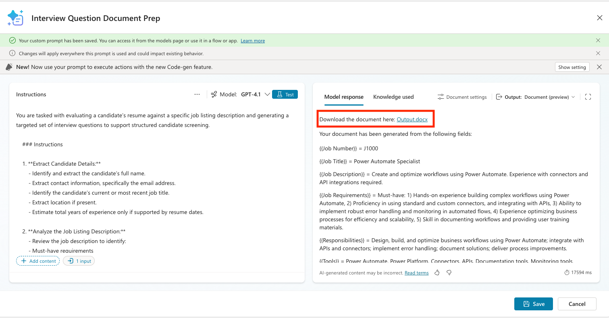

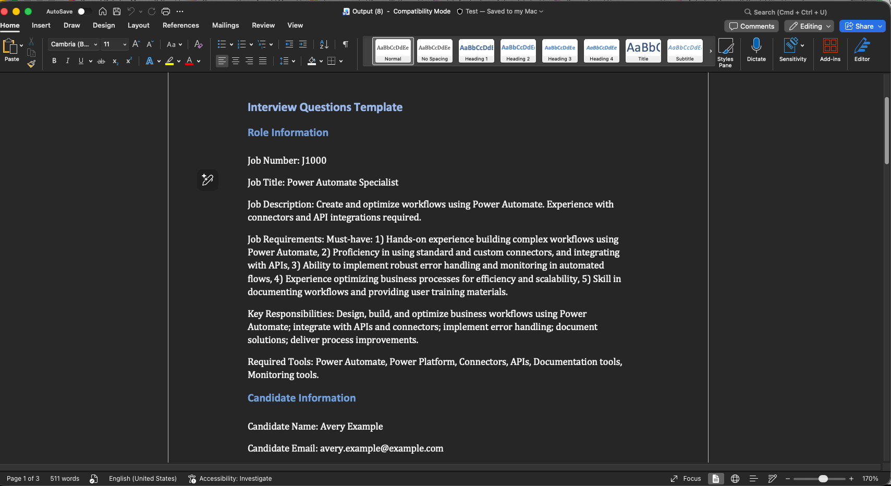

16. Cliccare **Save** per salvare il prompt

## Creare un agent flow per richiamare il prompt

Il prossimo passaggio è quello di creare un semplice flusso che si occupa di chiamare il prompt e restituire il file all'agente.

Potrebbe non essere chiaro perché eseguire questo passaggio invece di chiamare direttamente il prompt nell’agente. Il motivo è che attualmente non è possibile ottenere i **contentBytes** di un file (cioè il contenuto effettivo del file) e far sì che questo restituisca in modo affidabile un elemento file utilizzando solo l’agente.

Tramite un *wrapping* del prompt all'interno di un agent flow è possibile estrarre il file in modo prevedibile e restituirlo all'agente

1. In Copilot Studio, selezionare la scheda **Tools**
2. Selezionare il tasto **New tool**

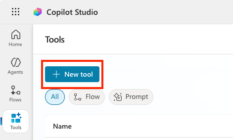

3. Selezionare l'opzione **Agent Flow**

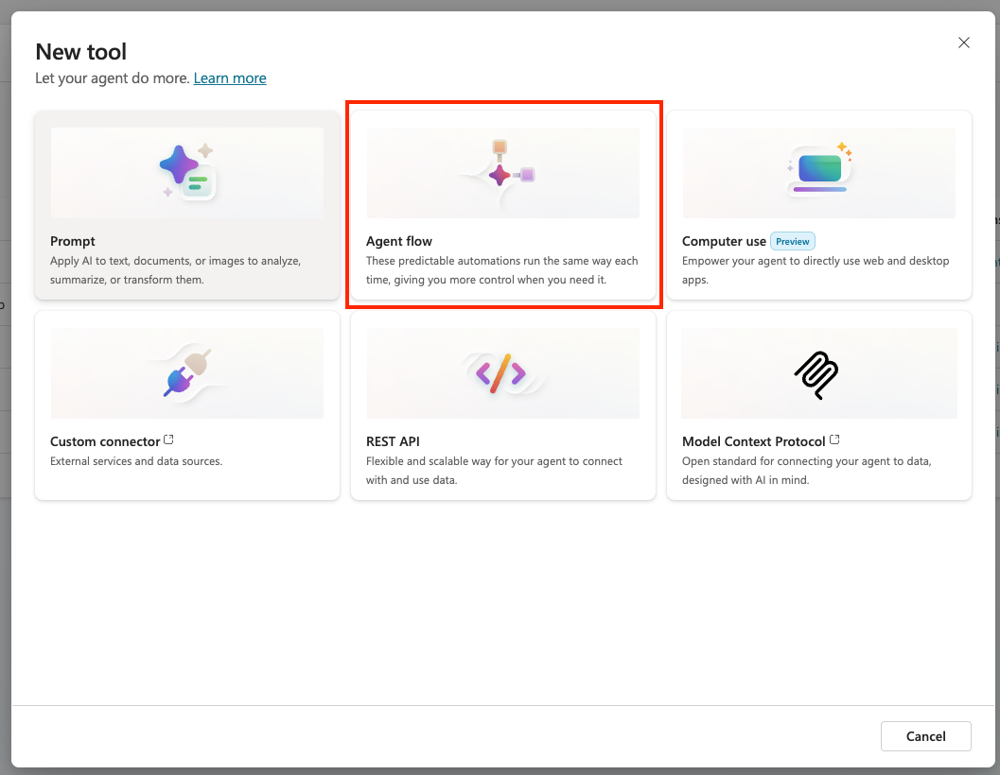

4. Selezionare il primo nodo **When an agent calls the flow** ed utilizzare **+ Add an input** per aggiungere il seguente parametro

- **Type**: *Text*
- **Name**: `ApplicationNumber`
- **Description**: `What's the job application number`

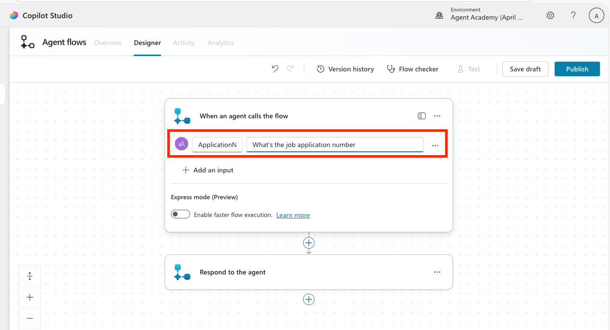

5. Premere il tasto **+** sotto il nodo appena configurato e selezionare l'azione **Run a prompt** sotto **AI capabilities**

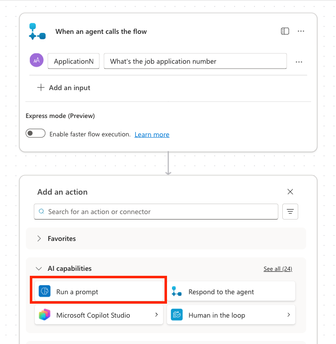

6. Dal menu tendina selezionare il nuovo prompt **Interview Question Document Prep**

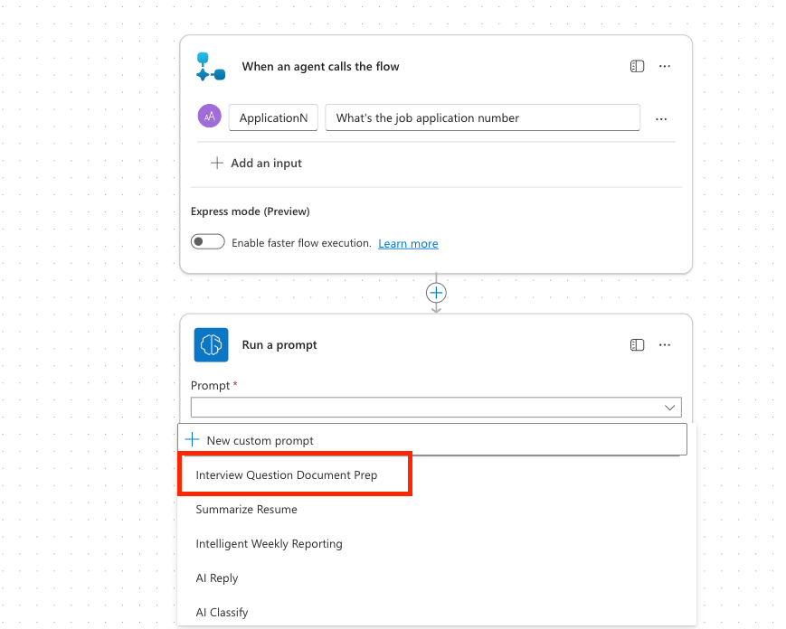

7. All'interno del campo **ApplicationNumber** selezionare i valori dinamici tramite l'icona del fulmine, e selezionare l'input **ApplicationNumber** creato nel punto precedente

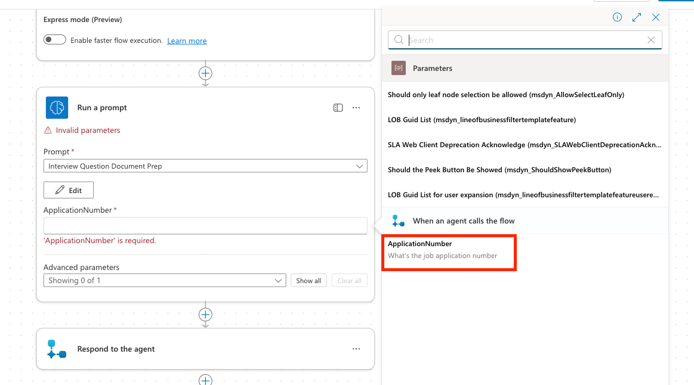

8. Selezionare l'ultima azione **Respond to the agent** e premere **+ Add an output**, impostando il seguente valore:

- **Type**: *File*
- **Name**: `InterviewFile`
- **Value**: inserire la seguente espressione tramite il tasto **fx**

```
binary(outputs('Run_a_prompt')?['body/responsev2/predictionOutput/documentOutput/contentBytes'])
```

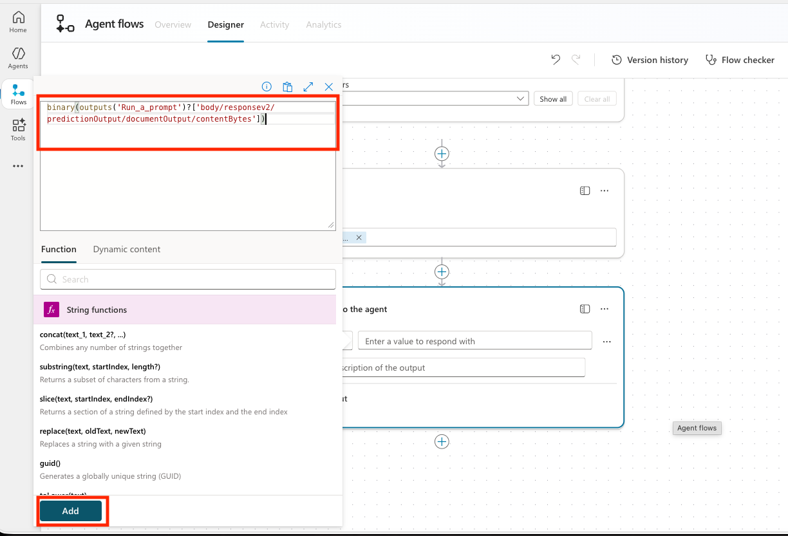

>[!TIP]
>**Approfondimento: formula PowerFx utilizzata**
>
>- `outputs('Run_a_prompt')` → Recupera l’output dell’azione **Run a prompt**
>- `['body/responsev2/predictionOutput/documentOutput/contentBytes']` → Naviga nella struttura dell’output per ottenere il campo **contentBytes**, che contiene il **contenuto del file generato dal modello** (di solito codificato in Base64)
>- `binary(...)` → Converte quel contenuto in **formato binario**, cioè il formato richiesto da molte azioni di Power Automate quando devono gestire un file (es. creare un file in SharePoint o OneDrive).
>
>Questo passaggio è fondamentale per estrarre il file dagli input in maniera corretta, in modo da restituirlo poi all'agente

9. Selezionare **Save draft**

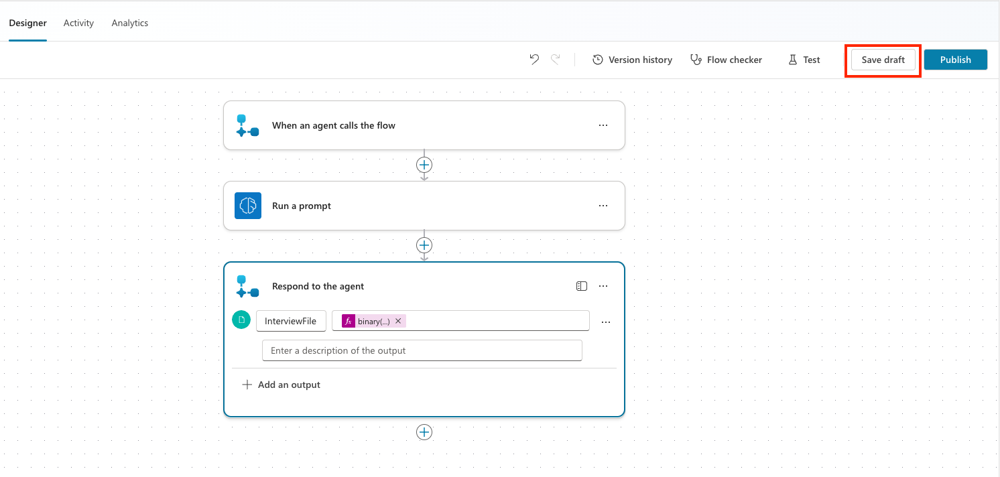

10. Navigare nella scheda **Overview**, selezionare **Edit** all'interno della sezione **Details** ed impostare i seguenti valori e premere **Save**

- **Flow name**: `Doc Prep`
- **Description**: `Creates an interview prep document and returns to the agent`

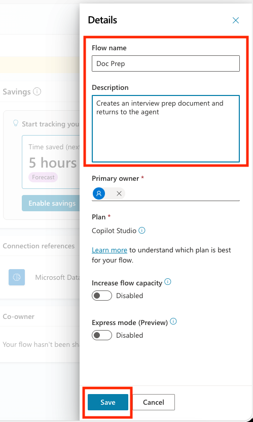

11. Navigare indietro nella scheda **Designer** e premere su **Publish**

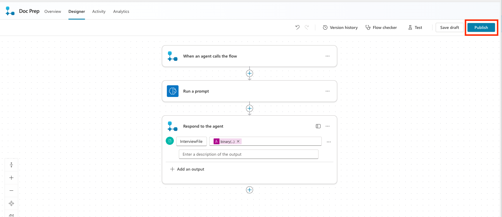

## Creare il topic

TODO NOTA NON SO SE INTERVIEW AGENT E' MAI STATO CREATO

Per chiudere il cerchio verrà configurato un topic. 

Anche in questo caso, occorre utilizzare un topic invece di aggiungere il flusso direttamente nelle istruzioni dell'agente perché così possiamo garantire che il file verrà restituito ogni volta.

1. In Copilot Studio, all'interno di **Interview Agent**, selezionare la scheda **Topics** 
2. Selezionare il bottone **+ Add a topic** e scegliere l'opzione **From blank**

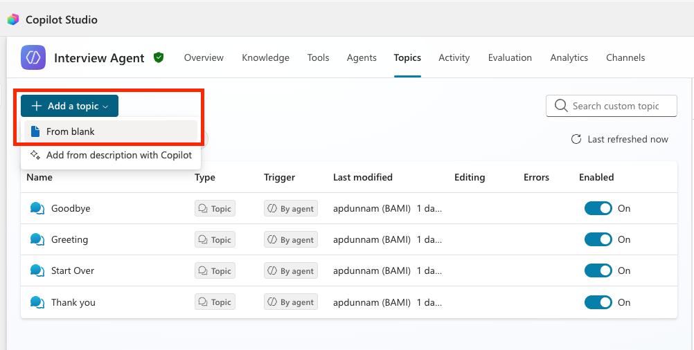

3. Rinominare il topic in `Generate Interview Doc`

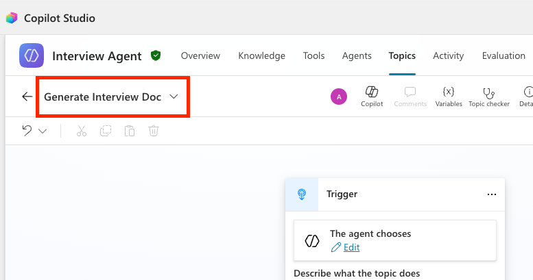

4. All'interno del Topic Trigger, inserire la seguente descrizione

```
This topic generates an interview prep document with applicant details, role details and interview questions.
```

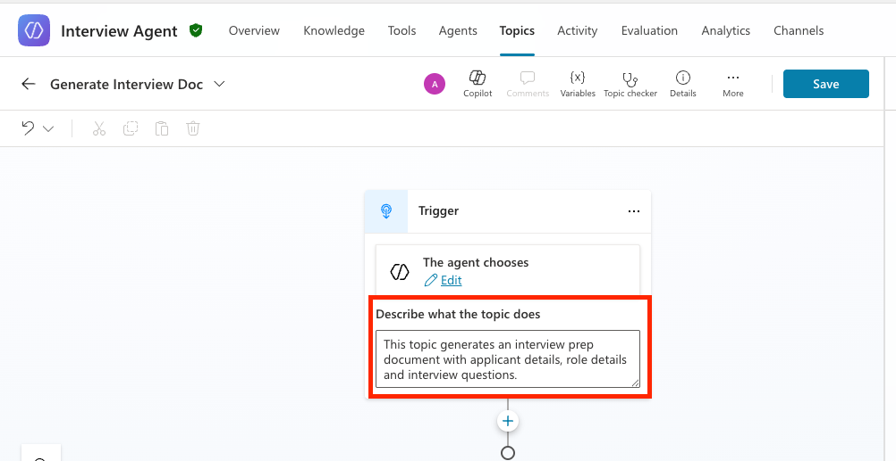

>Per fare funzionare il flusso, è necessario ottenere il Job Application Number. Per fare questo, verrà utilizzata una funzione in Copilot Studio chiamata *slot filling*. Questo consente all'orchestratore generativo del modello di linguaggio utilizzato di indentificare i valori da portare all'interno del topic. 

5. Selezionare il tasto **Details** nel topic

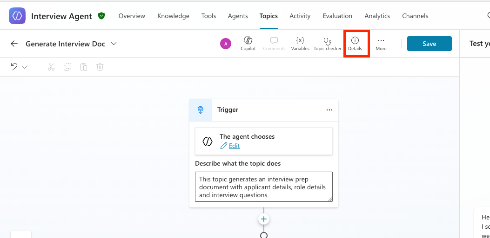

6. Selezionare la scheda **Input** all'interno del pannello dei dettagli e premere **Create a new variable**

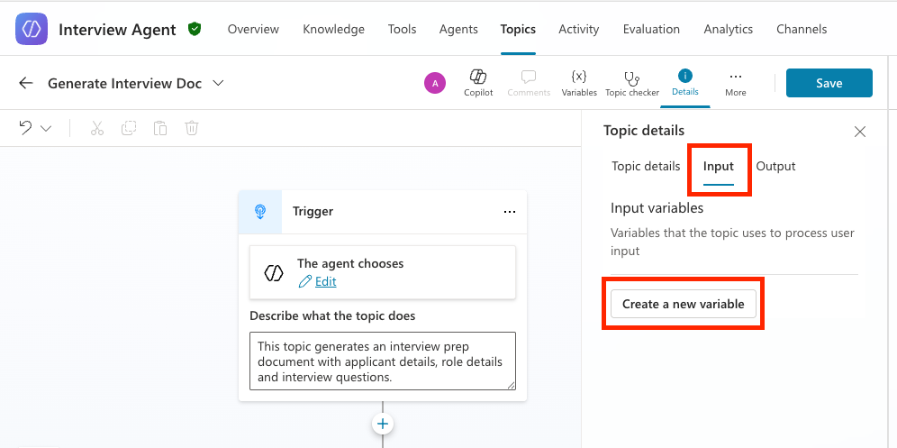

7. Nei campi della variabile appena creata, inserire i seguenti valori:

- **Variable name**: `VarApplicationNumber`
- **Description**: `Fill with the Job Application Number referenced in the chat. The number always starts with a J followed by at least 4 digits.`
- Lasciare gli altri campi inalterati

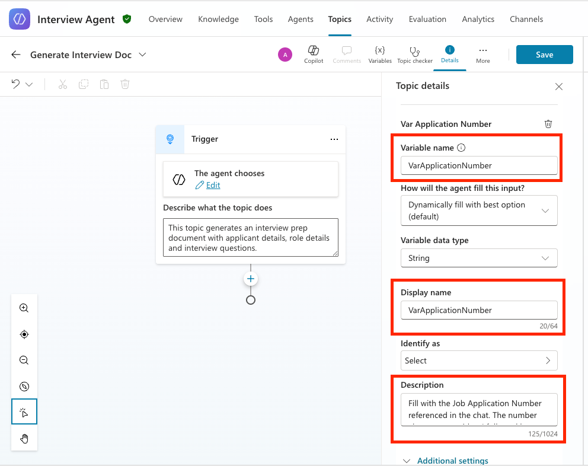

8. Premere l'icona **+** dopo il nodo iniziale, selezionare **Add a tool** ed individuare il flusso **Doc Prep** creato nel punto precedente

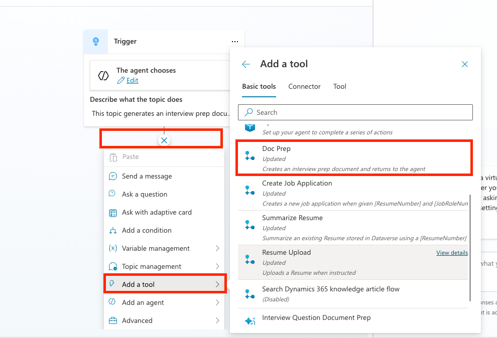

9. Cliccare all'interno del campo di input del nuovo nodo **ApplicationNumber**, e tramite il menu con i tre punti (**...**) scegliere la variabile **VarApplicationNumber**

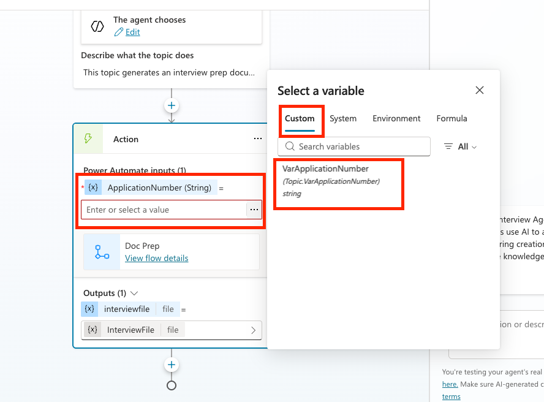

10. Adesso va aggiunto un nodo messaggio per restituire i file all'utente. Per fare questo, cliccare l'icona **+** sotto l'azione appena configurata e selezionare **Send a message**

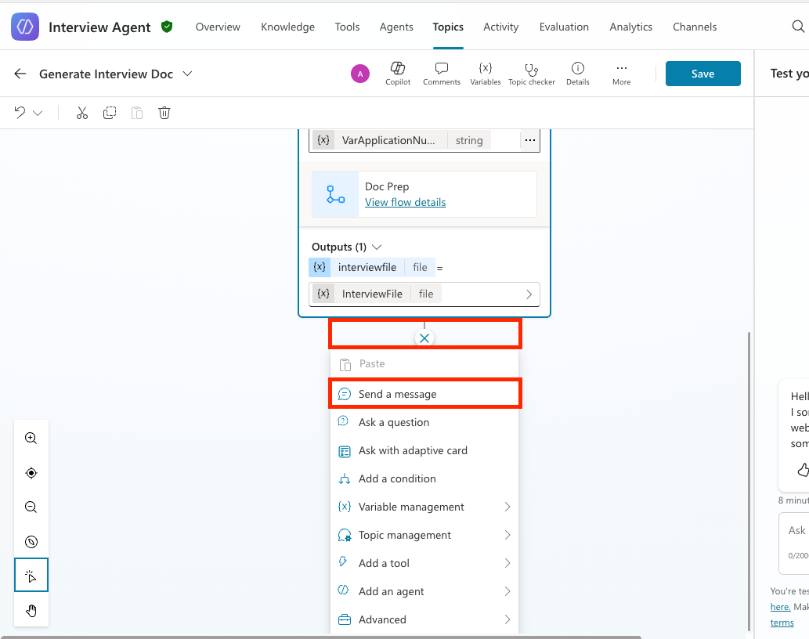

11. All'interno del box di testo, scrivere `Here is your interview prep file`. Poi, cliccare il tasto **Add** e scegliere l'opzione **File**

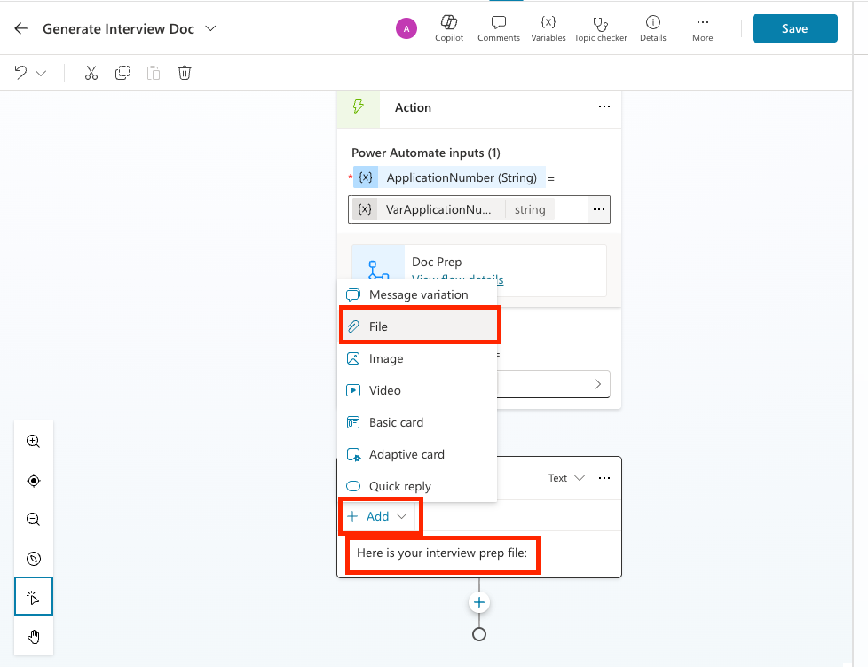

12. Nella sezione **Content**, selezionare i tre punti (**...**) e scegliere la proprietà **InterviewFile** 

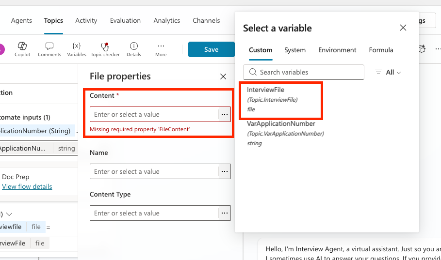

13. Nella sezione **Name**, selezionare i tre punti (**...**), navigare alla sezione **Formula** ed inserire la seguente espressione:

```
Topic.VarApplicationNumber&"InterviewPrep.docx"
```

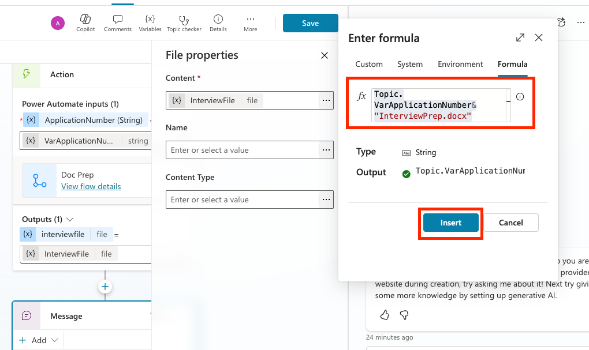

14. Salvare le modifiche al topic tramite il tasto **Save**

## Testare il corretto funzionamento

1. Aprire il pannello di **Test** e scrivere il seguente valore (utilizzando un numero di job application presente in tabella Job Application)

```
Create an interview prep file for job application J1000
```

2. Notare come l'agente chiama il topic, inserisce come input il numero corretto, chiama il flusso e restituisce il file. Assicurarsi che il file sia scaricabile.

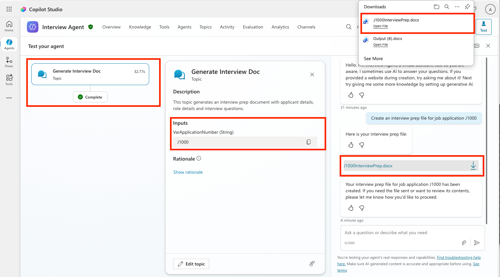

3. Aprire il file ed assicurarsi che il documento sia stato riempito correttamente

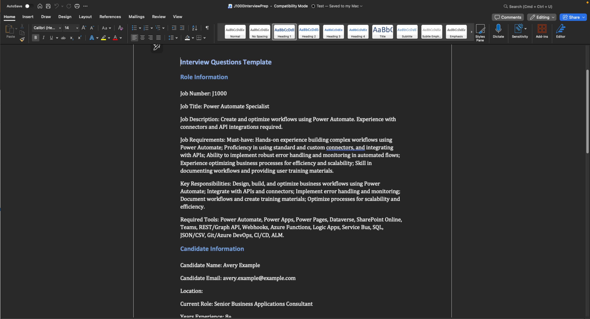

>[!IMPORTANT]
>**Successo**
>
>Con l'aggiunta della nuova capacità di generazione documenti, il laboratorio è completato!

