# Lab 12 - MCP Server Integration

[Previous: Lab 11](../11-advanced-content-generation/README.md) | [Back to README](../../README.md) | [Next: Lab 13](../13-user-feedback-and-telemetry/README.md)

>[!WARNING]
>**Programma Frontier**
>Per questo laboratorio, è necessario assicurarsi di far parte del programma di [anteprima Frontier](https://adoption.microsoft.com/en-us/copilot/frontier-program/) per ottenere l’accesso anticipato a **Microsoft Agent 365**. 
>
>Frontier consente di entrare in contatto diretto con le più recenti innovazioni di **AI Microsoft**. Le anteprime Frontier sono soggette ai termini di anteprima già previsti negli accordi con i clienti. Poiché queste funzionalità sono ancora in fase di sviluppo, la loro disponibilità e le loro capacità potrebbero variare nel tempo.

## Prerequisiti

In questo laboratorio verranno utilizzati due **MCP server**: **Work IQ User MCP** e **Work IQ Calendar MCP**. Affinché il laboratorio funzioni correttamente, è necessario configurare in anticipo nel proprio **tenant** quanto segue:

- OPZIONALE: avere un **manager configurato per il proprio utente**, impostabile nel **M365 Admin Center**. 
- Avere **un appuntamento nel proprio calendario entro le prossime 24 ore**, poiché l’MCP server verrà testato ponendo la domanda _“Get my meetings for today”_.
- Avere **un utente extra creato nel tenant**, così da poter invitare tale utente alla riunione di preparazione al colloquio ([How to create a user in M365](https://learn.microsoft.com/en-us/microsoft-365/admin/add-users/add-users?view=o365-worldwide)).
- Per questo **utente aggiuntivo**, è necessario che la **mailbox sia stata provisionata** ed è consigliabile impostare **giorni e orari lavorativi**.

## Aggiungere il server MCP Work IQ User

1. In Copilot Studio, aprire **Interview Agent** precedentemente configurato
2. Selezionare **Tools** nella navigazione in alto
3. Selezionare **Add a tool**

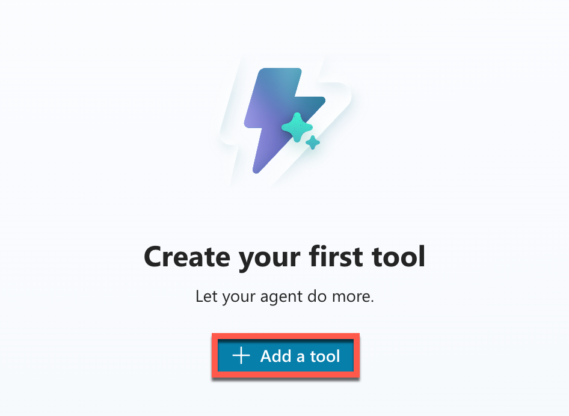

4. Selezionare il filtro **Model Context Protocol**
5. Individuare all'interno della lista **Work IQ User (Preview)**

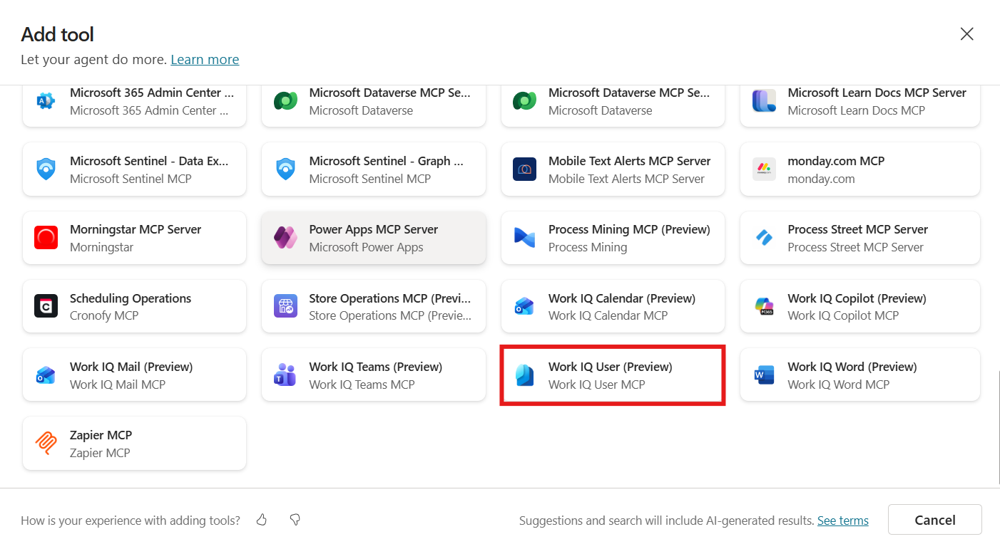

6. Creare una nuova connessione al servizio tramite il tasto **Create new connection** e poi premere **Create**

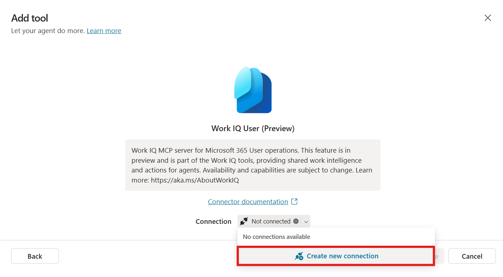

7. Effettuare la login con il proprio account. Infine, premere **Add and configure**
8. Scorrendo la schermata di overview, è possibile notare tutti i singoli strumenti che fanno parte del server MCP

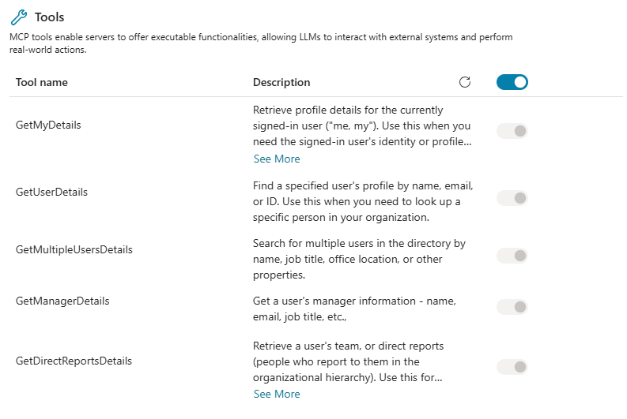

9. Selezionare **Test** per assicurarsi del corretto funzionamento dello strumento. Alcuni prompt di esempio includono:

```
Who is my manager?
What are my user details?
What is the job role of Mario Rossi?
```

10. Selezionare **Allow** per dare il consenso sul trattamento dati al server MCP.

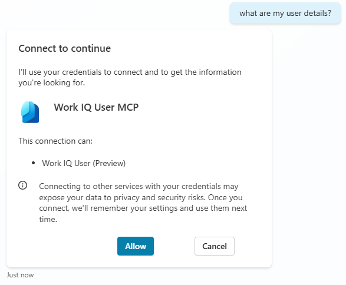

11. Di seguito, dovrebbe apparire la risposta dell'agente simile a quella mostrata in esempio sotto

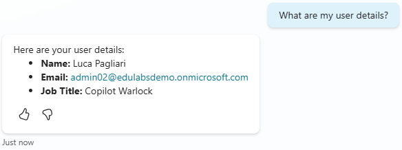

12. All'interno dell'activity map, è possibile notare che l'agente ha inizializzato il server MCP e chiamato l'azione corrispondente alla richiesta, come *getMyManager*. Si possono anche vedere i dettagli su cosa l'agente ha inviato e ricevuto dal server MCP

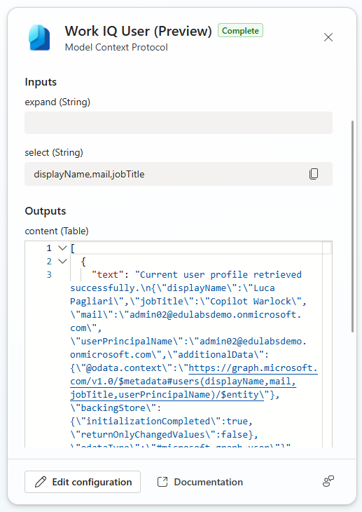

## Aggiungere il server MCP Work IQ Calendar

Nella sezione precedente è stato aggiunto il server MCP Work IQ User che rende possibile lavorare con i dettagli (pubblici) degli utenti nel tenant. Questo è molto utile quando si vuole ad esempio pianificare dei meetings, perché spesso gli utenti che interagiscono con l'agente non andranno ad inserire direttamente UPN dei colleghi da invitare nei meetings, ma tipicamente qualcosa simile al seguente:

```
meeting with Mario Rossi tomorrow
```

Prima di essere in grado di interagire con il calendario, va configurato un secondo MCP server.

1. Selezionare **Tools** nella navigazione in alto
2. Selezionare **Add a tool**
3. Selezionare il filtro **Model Context Protocol**
4. Individuare all'interno della lista **Work IQ Calendar (Preview)**

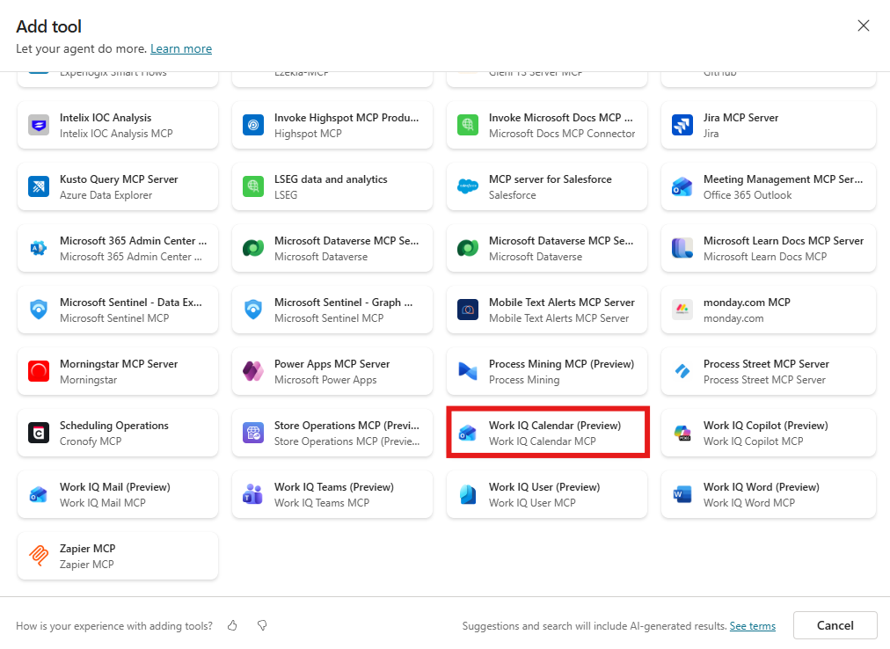

5. Effettuare il processo di connessione e poi selezionare **Add and configure**
6. Prendere nota delle azioni disponibili all'interno del server MCP appena configurato

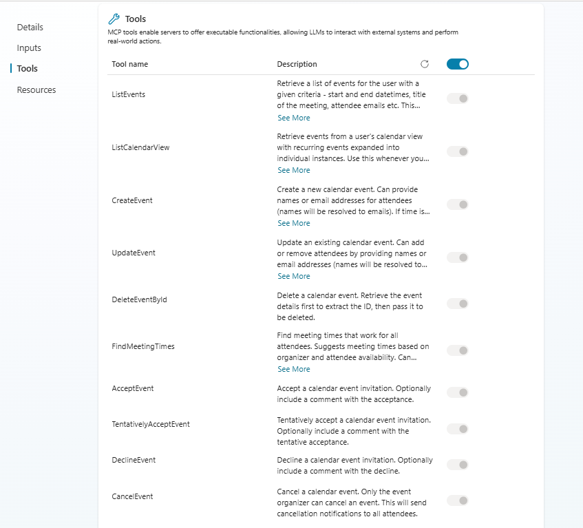

## Testare il corretto funzionamento

In alcuni casi, il tool potrebbe già funzionare. In generale è consigliabile esplicitare nelle istruzioni dell'agente come concatenare le chiamate degli strumenti.

1. Navigare all'interno del campo **Instructions** di **Interview Agent**
2. Aggiungere la seguente sezione in fondo alle istruzioni già presenti

```
## Tool usage policy

You have access to two tools:

1. Work IQ User (Preview)   
   Use this tool to resolve a person reference into a user identifier, especially an email address.

2. Work IQ Calendar (Preview)  
   Use this tool only after you have a valid user identifier from Work IQ User.

## Required tool sequence

When the user asks about meetings, calendar events, availability, schedule, or similar:

1. First, determine who the request is about.
2. If the user refers to:
   - "me", "my", "I" → resolve the current user with Work IQ User
   - a name such as "Bob" → resolve that person with Work IQ User
   - an email address already provided by the user → you may use that directly with Work IQ Calendar
3. After obtaining the resolved email or user identifier, call Work IQ Calendar with that value.
4. Never ask the user for an email, Entra ID, or identifier if it can be resolved through Work IQ User first.
5. Only ask a follow-up question if Work IQ User returns multiple ambiguous matches or no result.

## Entity resolution rules

- Interpret "me" as the current signed-in user and resolve it through Work IQ User.
- Interpret a person reference like "Bob", "Bob Smith", or "my manager" as a user lookup request for Work IQ User.
- If the user asks for someone else's meetings, first resolve that person with Work IQ User, then use the resolved email with Work IQ Calendar.
- Do not tell the user to provide an identifier before attempting resolution with Work IQ User.

## Examples

### Example 1
User: What are my meetings for today?  
Action:
- Call Work IQ User with current user reference ("me")
- Extract email
- Call Work IQ Calendar for today using that email

### Example 2
User: What meetings does Bob have today?  
Action:
- Call Work IQ User with "Bob"
- Extract Bob's email
- Call Work IQ Calendar for today using Bob's email

### Example 3
User: Do I have any meetings tomorrow morning?  
Action:
- Call Work IQ User with current user reference
- Extract email
- Call Work IQ Calendar for tomorrow morning using that email

## Failure handling

- If Work IQ User returns multiple matches, ask a short disambiguation question.
- If Work IQ User returns no match, say you could not resolve the person and ask for a clearer name or email.
- If Work IQ Calendar fails after successful resolution, explain that the calendar lookup failed after resolving the user.
```

3. Salvare le nuove istruzioni tramite **Save**
4. Aprire il pannello **Test** ed inserire il seguente prompt:

```
Get my meetings for today
```

5. L'agente risponderà con la richiesta di consenso. Premere **Allow** per consentire al server MCP di utilizzare i propri dati

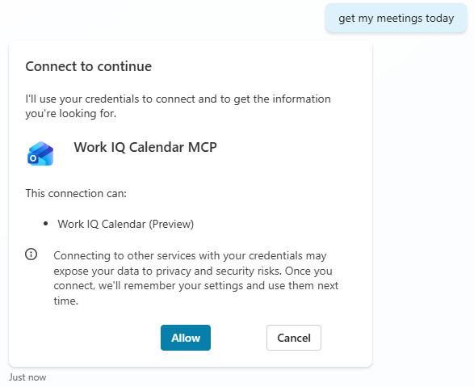

6. L'agente dovrebbe ora rispondere correttamente con i meetings presenti nel proprio calendario

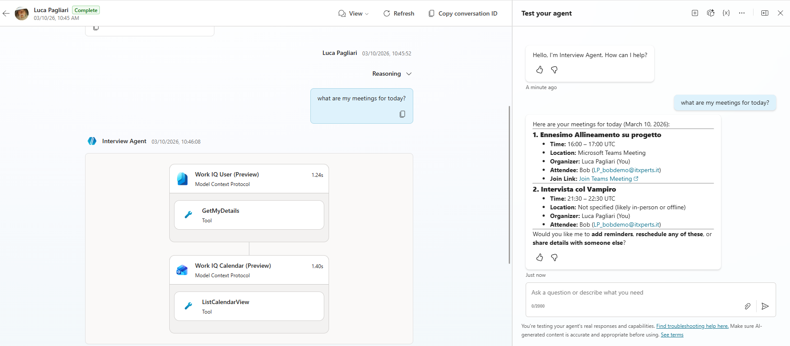
 
7. Iniziare una nuova sessione di test tramite **New test session**

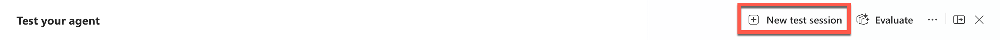

8. Inserire il seguente prompt (sostituendo il nome utente in base al proprio ambiente)

```
Can you find 3 meeting times for a 30 minute meeting with Jane Doe for an interview prep-meeting?
```

Questo farà partire lo strumento MCP *findMeetingsTimes* che cercherà all'interno dei calendari degli utenti interessati per estrapolare disponibilità condivise.

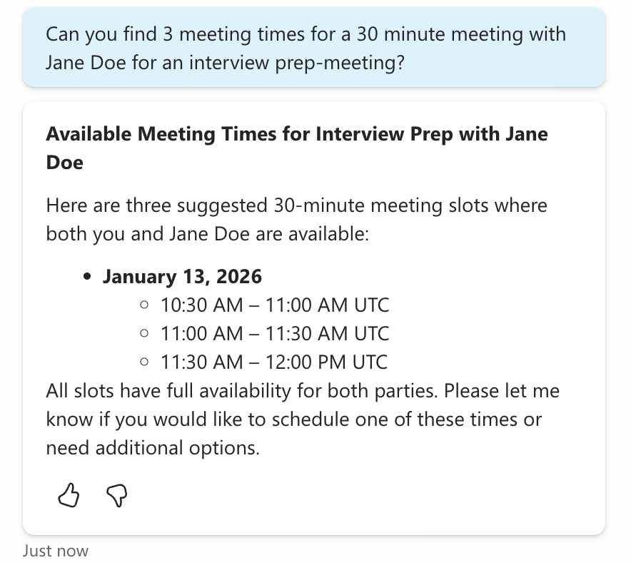

9. Terminare il test confermando uno degli slot proposti inserendo ad esempio:

```
Please schedule the one on 10:30 AM UTC
```

Questo attiverà la funzione *createEvent* MCP e pianificherà il meeting all'interno dei calendari (in questo caso su Exchange Online)

